# GEO+ 文档优化系统 — 测试报告

> 刷新日期：2026-05-13 | 数据集：14 组（DS1-DS14） + curated 3 组（DS101-DS103） | 模型接口：gpt-5.4（Anthropic-compatible gateway）
>
> 本版报告基于仓库当前脚本的动态聚合结果生成，已不再沿用早期手工抄录到图表脚本中的数组。当前默认主基线为 `after_nozws.md`；`after.md` 作为 Full-ZWS 对照版本保留。

---

## 一、测试方法

每组测试包含 6 篇文档：4 篇竞争文档（`1.md` 到 `4.md`）、1 篇原始文档（`before.md`）、1 篇优化文档。当前仓库的主评测口径如下：

- **Before 轮**：将 `before.md` 与 4 篇竞争文档混合，提交给 AI 评审，记录引用分布
- **Baseline 轮**：将 `after_nozws.md` 与 4 篇竞争文档混合，作为默认优化基线
- **Full-ZWS 对照**：将 `after.md` 与同一组竞争文档混合，用于衡量零宽字符注入的边际影响

两项核心指标：

1. **引用次数占比**：目标文档被引次数 / 所有文档被引总次数
2. **引用内容字数占比**：目标文档所引内容对应的回答字数 / 回答总字数

波动性部分使用两轮重复评测：

- **Round 1**：`test_<variant>.md`
- **Round 2**：`test_<variant>_r2.md`

当前脚本已支持任意 `round`，本文展示的是已有的两轮结果。

---

## 二、总体结果

### 2.1 默认基线整体提升

| 指标 | 优化前 (`before.md`) | 默认基线 (`after_nozws.md`) | 提升 |
|------|:--:|:--:|:--:|
| 引用次数占比 | **13.6%** | **52.9%** | +39.4 pp |
| 引用内容字数占比 | **18.6%** | **62.7%** | +44.1 pp |

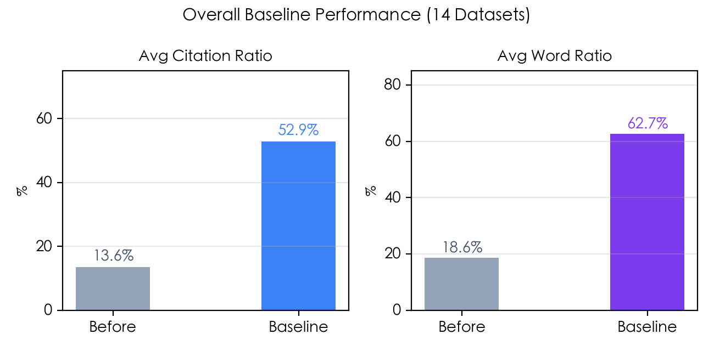

- 默认基线的引用次数占比约为原始文档的 **3.9 倍**。
- 默认基线的引用内容字数占比约为原始文档的 **3.4 倍**。
- 14 组数据集在默认基线口径下 **全部正向提升**，没有出现整体回退。

### 2.2 与 Full-ZWS 对照的真实差异

动态重算后，Full-ZWS 并没有比 No-ZWS 更强，反而略弱：

| 策略 | 平均引用次数占比 | 平均引用内容字数占比 |
|------|:--:|:--:|
| `after_nozws.md` | **52.9%** | **62.7%** |
| `after.md` | 52.4% | 61.9% |
| Full-ZWS 相对 No-ZWS | **-0.5 pp** | **-0.8 pp** |

这和早期手工数组所表达的“ZWS 平均正收益”不同。按当前真实产物动态统计，**内容本身是主增益来源，Full-ZWS 没有带来稳定正向提升**。

### 2.3 原始文档的竞争劣势

在 Before 轮中，`before.md` 的平均引用次数占比仅为 13.6%，低于 5 篇文档均匀竞争时约 20% 的直觉基线。说明原始文档在多文档竞争环境下天然吃亏，问题主要在信息密度、结构化程度和可抽取性上，而不是单一提示技巧。

---

## 三、逐数据集结果

### 3.1 默认基线的引用次数占比

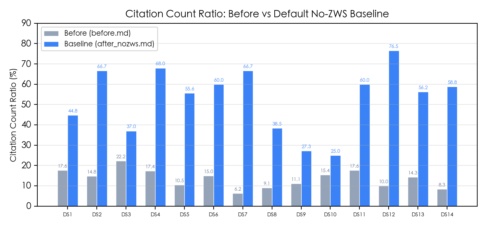

| 数据集 | 主题 | Before | Baseline | 提升 |
|:--:|------|:--:|:--:|:--:|
| 1 | 认知与元认知 | 17.6% | 44.8% | +27.2pp |
| 2 | 激素与行为 | 14.8% | 66.7% | +51.9pp |
| 3 | 语言习得 | 22.2% | 37.0% | +14.8pp |
| 4 | 记忆与学习 | 17.4% | 68.0% | +50.6pp |
| 5 | AI 与失业 | 10.5% | 55.6% | +45.0pp |
| 6 | 基因编辑 | 15.0% | 60.0% | +45.0pp |
| 7 | 转基因食品 | 6.2% | 66.7% | +60.4pp |
| 8 | 核电争议 | 9.1% | 38.5% | +29.4pp |
| 9 | 动物实验 | 11.1% | 27.3% | +16.2pp |
| 10 | 监控与隐私 | 15.4% | 25.0% | +9.6pp |
| 11 | 强制疫苗 | 17.6% | 60.0% | +42.4pp |
| 12 | 5G 辐射 | 10.0% | 76.5% | +66.5pp |
| 13 | 加密货币 | 14.3% | 56.2% | +42.0pp |
| 14 | 元宇宙 | 8.3% | 58.8% | +50.5pp |

### 3.2 默认基线的引用内容字数占比

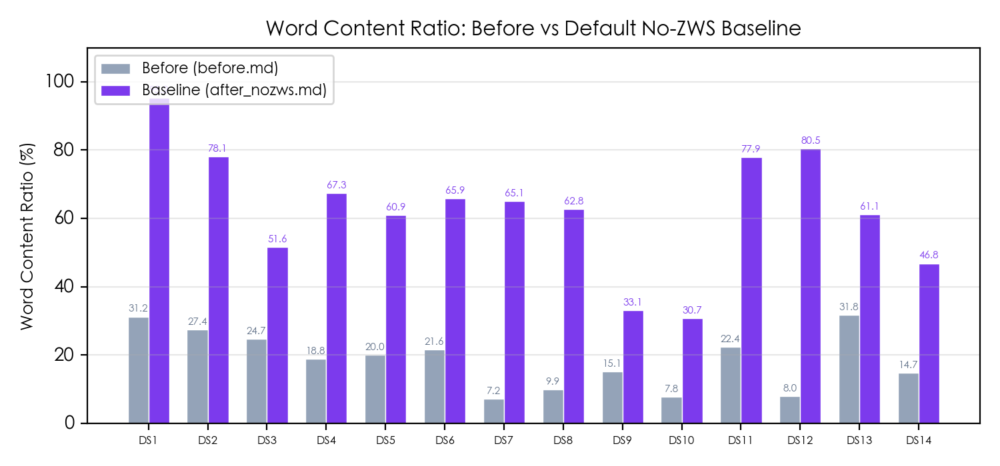

| 数据集 | 主题 | Before | Baseline | 提升 |
|:--:|------|:--:|:--:|:--:|
| 1 | 认知与元认知 | 31.2% | 95.2% | +64.0pp |
| 2 | 激素与行为 | 27.4% | 78.1% | +50.7pp |
| 3 | 语言习得 | 24.7% | 51.6% | +26.9pp |
| 4 | 记忆与学习 | 18.8% | 67.3% | +48.5pp |
| 5 | AI 与失业 | 20.0% | 60.9% | +40.9pp |
| 6 | 基因编辑 | 21.6% | 65.9% | +44.3pp |
| 7 | 转基因食品 | 7.2% | 65.1% | +57.9pp |
| 8 | 核电争议 | 9.9% | 62.8% | +52.9pp |
| 9 | 动物实验 | 15.1% | 33.1% | +18.0pp |
| 10 | 监控与隐私 | 7.8% | 30.7% | +23.0pp |
| 11 | 强制疫苗 | 22.4% | 77.9% | +55.5pp |
| 12 | 5G 辐射 | 8.0% | 80.5% | +72.6pp |
| 13 | 加密货币 | 31.8% | 61.1% | +29.3pp |
| 14 | 元宇宙 | 14.7% | 46.8% | +32.2pp |

---

## 四、提升效果分析

### 4.1 总体趋势

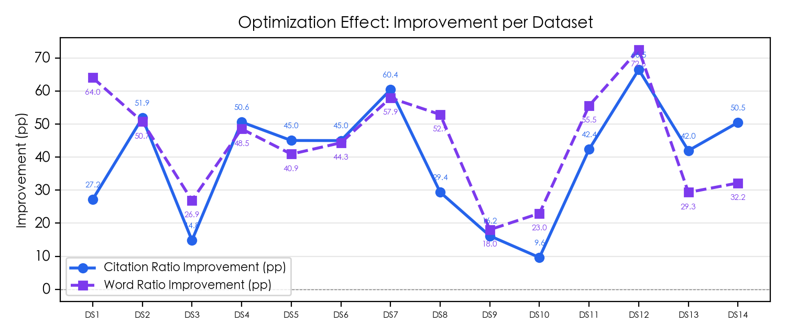

在默认基线口径下，14 组数据集的引用次数和字数占比全部获得正向提升。这说明优化系统的主要竞争力仍然来自内容扩充、结构重写和信息密度提升，而不是字符级技巧。

### 4.2 表现最强的样本

按当前图表使用的“引用提升 + 字数提升”综合排序，表现最强的 5 组是：

1. `DS12` 5G 辐射
2. `DS7` 转基因食品
3. `DS2` 激素与行为
4. `DS4` 记忆与学习
5. `DS11` 强制疫苗

这些样本的共同特征是原始文档普遍偏短、信息覆盖不完整，优化后能够明显扩大事实密度和论点覆盖面。

### 4.3 提升较低的样本

当前默认基线下，引用次数提升最低的几组是：

- `DS10` 监控与隐私：`+9.6pp`
- `DS3` 语言习得：`+14.8pp`
- `DS9` 动物实验：`+16.2pp`

这些主题更容易出现价值判断、伦理争议或多源综合回答，单篇优化文档即使更强，也不一定能像事实密集型主题那样形成压倒性引用优势。

---

## 五、关键发现

1. **内容优化本身有效，而且是主要因子。** 无论是否注入 ZWS，优化后的文档都显著强于 `before.md`。
2. **默认基线应当是 `after_nozws.md`。** 动态统计显示它在平均引用占比和字数占比上都略优于 Full-ZWS，同时稳定性也更好。
3. **ZWS 的历史“正收益”结论不再成立。** 旧报告中的正向均值来自手工数组；当前脚本直接读取真实评测产物后，结论变成了轻微负收益且高波动。
4. **多轮波动不可忽略。** 单次评测的数值不应被过度解读，尤其不能拿单轮结果去证明 ZWS 这类边际策略有效。

---

## 六、零宽字符消融实验

### 6.1 实验设计

在同一份优化内容上比较两种版本：

- **With ZWS**：`after.md`，在非空白字符间注入 U+200B
- **No ZWS**：`after_nozws.md`，不含零宽字符的纯文本基线

两者内容语义保持一致，差异只在于字符级注入方式。

### 6.2 引用次数占比对比

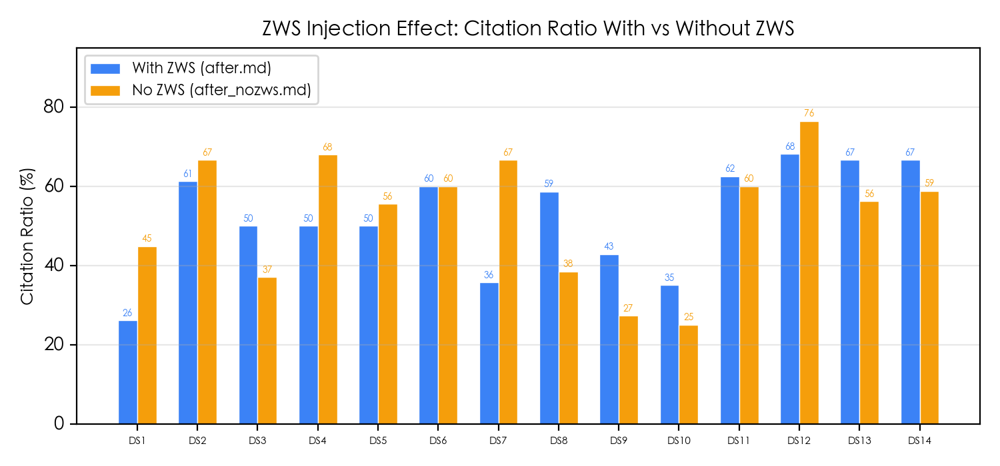

| 数据集 | With ZWS | No ZWS | 差值 |
|:--:|:--:|:--:|:--:|
| 1 | 26.1% | 44.8% | -18.7pp |
| 2 | 61.3% | 66.7% | -5.4pp |
| 3 | 50.0% | 37.0% | +13.0pp |
| 4 | 50.0% | 68.0% | -18.0pp |
| 5 | 50.0% | 55.6% | -5.6pp |
| 6 | 60.0% | 60.0% | +0.0pp |
| 7 | 35.7% | 66.7% | -31.0pp |
| 8 | 58.6% | 38.5% | +20.2pp |
| 9 | 42.9% | 27.3% | +15.6pp |
| 10 | 35.0% | 25.0% | +10.0pp |
| 11 | 62.5% | 60.0% | +2.5pp |
| 12 | 68.2% | 76.5% | -8.3pp |
| 13 | 66.7% | 56.2% | +10.4pp |
| 14 | 66.7% | 58.8% | +7.8pp |

### 6.3 净效应分析

| 指标 | With ZWS | No ZWS | ZWS 净效应 |
|------|:--:|:--:|:--:|
| 平均引用次数占比 | 52.4% | **52.9%** | **-0.5 pp** |
| 平均内容字数占比 | 61.9% | **62.7%** | **-0.8 pp** |
| 正效应数据集 | — | — | 7 / 14 |
| 负效应数据集 | — | — | 6 / 14 |
| 持平数据集 | — | — | 1 / 14 |

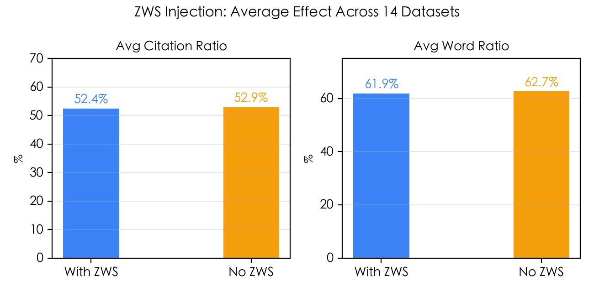

### 6.4 解释

当前真实结果和旧版报告的差异很关键：

- ZWS 并不是“平均正收益”，而是 **轻微负收益**。
- 正向和负向样本数量接近，但负向样本里存在更大的极端值，尤其是 `DS7 -31.0pp`、`DS1 -18.7pp`、`DS4 -18.0pp`。
- 正向样本主要集中在 `DS8`、`DS9`、`DS3`、`DS10`、`DS13` 等局部案例，但这些收益并不稳定。

结论上，**ZWS 目前更像高方差噪声源，而不是可依赖的边际增强手段**。

---

## 七、测试波动性分析

### 7.1 Full-ZWS 的跨轮波动

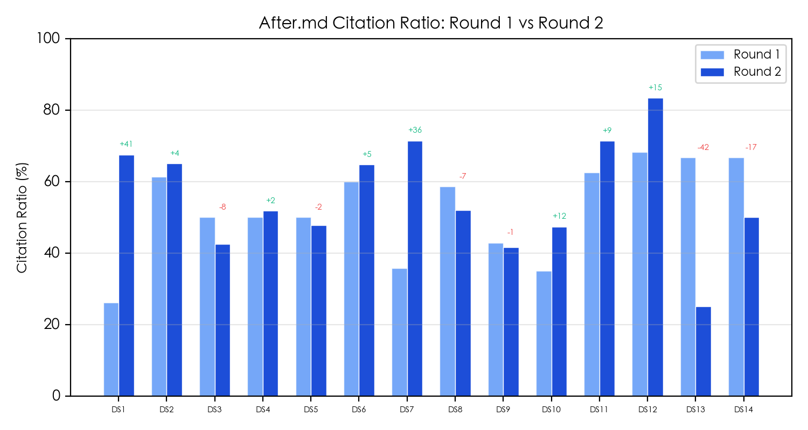

| 数据集 | 主题 | R1 引用率 | R2 引用率 | Δ |
|:--:|------|:--:|:--:|:--:|
| 1 | 认知与元认知 | 26.1% | 67.5% | +41.4pp |
| 2 | 激素与行为 | 61.3% | 65.0% | +3.7pp |
| 3 | 语言习得 | 50.0% | 42.4% | -7.6pp |
| 4 | 记忆与学习 | 50.0% | 51.9% | +1.9pp |
| 5 | AI 与失业 | 50.0% | 47.8% | -2.2pp |
| 6 | 基因编辑 | 60.0% | 64.7% | +4.7pp |
| 7 | 转基因食品 | 35.7% | 71.4% | +35.7pp |
| 8 | 核电争议 | 58.6% | 52.0% | -6.6pp |
| 9 | 动物实验 | 42.9% | 41.7% | -1.2pp |
| 10 | 监控与隐私 | 35.0% | 47.4% | +12.4pp |
| 11 | 强制疫苗 | 62.5% | 71.4% | +8.9pp |
| 12 | 5G 辐射 | 68.2% | 83.3% | +15.2pp |
| 13 | 加密货币 | 66.7% | 25.0% | -41.7pp |
| 14 | 元宇宙 | 66.7% | 50.0% | -16.7pp |

- Full-ZWS 平均绝对引用偏差：**14.3pp**
- Full-ZWS 引用偏差标准差：**20.5pp**
- Full-ZWS 最大绝对偏差：**41.7pp**

### 7.2 No-ZWS 基线的跨轮波动

| 数据集 | 主题 | R1 引用率 | R2 引用率 | Δ |
|:--:|------|:--:|:--:|:--:|
| 1 | 认知与元认知 | 44.8% | 39.1% | -5.7pp |
| 2 | 激素与行为 | 66.7% | 56.2% | -10.4pp |
| 3 | 语言习得 | 37.0% | 58.3% | +21.3pp |
| 4 | 记忆与学习 | 68.0% | 46.2% | -21.8pp |
| 5 | AI 与失业 | 55.6% | 68.8% | +13.2pp |
| 6 | 基因编辑 | 60.0% | 57.1% | -2.9pp |
| 7 | 转基因食品 | 66.7% | 46.2% | -20.5pp |
| 8 | 核电争议 | 38.5% | 63.3% | +24.9pp |
| 9 | 动物实验 | 27.3% | 18.2% | -9.1pp |
| 10 | 监控与隐私 | 25.0% | 0.0% | -25.0pp |
| 11 | 强制疫苗 | 60.0% | 54.5% | -5.5pp |
| 12 | 5G 辐射 | 76.5% | 63.6% | -12.8pp |
| 13 | 加密货币 | 56.2% | 50.0% | -6.2pp |
| 14 | 元宇宙 | 58.8% | 48.1% | -10.7pp |

- No-ZWS 平均绝对引用偏差：**13.6pp**
- No-ZWS 引用偏差标准差：**15.2pp**
- No-ZWS 最大绝对偏差：**25.0pp**

### 7.3 ZWS 效应的跨轮稳定性

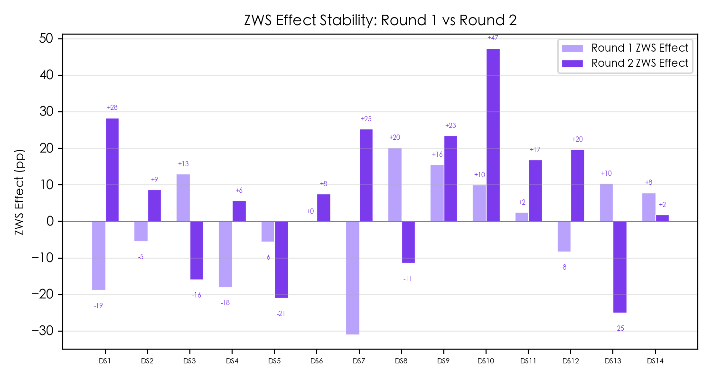

按当前动态统计结果，ZWS 效应的平均绝对引用偏差为 **25.3pp**，平均绝对字数偏差为 **18.1pp**，引用偏差标准差 **29.1pp**，最大引用偏差 **56.2pp**。这显著高于基础文档自身的跨轮波动。

| 指标       |  After.md  | After_nozws |   ZWS 效应   |
| -------- | :--------: | :---------: | :--------: |
| 平均绝对偏差   | **14.3pp** | **13.6pp**  | **25.3pp** |
| 平均绝对字数偏差 |   13.3pp   | **10.3pp**  | **18.1pp** |
| 标准差      |   20.5pp   | **15.2pp**  | **29.1pp** |
| 最大绝对偏差   |   41.7pp   | **25.0pp**  | **56.2pp** |
| 方向变化次数   |     —      |      —      |  **9/14**  |

结论很直接：

- `after_nozws.md` 不仅平均效果略好，而且 **稳定性也优于** `after.md`。
- ZWS 效应的方差太大，不适合被当作主策略。
- 单轮里看到的某些正向收益，极有可能只是推理路径扰动，而不是可复现信号。

---

## 八、语义级零宽字符注入优化

本节比较 DS1-DS5 上的三种策略：

- `Full-ZWS`：`after.md`
- `No-ZWS`：`after_nozws.md`
- `Salient-ZWS`：`after_salient.md`

### 8.1 三策略引用率对比

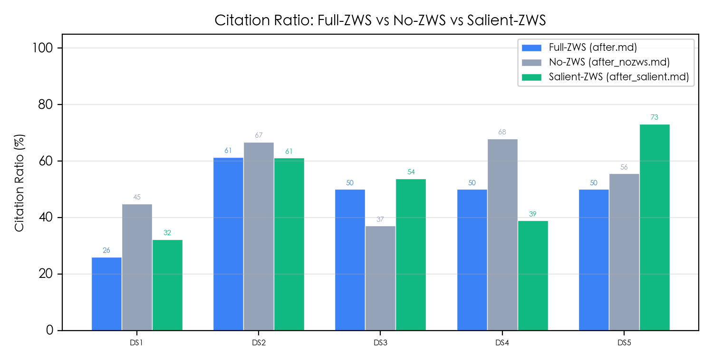

| 数据集 | Full-ZWS | No-ZWS | Salient-ZWS | Salient vs Full |
|:--:|:--:|:--:|:--:|:--:|
| 1 | 26.1% | 44.8% | 32.3% | +6.2pp |
| 2 | 61.3% | 66.7% | 61.1% | -0.2pp |
| 3 | 50.0% | 37.0% | 53.8% | +3.8pp |
| 4 | 50.0% | 68.0% | 38.9% | -11.1pp |
| 5 | 50.0% | 55.6% | 73.1% | +23.1pp |
| **平均** | **47.5%** | **54.4%** | **51.8%** | **+4.4pp** |

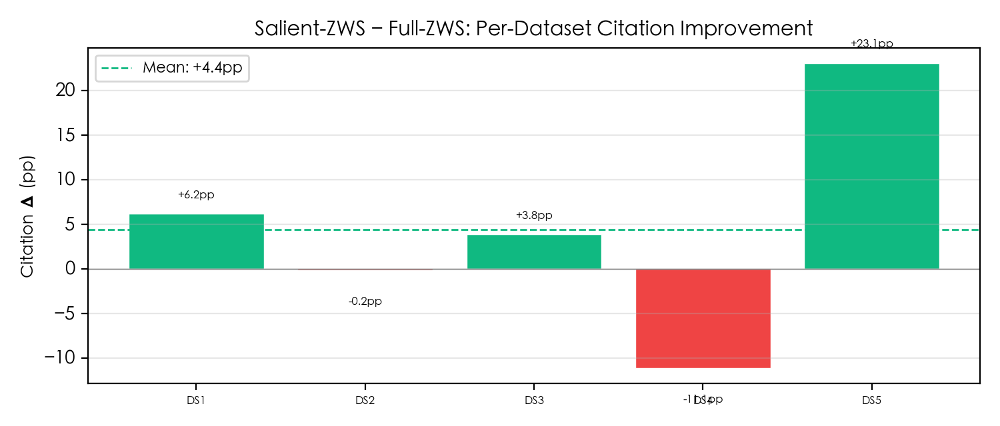

### 8.2 密度与效果关系

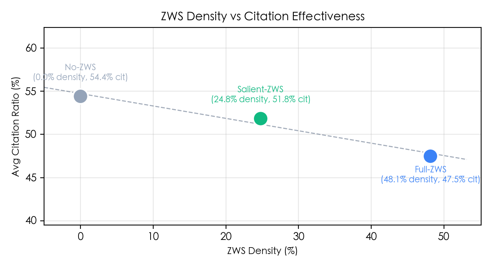

| 策略 | 平均 ZWS 密度 | 平均引用率 |
|------|:--:|:--:|
| No-ZWS | 0.0% | **54.4%** |
| Salient-ZWS | 24.8% | 51.8% |
| Full-ZWS | 48.1% | 47.5% |

这里的真实状态是：

- `Salient-ZWS` 明显优于 `Full-ZWS`，说明“低密度选择性注入”比全文注入更合理。
- 但 `No-ZWS` 仍然是 DS1-DS5 的最佳平均策略。
- 当前数据继续支持“**ZWS 密度越低，效果越稳**”这一判断。

因此，语义级注入可以保留为实验分支，但还不具备替代纯文本基线的证据。

---

## 九、内容级实验（两轮复测）

本节针对 4 组代表性样本做内容路线复测：

- `DS3` 语言习得
- `DS9` 动物实验
- `DS10` 监控与隐私
- `DS12` 5G 辐射

其中 `DS3`、`DS9`、`DS10` 代表默认基线提升较低的争议/综合型题目，`DS12` 用作高表现样本回归检查。与上一版不同，这里先用当前模型配置重新生成了这 4 组的 `after_nozws.md`，再重跑两轮 baseline 评测，因此本节的对比基线不再沿用旧产物。

### 9.1 两轮汇总结果

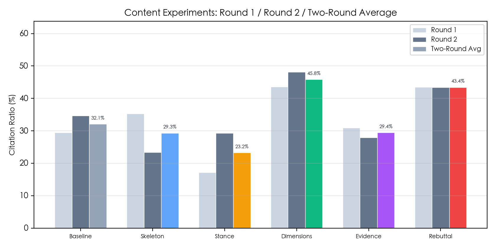

| 路线 | 对应文件 | R1 平均引用次数占比 | R2 平均引用次数占比 | 两轮平均引用次数占比 | 两轮平均引用内容字数占比 | 相对默认基线 | 平均绝对引用偏差 |
|------|------|:--:|:--:|:--:|:--:|:--:|:--:|
| 默认基线 | `after_nozws.md` | 29.4% | 34.7% | 32.1% | 47.8% | +0.0pp | 5.2pp |
| Path 1 Skeleton | `after_skeleton.md` | 35.3% | 23.3% | 29.3% | 46.1% | -2.8pp | 21.4pp |
| Path 2 Stance | `after_stance.md` | 17.2% | 29.2% | 23.2% | 33.6% | -8.8pp | 19.0pp |
| Path 3 Dimensions | `after_dimensions.md` | 43.5% | 48.1% | 45.8% | 69.7% | +13.8pp | 6.0pp |
| Path 4 Evidence | `after_evidence.md` | 30.9% | 27.9% | 29.4% | 51.5% | -2.6pp | 4.6pp |
| Path 5 Rebuttal | `after_rebuttal.md` | 43.5% | 43.4% | 43.4% | 59.0% | +11.4pp | 7.7pp |

在新基线口径下，`dimensions` 和 `rebuttal` 的优势被进一步放大。`dimensions` 的两轮平均引用次数占比达到 `45.8%`，相对默认基线 `+13.8pp`；`rebuttal` 达到 `43.4%`，相对默认基线 `+11.4pp`。相对地，`skeleton`、`stance`、`evidence` 都低于新基线，其中 `evidence` 虽然字数占比不差，但引用次数均值仍落后。

### 9.2 分数据集净变化

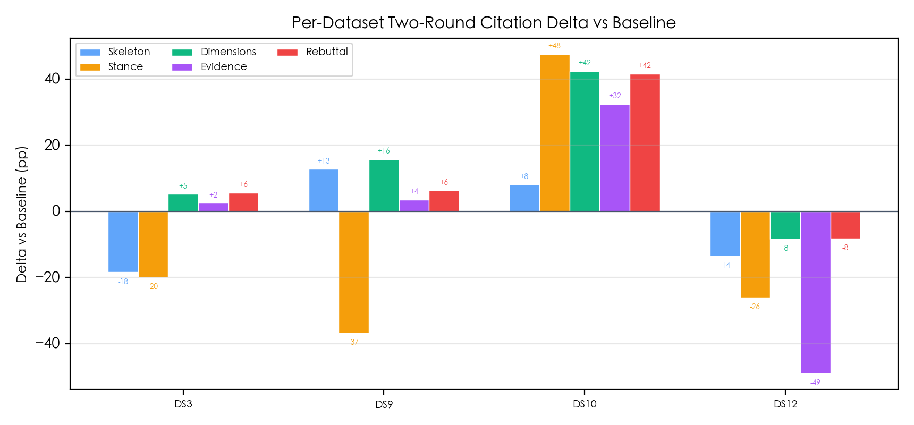

| 路线                |   DS3   |   DS9   |  DS10   |  DS12   |
| ----------------- | :-----: | :-----: | :-----: | :-----: |
| Path 1 Skeleton   | -18.4pp | +12.8pp | +8.1pp  | -13.6pp |
| Path 2 Stance     | -20.0pp | -36.9pp | +47.6pp | -26.1pp |
| Path 3 Dimensions | +5.3pp  | +15.7pp | +42.5pp | -8.4pp  |
| Path 4 Evidence   | +2.5pp  | +3.5pp  | +32.5pp | -49.0pp |
| Path 5 Rebuttal   | +5.6pp  | +6.3pp  | +41.6pp | -8.2pp  |

基线重跑后，分数据集格局也比上一版更可信：

- `DS3` 不再出现“dimensions/rebuttal 低于基线”的假象，反而都转成了小幅正收益，分别是 `+5.3pp` 和 `+5.6pp`。
- `DS10` 仍然是内容路线最容易打穿基线的样本，`dimensions` 和 `rebuttal` 分别达到 `+42.5pp` 和 `+41.6pp`。
- `DS12` 依旧是高表现回归样本，所有路线都低于默认基线，但 `dimensions` 和 `rebuttal` 的回退已经收敛到 `-8pp` 级别，明显好于 `evidence`、`stance` 和 `skeleton`。
- `DS9` 的信号也更清晰：`dimensions` 和 `rebuttal` 继续正向，但 `stance` 变成了显著负收益，说明它并不是可靠的争议题模板。

### 9.3 稳定性补充

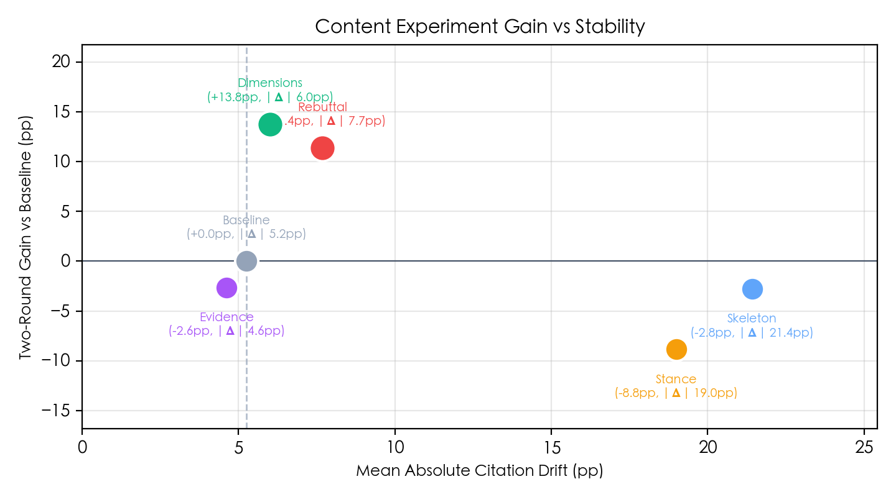

| 路线 | 平均绝对引用偏差 | 最大绝对引用偏差 | 平均绝对字数偏差 |
|------|:--:|:--:|:--:|
| 默认基线 | 5.2pp | 10.5pp | 8.6pp |
| Path 1 Skeleton | 21.4pp | 35.5pp | 22.2pp |
| Path 2 Stance | 19.0pp | 32.4pp | 26.8pp |
| Path 3 Dimensions | 6.0pp | 12.2pp | 19.5pp |
| Path 4 Evidence | 4.6pp | 12.5pp | 8.6pp |
| Path 5 Rebuttal | 7.7pp | 15.6pp | 9.2pp |

重跑后的 baseline 自身波动已经降到 `5.2pp`，这让稳定性判断更严格也更有意义：

- `dimensions` 虽然略高于 baseline 的偏差，但仍处在可接受区间，而且换来了显著更高的均值。
- `rebuttal` 的波动略大于 `dimensions`，但整体仍然稳定，且收益足够明显。
- `evidence` 的稳定性最好之一，但均值收益不足，说明它更像保守替代而不是最优路线。
- `skeleton` 和 `stance` 的波动远高于 baseline，风险过大。

### 9.4 当前判断

这轮在“新生成 baseline + 双轮复测”口径下，结论比上一版更明确：

- `dimensions` 已经是当前最强内容路线候选；`rebuttal` 仍然是次优但明确有效的备选分支。
- `skeleton`、`stance`、`evidence` 不再适合作为默认路线候选，其中 `stance` 的不稳定性和 `evidence` 的收益不足都已经比较明确。
- 不过这里仍然只是 4 组代表性样本，不是全量 14 组切换验证。因此，默认主基线暂时仍保持 `after_nozws.md`，但下一步最合理的动作已经从“继续并行试五条路线”收敛成“优先扩大 `dimensions`，其次保留 `rebuttal`”。

---

## 十、正文长度带宽实验（Curated 数据集）

本节把范围锁定在 `rebuttal` 家族里的中长文宽区间，只比较三档：

- `after_rebuttal.md`：中等长度，3 题平均约 `5454` 字符
- `after_rebuttal_extended.md`：中长文，3 题平均约 `6955` 字符
- `after_rebuttal_ultra.md`：超长文，3 题平均约 `13080` 字符

数据来源为 `data.md` 物化出的 `DS101-DS103`，并使用模拟器结果文件：

- `outputs/simulator_length_summary_rebuttal_curated_with_ultra.json`
- `outputs/simulator_length_summary_rebuttal_curated_with_ultra_r2.json`

这一节的目的不是重做路线选择，而是在当前 `rebuttal` 方向内确认正文长度带宽。

### 10.1 两轮统计图

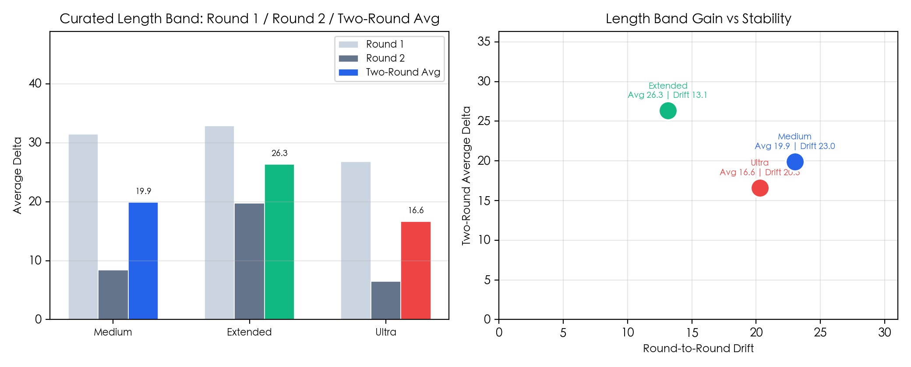

图中左侧展示三档在 `Round 1 / Round 2 / 两轮均值` 下的平均 `delta`，右侧展示“收益 vs 跨轮漂移”。这里的漂移定义为两轮平均 `delta` 的绝对差值，越小表示稳定性越好。

### 10.2 两轮汇总表

| 档位 | 对应文件 | 平均长度 | R1 平均 `delta` | R2 平均 `delta` | 两轮平均 `delta` | 跨轮漂移 |
|------|------|:--:|:--:|:--:|:--:|:--:|
| Medium | `after_rebuttal.md` | 5454 | +31.44 | +8.41 | +19.92 | 23.03 |
| Extended | `after_rebuttal_extended.md` | 6955 | +32.90 | +19.76 | +26.33 | 13.15 |
| Ultra | `after_rebuttal_ultra.md` | 13080 | +26.75 | +6.47 | +16.61 | 20.29 |

从这两轮结果看，`extended` 已经成为当前最优的中长文宽区间档位：它在第一轮和第二轮都高于 `ultra`，而且两轮平均收益最高，跨轮漂移也最小。`medium` 虽然第一轮和 `extended` 接近，但第二轮回落更明显，因此目前更像可用备选，而不是最优默认长度。

### 10.3 分题信号

- `DS102` 对三档长度都给出大幅正收益，说明这题主要由“从极低基线翻盘”主导，对长度上限的区分能力有限。
- `DS101` 对 `medium` 和 `extended` 都持续正向，但 `ultra` 始终偏弱，说明单纯拉长到 `1w+` 并没有继续增益。
- `DS103` 是当前最关键的约束样本：第二轮里 `medium` 为 `-2.22`，`extended` 为 `-10.08`，`ultra` 直接掉到 `-41.44`，显示超长文在争议题上存在更高的尾部风险。

### 10.4 当前判断

- 正文长度不应继续向 `1w+` 扩张，`ultra` 已经可以从默认候选中降级。
- 当前最值得继续验证的带宽是约 `5.5k-7.0k` 字符，也就是 `medium` 到 `extended` 之间。
- 如果只保留一个默认长度候选，现阶段应优先保留 `extended`；如果要保留一个更稳的对照档，则是 `medium`。

---

## 十一、结论

基于当前仓库的真实动态统计结果，可以得出以下结论：

- 主优化流程本身是有效的。默认基线 `after_nozws.md` 将平均引用次数占比从 **13.6%** 提升到 **52.9%**，将平均引用内容字数占比从 **18.6%** 提升到 **62.7%**。
- `after_nozws.md` 应该作为默认主基线。它不仅比 `after.md` 略强，而且跨轮波动更小。
- Full-ZWS 的平均净效应为 **-0.5pp 引用占比**、**-0.8pp 字数占比**，不支持“平均正收益”的旧结论。
- ZWS 效应的统计稳定性很差，跨轮方向变化达到 **9/14**，说明它更像高方差扰动，而不是可靠的优化手段。
- 在 DS1-DS5 上，`Salient-ZWS` 相比 `Full-ZWS` 有 **+4.4pp** 的平均改进，但仍未超过 `No-ZWS`。
- 本次只对 `DS3/DS9/DS10/DS12` 的 baseline 做了“重生成 + 双轮重测”。因此，第九节的内容路线结论已经切到新基线口径，而第二节到第八节的 14 组总体统计仍然代表仓库当前已有的全量评测产物。
- 在 4 组代表性样本上重生成 baseline 并完成双轮复测后，`dimensions` 已经成为最强内容路线候选：两轮平均引用次数占比 `45.8%`，相对新 baseline `+13.8pp`；`rebuttal` 排名第二，达到 `+11.4pp`。
- 在 `DS101-DS103` 的 `rebuttal` 长度带宽实验中，`extended` 两轮平均 `delta` 为 `+26.33`，高于 `medium` 的 `+19.92` 和 `ultra` 的 `+16.61`，目前最优长度带宽收敛到约 `5.5k-7.0k` 字符。
- 现阶段最稳妥的产品化方向仍然是：**默认主流程暂时保持 `after_nozws.md`，同时优先把 `dimensions` 扩展到更大样本面继续验证，把 `rebuttal` 作为次优分支保留；在 `rebuttal` 分支内，正文长度先锁定在 `medium-extended` 区间，并把 `ultra` 降级为实验性长度分支**。

---

*报告图表由 `generate_charts.py`、`generate_zws_charts.py`、`generate_volatility_charts.py`、`generate_content_experiment_charts.py`、`generate_length_band_charts.py` 和 `chart_salient_comparison.py` 动态生成；原始数据来自 `outputs/datasets/` 下的 `test_*.md` 评测结果，以及 `outputs/simulator_length_summary_rebuttal_curated_with_ultra*.json` 长度实验汇总文件。*