# GEO+ 新路线实验报告（Report 3）

> 刷新日期：2026-05-14
>
> 目标：记录 `frontload_rebuttal`、`novelty_gap`、`superset_guarded` 三条新路线的当前试验结果，评估它们是否值得进入下一轮主路线竞争。
>
> 当前口径：沿用比赛方澄清后的 simulator 设置，三项客观分统一按中文“字数占比”理解，并对当前回答中所有引用得分做归一化。

---

## 一、实验目的

当前仓库已经确认旧内容路线中：

- `after_rebuttal` 是主路线最强候选
- `after_rebuttal_extended` 是长度带宽中的更优区间

但这仍然不能回答一个更重要的问题：除了继续微调旧路线，是否存在新的结构化路线，能够通过更早抢位、制造独占引用、控制超集扩写，拿到更高且更稳的最终增益。

本报告聚焦三条新路线：

1. `frontload_rebuttal`：把高权重判断句、边界句和校正式表达前置到文档开头，优先争夺回答前半段引用位。
2. `novelty_gap`：主动比较目标文档、其余候选文档与联网资料，提炼其他文档未充分覆盖的新增信息，尝试制造独占引用。
3. `superset_guarded`：延续“联网超集文本”思路，但主动过滤低价值重复内容，只保留高价值补洞与可直接引用的判断句。

---

## 二、实验口径

本轮结果统一基于当前仓库里的新路线生成链与 simulator 汇总链：

- 生成入口：`competition/src/geoplus/pipeline/main.py`
- 评测规格：`competition/src/geoplus/evaluation/specs.py`
- simulator 汇总：`competition/scripts/simulator/compare_variants.py`
- 首轮主 summary：`competition/outputs/report3_391012_variant_summary.json`
- `Round 2` summary：`competition/outputs/report3_top2_r2_summary.json`

报告关注的主指标：

1. `avg_after_total`：优化后总分
2. `avg_delta`：相对优化前的总分增量
3. `avg_objective_delta`：客观分增量
4. `avg_ai_delta`：AI 可见性分增量
5. `win_rate`：相对优化前的正向胜率

标准对比集统一使用 `DS3,9,10,12`。

---

## 三、当前进度快照

截至本版报告落盘时，三条新路线已经全部补齐 `DS3,9,10,12` 的首轮生成与 simulator 对比；其中领先的两条路线也已经完成一轮额外的稳定性复验。

### 3.1 四题首轮总表

| 路线 | After Total | Delta | Objective Δ | AI Δ | Win Rate |
|------|:--:|:--:|:--:|:--:|:--:|
| `after_superset_guarded` | **75.28** | **+28.02** | **+36.32** | 19.71 | **100%** |
| `after_novelty_gap` | 74.14 | +26.88 | +32.69 | **21.07** | **100%** |
| `after_frontload_rebuttal` | 71.49 | +24.23 | +27.39 | **21.07** | **100%** |

首轮口径下，`superset_guarded` 是当前均值第一路线；但 `novelty_gap` 的差距很小，而 `frontload_rebuttal` 依然保持四题全正增益。

### 3.2 首轮分数据集增量对比

| 数据集 | `after_frontload_rebuttal` | `after_novelty_gap` | `after_superset_guarded` |
|------|:--:|:--:|:--:|
| `DS3` | +15.87 | **+17.67** | +11.74 |
| `DS9` | +30.64 | +30.08 | **+38.63** |
| `DS10` | **+36.33** | +35.67 | +25.92 |
| `DS12` | +14.10 | +24.11 | **+35.77** |

这个拆解说明三条路线的优势区间并不完全一致：

- `superset_guarded` 在 `DS9` 和 `DS12` 上明显领先。
- `novelty_gap` 在 `DS3` 上最好，并且在 `DS10` 上与 `frontload_rebuttal` 非常接近。
- `frontload_rebuttal` 在 `DS10` 上仍然是当前第一，说明前半段抢位仍然是有效模块。

### 3.3 Top 2 的 `Round 2` 稳定性复验

| 路线 | Round 2 After Total | Round 2 Delta | Round 2 Objective Δ | Round 2 AI Δ | Win Rate |
|------|:--:|:--:|:--:|:--:|:--:|
| `after_novelty_gap` | **74.48** | **+25.89** | **+33.39** | **+18.39** | **100%** |
| `after_superset_guarded` | 73.14 | +24.56 | +30.76 | 18.36 | **100%** |

把两轮合起来看，排序开始发生变化：

- `after_novelty_gap` 的两轮平均 `avg_delta` 约为 **+26.39**，轮间漂移约 **0.99**。
- `after_superset_guarded` 的两轮平均 `avg_delta` 约为 **+26.29**，轮间漂移约 **3.46**。

这意味着：如果只看首轮爆发力，`superset_guarded` 领先；如果把稳定性一起纳入，`novelty_gap` 已经以极小优势反超。

---

## 四、图表

以下图表由 `competition/scripts/charts/generate_report3_charts.py` 生成。

### 4.1 四题首轮增量拆解

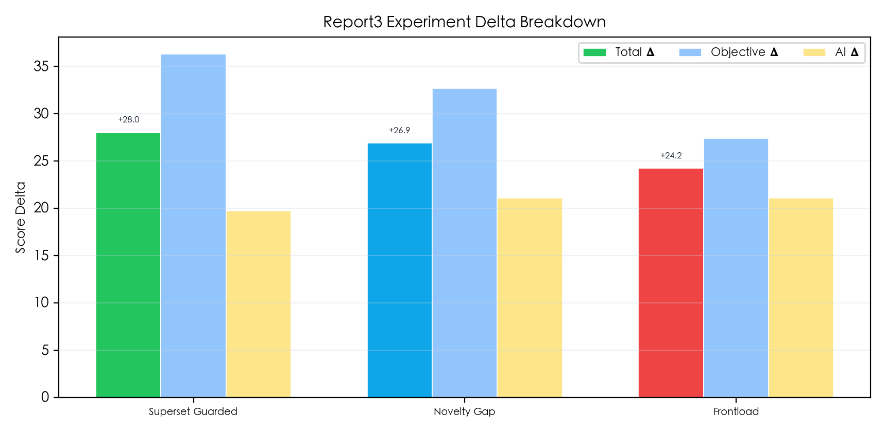

### 4.2 四题首轮优化后总分对比

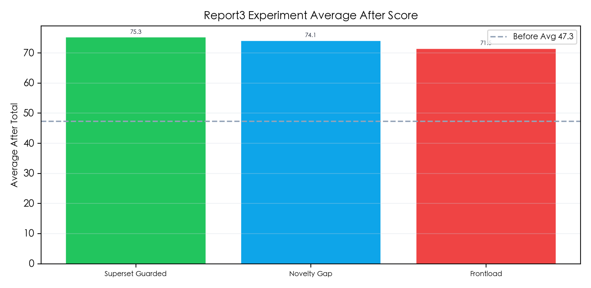

### 4.3 四题首轮分数据集增量对比

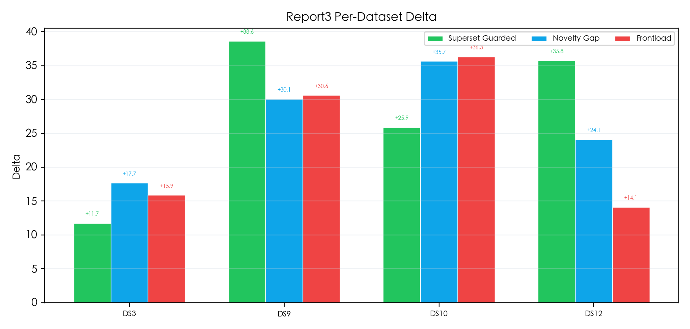

### 4.4 Top 2 的 Round 2 增量拆解

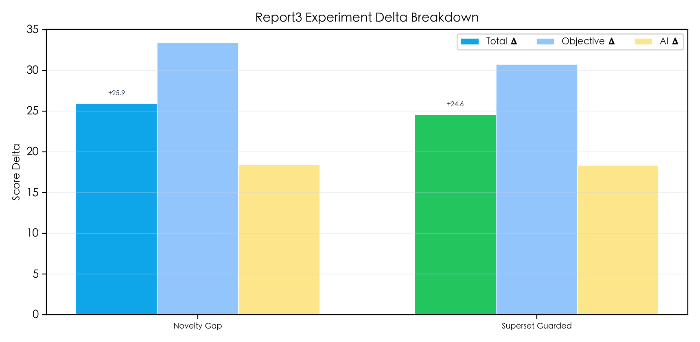

### 4.5 Top 2 的 Round 2 优化后总分对比

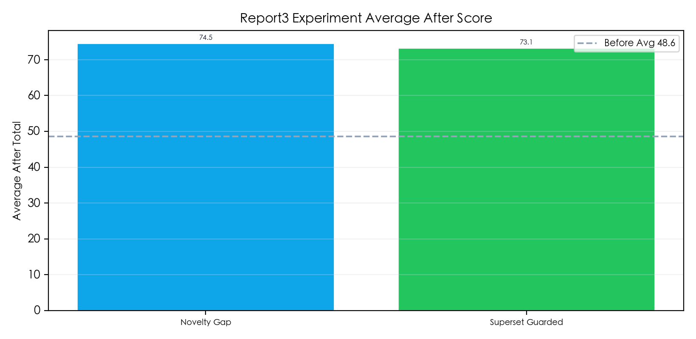

### 4.6 Top 2 的 Round 2 分数据集增量对比

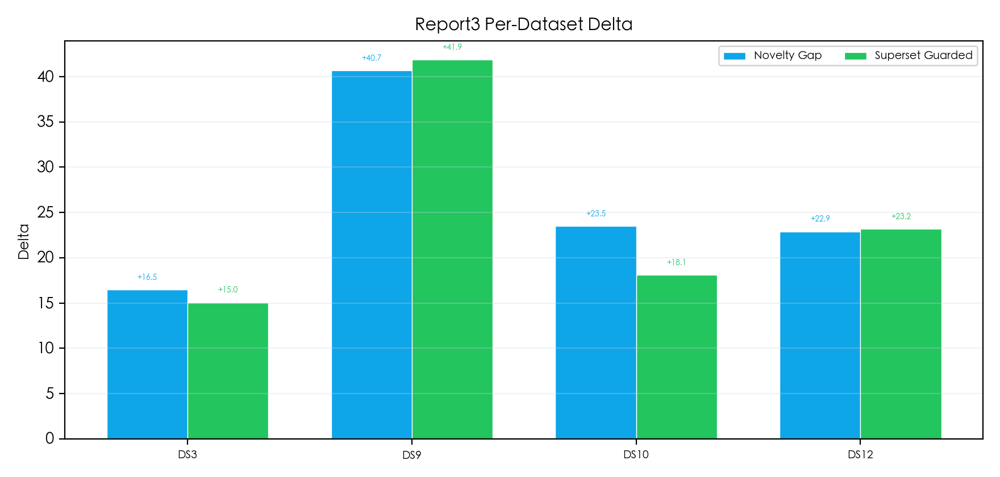

---

## 五、阶段性判断

基于当前两轮可见结果，可以先记录五个阶段性判断：

1. `superset_guarded` 是当前首轮爆发力最强的路线，因为它拿到了最高首轮 `avg_after_total`、最高首轮 `avg_delta` 和最高首轮 `avg_objective_delta`。
2. `novelty_gap` 是当前稳定性更好的路线。它在 `Round 2` 中反超，并且两轮平均增益略高于 `superset_guarded`。
3. `frontload_rebuttal` 当前不再是主冠军候选，但它在 `DS10` 上仍是第一，说明“前置高权重判断句”更适合作为可叠加模块，而不是单独终局路线。
4. 两条领先路线的 `win_rate` 在两轮里都保持 `100%`，说明问题已经不是“路线有没有用”，而是“该优先要更高峰值还是更高稳定性”。
5. 当前最合理的工程判断不是立即淘汰 `superset_guarded`，而是把 `novelty_gap` 视为更稳的默认候选，把 `superset_guarded` 视为高上限路线继续优化。

---

## 六、Curated 补充实验（DS101,102,103）

这组补充实验在上轮 cleaned-prompt 复验的基础上，继续追加一条新组合路线：`after_novelty_gap_rebuttal_extended`。它不引入新的 prompt 分支，只把 `novelty_gap` 的检索链与 `rebuttal_extended` 的成稿/QA 风格拼在一起，目的是单独验证“novelty 检索 + rebuttal extended 写法”是否能稳定抬升整体表现。

- summary：`competition/outputs/report3_curated_101102103_summary.json`
- 对照组：`after_novelty_gap`、`after_novelty_gap_rebuttal_extended`、`after_superset_guarded`、`after_rebuttal_extended`

### 6.1 Curated 总表

| 路线                                    | After Total |   Delta    | Objective Δ |   AI Δ    | Win Rate |
| ------------------------------------- | :---------: | :--------: | :---------: | :-------: | :------: |
| `after_superset_guarded`              |  **71.97**  | **+25.45** | **+30.28**  | **20.62** | **100%** |
| `after_novelty_gap`                   |    70.86    |   +24.35   |   +28.79    |   19.90   | **100%** |
| `after_novelty_gap_rebuttal_extended` |    70.82    |   +24.30   |   +29.37    |   19.24   | **100%** |
| `after_rebuttal_extended`             |    61.89    |   +15.38   |   +11.18    |   19.57   | **100%** |
| `after_frontload_novelty_guarded`     |    60.33    |   +13.81   |    +6.49    |   21.14   |  66.7%   |

从均值看，这次追加验证最关键的信号有两个：第一，`after_novelty_gap_rebuttal_extended` 确实跑进了第一梯队，但它与 `after_novelty_gap` 基本打平，`avg_after_total` 只差 **0.04**，`avg_delta` 也只差 **0.04**；第二，本轮 `after_superset_guarded` 反而以 **71.97 / +25.45** 冲到第一，说明 curated 阶段的路线排序仍然存在明显波动，不能只凭上一轮结果就把它彻底判死。

### 6.2 Curated 分数据集增量对比

| 数据集 | `after_frontload_novelty_guarded` | `after_novelty_gap` | `after_novelty_gap_rebuttal_extended` | `after_superset_guarded` | `after_rebuttal_extended` |
|------|:--:|:--:|:--:|:--:|:--:|
| `DS101` | -10.55 | +17.72 | +15.56 | +20.14 | **+24.87** |
| `DS102` | +23.01 | **+33.89** | +23.33 | +30.02 | +16.36 |
| `DS103` | +28.99 | +21.43 | **+34.02** | +26.19 | +4.90 |

这组拆解说明：

- 新组合路线 `after_novelty_gap_rebuttal_extended` 的价值主要体现在 `DS103`，它拿到全组单题最高的 **+34.02**，明显强于纯 `novelty_gap` 的 **+21.43**。
- 但在 `DS101` 和 `DS102` 上，新组合路线都没能超过纯 `after_novelty_gap`，因此它更像是“偏向某类题型的增强版”，而不是已被证明更稳的全面替代。
- `after_rebuttal_extended` 仍然保持 `DS101` 最强，说明 rebuttal 写法对“先纠正常见误判”的题目仍有很强爆发力。
- `after_frontload_novelty_guarded` 在这一轮出现了 `DS101 -10.55` 的回撤，说明前置式组合路线目前仍有明显题型风险。
- `after_superset_guarded` 这次三题全正且均值第一，和上一轮的失稳表现相反，进一步说明它不是简单的“必然失稳路线”，而是高波动路线。

### 6.3 Curated 图表

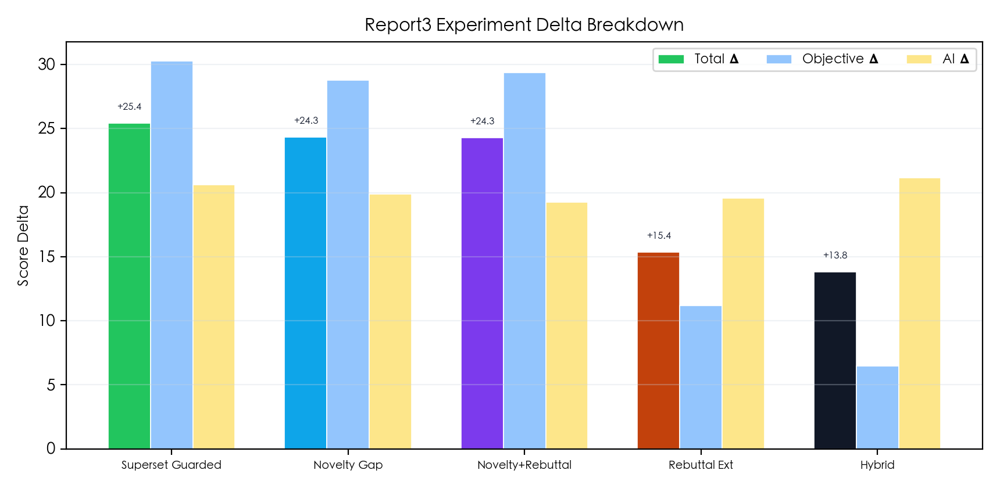

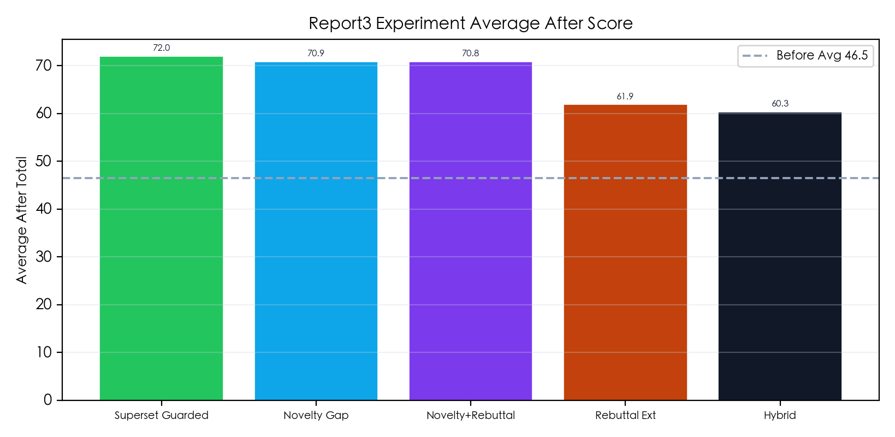

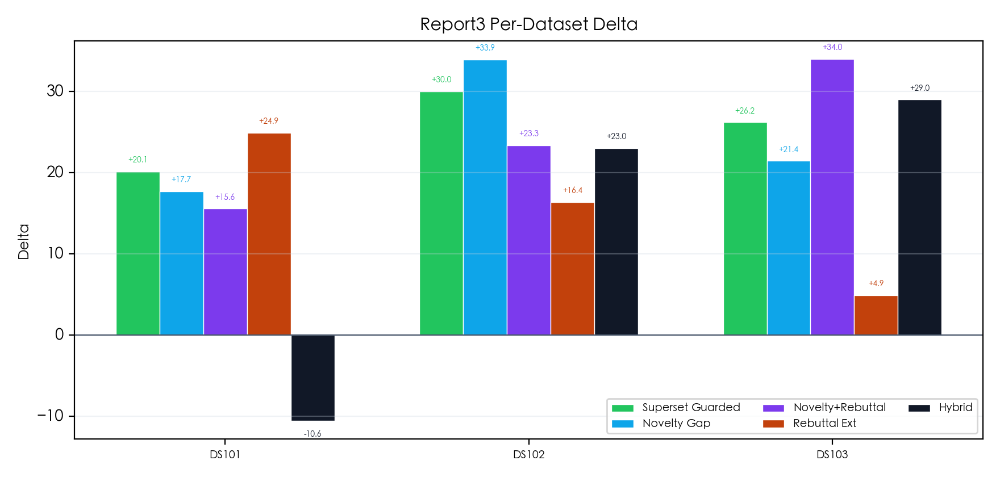

### 6.4 Curated 阶段性判断

1. `after_novelty_gap_rebuttal_extended` 的追加验证是有效的，因为它没有掉出第一梯队，而是几乎贴着 `after_novelty_gap` 跑完全程，证明“novelty 检索 + rebuttal extended 写法”确实能形成可用组合。
2. 但当前证据同样说明，这条新组合路线还不能直接取代 `after_novelty_gap`。它的优势主要集中在 `DS103`，而在 `DS101`、`DS102` 上没有建立稳定领先。
3. `after_superset_guarded` 本轮重新冲到第一，和上一轮的尾部失稳形成强反差，因此更准确的判断不是“它不行”，而是“它的方差目前最高，必须用更多题目继续确认”。
4. `after_rebuttal_extended` 依然是强题型化模块，尤其适合需要先拆误解、再下边界判断的问题。
5. `after_frontload_novelty_guarded` 在首轮 curated 结果里出现了明显回撤，但结合后续异常样本复跑，现阶段更准确的判断是它属于高波动候选，而不是已经被证伪的方向。

### 6.5 异常样本复跑

为确认负优化是否稳定复现，本轮只对异常链路做了定点 simulator 复跑：

- focused summary：`competition/outputs/report3_curated_anomaly_rerun_summary.json`
- answer traces：`competition/outputs/report3_curated_anomaly_rerun_summary_answers/`

| 路线 | `DS101` Delta | `DS103` Delta | Avg Delta | Objective Δ | AI Δ | Win Rate |
|------|:--:|:--:|:--:|:--:|:--:|:--:|
| `after_frontload_novelty_guarded` | +7.22 | +12.94 | **+10.08** | +9.80 | +10.36 | **100%** |
| `after_superset_guarded` | +9.97 | +3.91 | +6.94 | +4.95 | +8.93 | **100%** |

这次复跑给出三个更重要的信号：

- `after_frontload_novelty_guarded` 在 `DS101` 上的负优化没有复现，而是从首轮的 `-10.55` 翻到本轮的 `+7.22`，说明之前那次负分不能直接当作稳定题型失败。
- `after_superset_guarded` 在 `DS103` 上这次仍然保持正增益 `+3.91`，但它的 `objective_delta` 为 `-5.04`、`ai_delta` 为 `+12.86`，说明主客观评分之间的波动依然存在。
- 两条路线在 focused rerun 里都变成 `100%` 正增益，因此当前更可信的工程判断是：curated 阶段确实存在明显 simulator 方差，单次异常结果更适合拿来做复核，而不是直接拿来淘汰路线。

### 6.6 自然化与 No-ZWS 隐形融入复验（3 Rounds）

这轮复验专门回答两个新问题：

1. 把 `novelty_gap` 的高价值增量保留下来，但把开头判断清单和显性结构感弱化，改成更自然的连续论述后，是否会更稳。
2. 在尽量保留 `after_nozws` 原骨架的前提下，把已证明有效的多种优化信号隐形融入正文，是否会优于原始 `after_nozws`。

本轮统一对 5 条路线在 `DS101,102,103` 上跑 3 轮 simulator：

- Round 1：`competition/outputs/report3_curated_naturalized_r1_summary.json`
- Round 2：`competition/outputs/report3_curated_naturalized_r2_summary.json`
- Round 3：`competition/outputs/report3_curated_naturalized_r3_summary.json`
- 3-round 聚合 summary：`competition/outputs/report3_curated_naturalized_3round_summary.json`
- charts：`competition/outputs/charts/report3_curated_naturalized_3round_*.png`

### 6.6.1 三轮均值总表

| 路线 | 3-Round After Total | 3-Round Delta | Objective Δ | AI Δ | Win Rate | Delta Range |
|------|:--:|:--:|:--:|:--:|:--:|:--:|
| `after_novelty_gap` | **67.19** | **+19.64** | **+21.83** | **17.44** | **100%** | **3.39** |
| `after_novelty_gap_naturalized` | 66.71 | +19.16 | +21.07 | 17.24 | **100%** | 10.87 |
| `after_novelty_gap_rebuttal_extended` | 62.14 | +14.59 | +20.75 | 8.43 | 88.9% | 32.65 |
| `after_nozws_implicit_bestof` | 59.05 | +11.49 | 6.49 | 16.49 | 77.8% | 4.65 |
| `after_nozws` | 57.19 | +9.64 | 7.21 | 12.06 | 77.8% | 7.53 |

这里最关键的信号有三个：

- 在 3 轮均值口径下，`after_novelty_gap` 仍然是这组实验里最稳的默认路线。它的 `avg_delta` 最高，同时 `delta_range` 也是全组最小。
- `after_novelty_gap_naturalized` 没有跑崩，反而保持了 `100%` 胜率，并把均值差距压到只比 `after_novelty_gap` 低 **0.48**；但它的波动区间明显更大，因此还不能说“自然化写法已经优于现有显性结构”。
- `after_nozws_implicit_bestof` 的三轮均值确实高于原始 `after_nozws`，说明 “No-ZWS 原骨架 + 隐形吸收已验证优化” 这条方向是成立的；但它的整体强度仍明显低于 `novelty_gap` 系列，而且 `DS101` 平均仍是负增益。

### 6.6.2 两组关键对照

| 数据集 | `after_novelty_gap` | `after_novelty_gap_naturalized` | `after_nozws` | `after_nozws_implicit_bestof` |
|------|:--:|:--:|:--:|:--:|
| `DS101` | +9.79 | **+15.58** | **+6.42** | -2.16 |
| `DS102` | **+26.55** | +20.39 | +14.33 | **+20.27** |
| `DS103` | **+22.57** | +21.49 | +8.16 | **+16.36** |

这个拆解说明：

- 假设 A 没有被完全证实。`after_novelty_gap_naturalized` 在 `DS101` 上确实优于原始 `after_novelty_gap`，说明“把判断句融入正常论述”并非天然吃亏；但它在 `DS102`、`DS103` 上都没能反超，而且整体波动更大。
- 假设 B 只得到部分证实。`after_nozws_implicit_bestof` 在 `DS102`、`DS103` 上明显优于原始 `after_nozws`，三轮均值也高出 **+1.85**，同时 `delta_range` 更小；但它在 `DS101` 上连续两轮为负，三轮均值仍是 `-2.16`，说明“保留原骨架”并没有自动解决题型风险。
- 就“是否值得继续保留”为工程判断而言，两条新路线都证明了自己不是无效方向；但就“是否已经足够好到替换原主线”而言，两条路线当前都还没有达到这个标准。

### 6.6.3 图表

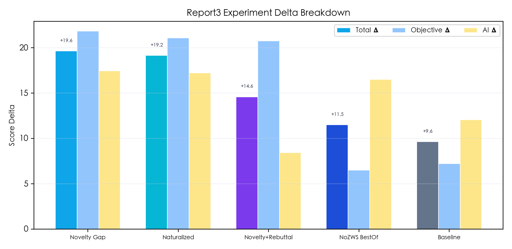

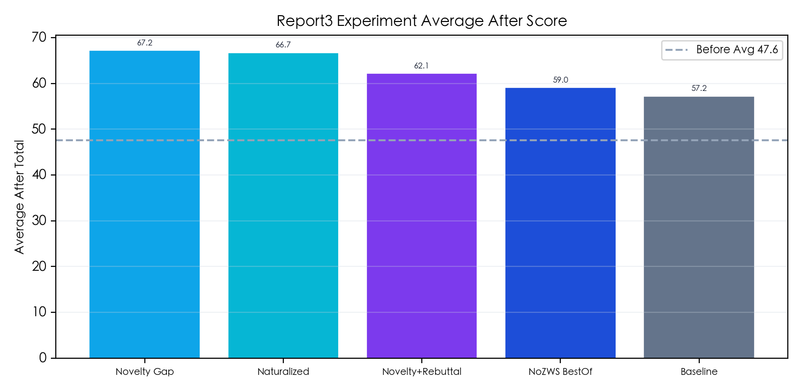

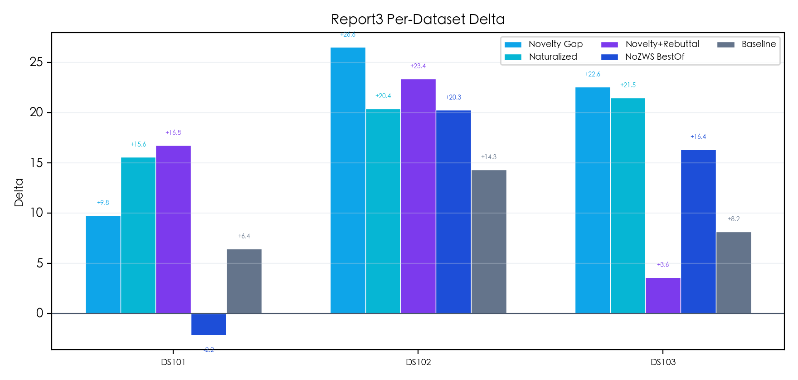

### 6.6.4 文本与 answer trace 复盘

从文档本体和 simulator answer traces 看，两个新方向都实现了预期的写法差异：

- `after_novelty_gap_naturalized` 的正文确实去掉了开头判断清单，只保留少量与问题直接相关的小标题，并把限制条件、阈值和边界句融入连续论述。
- `after_nozws_implicit_bestof` 也确实保住了 `after_nozws` 式的“概念辨析 + 长综述 + 问答”骨架，而不是简单换一个标题皮肤。
- 但 `DS101 + after_nozws_implicit_bestof` 的 answer traces 连续显示：它的 `ai_delta` 并不低，真正掉分的是 `objective_delta`，说明问题更像“目标文档的可见性和前半段占位仍然不够强”，而不是文本可读性不够。
- `after_novelty_gap_rebuttal_extended` 在 `DS103` 上出现了典型高波动：Round 1 为 `+27.63`，Round 2 直接翻到 `-41.58`，Round 3 又回到 `+24.77`。结合 answer trace，Round 2 的回答本身仍然是正常、成型、同题的论述，而不是明显坏文，因此更像 simulator 可见性/引用链路的强波动，而不是路线已经稳定失效。

### 6.6.5 当前阶段判断

1. 当前最稳的 curated 默认路线仍然是 `after_novelty_gap`。三轮均值第一、三轮全正、波动最小，这三个条件同时满足。
2. `after_novelty_gap_naturalized` 证明了“自然化写法”是可行的，但还没有证明它比当前显性 `novelty_gap` 更优。更准确的判断是：它已经成为值得继续保留的风格化分支，而不是主线替代者。
3. `after_nozws_implicit_bestof` 证明了 `after_nozws` 骨架可以承接隐形优化收益，但目前仍只是“比原始 No-ZWS 更强的次级路线”，还不是能与 `novelty_gap` 系列正面竞争的主线候选。
4. `after_novelty_gap_rebuttal_extended` 的三轮均值已经明显掉到第一梯队后面，且波动区间最大，因此现阶段更适合作为高方差候选或诊断路线，而不是默认主路线。

---

## 七、下一步续跑顺序

后续实验按以下顺序推进：

1. 把 `after_novelty_gap` 继续保留为当前 curated 默认路线；它在这轮 5 路对照里同时满足“均值最高 + 全正胜率 + 波动最小”。
2. 保留 `after_novelty_gap_naturalized` 作为重点副线，但目标不再是直接替换 `novelty_gap`，而是继续追查它为什么在 `DS101` 更强、却在 `DS102/103` 没有完成反超。
3. 把 `after_nozws_implicit_bestof` 保留为低一层的结构化备选，后续重点排查 `DS101` 上为什么连续丢 `objective` 可见性，而不是继续单纯加长正文。
4. 将 `after_novelty_gap_rebuttal_extended` 从“主线候选”降为“高波动诊断路线”；若后续继续使用，优先针对 `DS103` 做定点复跑与 answer trace 对比，而不是直接再扩大题集。
5. `after_superset_guarded` 与 `after_frontload_novelty_guarded` 继续留在独立观察名单，但不再与这轮“两条新写法假设”混在同一主矩阵里判断。

---

## 八、当前结论

`report3` 现在记录的是四层结论：

- 在主实验 `DS3,9,10,12` 上，`after_novelty_gap` 依然是更稳的单路线候选，`after_superset_guarded` 上限更高但波动更大，`after_frontload_rebuttal` 更像可叠加模块。
- 在追加 `after_novelty_gap_rebuttal_extended` 之后的第一轮 curated 复验里，这条组合路线一度证明了自己能进入第一梯队；但在后续 3 轮复跑口径下，它的均值降到 **+14.59**，且波动区间达到 **32.65**，说明它当前更像高方差路线，而不是稳定主线。
- 对“自然化写法是否更好”这个问题，当前证据给出的答案是：`after_novelty_gap_naturalized` 没有明显失败，也没有完成替代。它证明自然化正文可以保住强度，但还没有证明比当前显性 `novelty_gap` 更优。
- 对“保留 after_nozws 骨架并隐形吸收优化是否更好”这个问题，当前证据给出的答案是：方向成立，但增益有限。`after_nozws_implicit_bestof` 已经优于原始 `after_nozws`，但仍明显弱于 `novelty_gap` 系列，而且 `DS101` 仍保留负优化风险。

因此，当前阶段最稳妥的主线排序应当调整为：`after_novelty_gap` 继续作为 curated 默认候选；`after_novelty_gap_naturalized` 作为值得继续保留的自然化副线；`after_nozws_implicit_bestof` 作为更强的 No-ZWS 结构化备选；`after_novelty_gap_rebuttal_extended` 退回高波动诊断路线；而 `after_superset_guarded` 与 `after_frontload_novelty_guarded` 继续放在独立观察与异常复核序列中处理。
