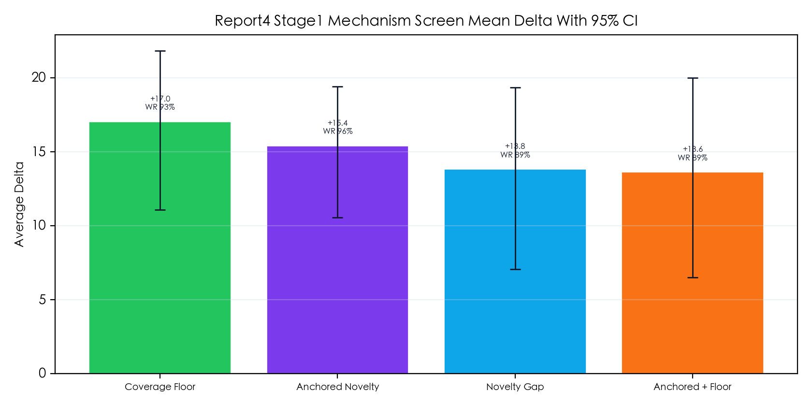
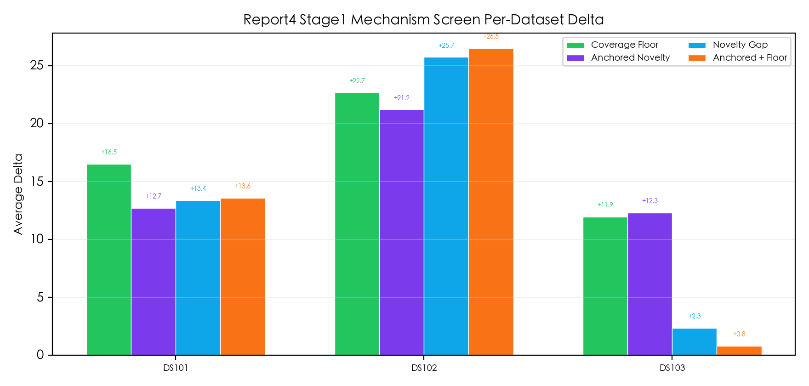
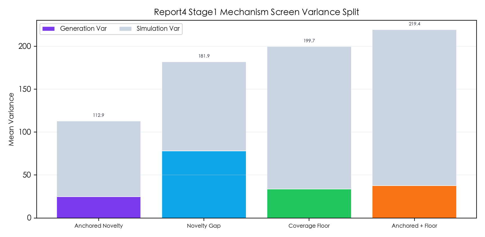

# GEO+ 可信度与机制实验报告（Report 4）

> 刷新日期：2026-05-14
>
> 本报告只保留本轮实验的核心信息：实验目标、实验做法、阶段一结果、阶段二状态与最终待补结论。

---

## 一、实验目标

本轮围绕 `after_novelty_gap` 验证两个问题：

1. `novelty_gap` 的差异化信息，怎样保证足够贴题，而不是因为偏离题眼被忽略。
2. 是否需要加入最小共享覆盖下限，以提高共同引用命中率并降低最坏轮次风险。

阶段一固定比较四条路线：

- `after_novelty_gap`
- `after_query_anchored_novelty_gap`
- `after_coverage_floor`
- `after_anchored_novelty_with_coverage_floor`

阶段二只保留阶段一入围路线与基线继续放大比较。

---

## 二、实验做法

### 2.1 路线改动

- `after_query_anchored_novelty_gap`
  - 强制所有 novelty 信息对齐题目槽位，优先回答核心判断、成立条件、边界与限制。
- `after_coverage_floor`
  - 在保留主文档主导性的前提下，补入最小共享覆盖下限。
- `after_anchored_novelty_with_coverage_floor`
  - 先做贴题 novelty，再补共享覆盖。

### 2.2 阶段一配置

- 题集：`DS101,102,103`
- 路线：4 条
- 重复规模：每路线 `3` 次独立生成 x 每份 `3` 次 simulator
- 结果目录：`competition/outputs/repeated_experiments/report4_stage1_mechanism_screen_strict/`

### 2.3 阶段二配置

- 题集：`DS3,9,10,12,101,102,103`
- 路线：`after_novelty_gap`、`after_coverage_floor`、`after_query_anchored_novelty_gap`
- 重复规模：每路线 `5` 次独立生成 x 每份 `5` 次 simulator
- 结果目录：`competition/outputs/repeated_experiments/report4_stage2_scale_confidence/`
- 当前状态：进行中，待完整结果产出后统一分析

### 2.4 统计口径

本轮统一看四类指标：

- 总体得分：`avg_delta`、`avg_objective_delta`、`avg_ai_delta`、`win_rate`
- 逐题表现：按 `dataset_id` 聚合的均值、分位数、胜率
- 波动结构：生成侧方差、simulator 侧方差、总方差
- AI 主观评分：`relevance`、`fluency`、`diversity`、`uniqueness`、`click_follow`、`prominence`、`content_volume`

---

## 三、阶段一结果

### 3.1 总体结果

阶段一每条路线共有 `27` 条评分记录。按路线聚合结果如下：

| 路线 | avg_delta | avg_objective_delta | avg_ai_delta | win_rate | 95% CI |
| --- | ---: | ---: | ---: | ---: | --- |
| `after_coverage_floor` | +17.03 | +21.38 | +12.69 | 92.59% | [11.06, 21.82] |
| `after_query_anchored_novelty_gap` | +15.39 | +16.89 | +13.89 | 96.30% | [10.55, 19.40] |
| `after_novelty_gap` | +13.81 | +16.74 | +10.88 | 88.89% | [7.04, 19.34] |
| `after_anchored_novelty_with_coverage_floor` | +13.62 | +17.34 | +9.89 | 88.89% | [6.48, 19.99] |

直接结论：

- 均值最强路线是 `after_coverage_floor`
- 稳定性最强路线是 `after_query_anchored_novelty_gap`
- `after_anchored_novelty_with_coverage_floor` 没有证明自己优于单独的 `coverage_floor`

### 3.2 逐题结果

`DS102` 是四条路线共同的强势题，真正的分歧集中在 `DS103`。

| 路线 | DS101 avg_delta | DS102 avg_delta | DS103 avg_delta | DS103 win_rate |
| --- | ---: | ---: | ---: | ---: |
| `after_coverage_floor` | +16.50 | +22.66 | +11.94 | 77.78% |
| `after_query_anchored_novelty_gap` | +12.69 | +21.20 | +12.29 | 88.89% |
| `after_novelty_gap` | +13.37 | +25.72 | +2.34 | 66.67% |
| `after_anchored_novelty_with_coverage_floor` | +13.56 | +26.49 | +0.79 | 66.67% |

这里最关键的观察是：

- `coverage_floor` 和 `query_anchored_novelty_gap` 都明显缓解了 `DS103` 的失手问题。
- 基线 `after_novelty_gap` 与混合路线在 `DS103` 上都存在更明显的波动暴露。

### 3.3 七项 AI 评分

如果只看 7 项 AI 主观评分，阶段一最强路线不是 `coverage_floor`，而是 `after_query_anchored_novelty_gap`。

#### AI 评分 after 均值

| 路线                                           | relevance | fluency | diversity | uniqueness | click_follow | prominence | content_volume |
| -------------------------------------------- | --------: | ------: | --------: | ---------: | -----------: | ---------: | -------------: |
| `after_query_anchored_novelty_gap`           |     96.04 |   90.96 |     87.70 |      90.19 |        88.26 |      93.33 |          93.19 |
| `after_coverage_floor`                       |     93.30 |   90.81 |     86.44 |      88.44 |        87.81 |      92.37 |          92.04 |
| `after_novelty_gap`                          |     92.26 |   89.93 |     85.37 |      87.26 |        85.00 |      89.63 |          89.11 |
| `after_anchored_novelty_with_coverage_floor` |     91.44 |   90.19 |     83.81 |      87.04 |        82.56 |      88.19 |          88.44 |

#### AI 评分相对 before 的平均提升

| 路线 | relevance | fluency | diversity | uniqueness | click_follow | prominence | content_volume |
| --- | ---: | ---: | ---: | ---: | ---: | ---: | ---: |
| `after_query_anchored_novelty_gap` | +6.48 | +0.26 | +14.70 | +12.67 | +14.89 | +22.48 | +25.78 |
| `after_coverage_floor` | +3.74 | +0.11 | +13.44 | +10.93 | +14.44 | +21.52 | +24.63 |
| `after_novelty_gap` | +2.70 | -0.78 | +12.37 | +9.74 | +11.63 | +18.78 | +21.70 |
| `after_anchored_novelty_with_coverage_floor` | +1.89 | -0.52 | +10.81 | +9.52 | +9.19 | +17.33 | +21.04 |

从 AI 评分看，结论也很清楚：

- `after_query_anchored_novelty_gap` 在 7 个维度上全部第一。
- `after_coverage_floor` 在 AI 主观评分上也显著优于基线，但整体仍略低于 `query_anchored_novelty_gap`。
- `after_novelty_gap` 和混合路线都在 `fluency` 上存在轻微回撤，说明仅靠提高信息密度容易损伤行文顺滑度。
- `relevance`、`click_follow`、`prominence`、`content_volume` 是本轮最容易被结构改动拉开的四个 AI 维度。

### 3.4 方差结果

| 路线 | 生成侧方差 | simulator 侧方差 | 总方差 |
| --- | ---: | ---: | ---: |
| `after_query_anchored_novelty_gap` | 24.70 | 88.25 | 112.95 |
| `after_novelty_gap` | 77.98 | 103.91 | 181.88 |
| `after_coverage_floor` | 33.85 | 165.80 | 199.65 |
| `after_anchored_novelty_with_coverage_floor` | 37.73 | 181.66 | 219.39 |

方差口径下的判断：

- `after_query_anchored_novelty_gap` 最稳，尤其生成侧随机性最低。
- `after_novelty_gap` 的生成侧方差最高，说明基线更依赖单次生成运气。
- `after_coverage_floor` 的均值最高，但 simulator 侧波动仍然偏大。
- `after_anchored_novelty_with_coverage_floor` 总方差最高，不适合作为默认升级方向。

### 3.5 图表

### 3.6 阶段一结论

阶段一先给出以下筛选结论：

1. `after_coverage_floor` 是当前最强的均值路线，应作为阶段二主升级候选。
2. `after_query_anchored_novelty_gap` 是当前最稳、且 AI 主观评分最强的路线，应作为阶段二稳定性与主观评分对照候选。
3. `after_novelty_gap` 保留为基线。
4. `after_anchored_novelty_with_coverage_floor` 暂不建议继续作为主比较路线。

---

## 四、阶段二状态

阶段二大样本实验已经启动，完整结果待回写。

当前只保留运行配置，不提前写结论：

- 题集：`DS3,9,10,12,101,102,103`
- 路线：`after_novelty_gap`、`after_coverage_floor`、`after_query_anchored_novelty_gap`
- 重复规模：每路线 `5` 次独立生成 x 每份 `5` 次 simulator
- 结果目录：`competition/outputs/repeated_experiments/report4_stage2_scale_confidence/`

阶段二完成后，再统一补：

- 总体均值与胜率比较
- 最坏轮次与逐题稳定性
- 客观得分与 AI 七项评分的综合判断
- 是否正式升级默认主线
