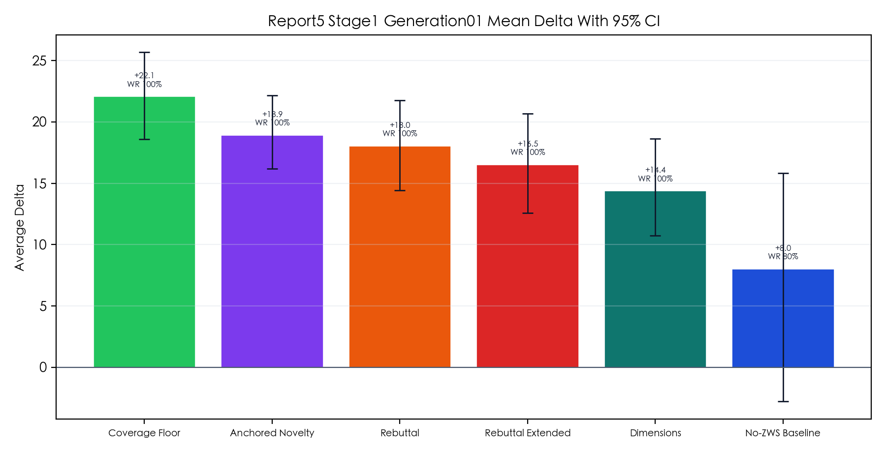
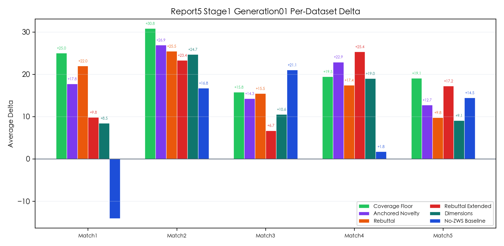
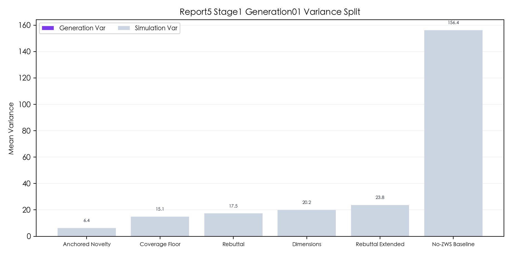
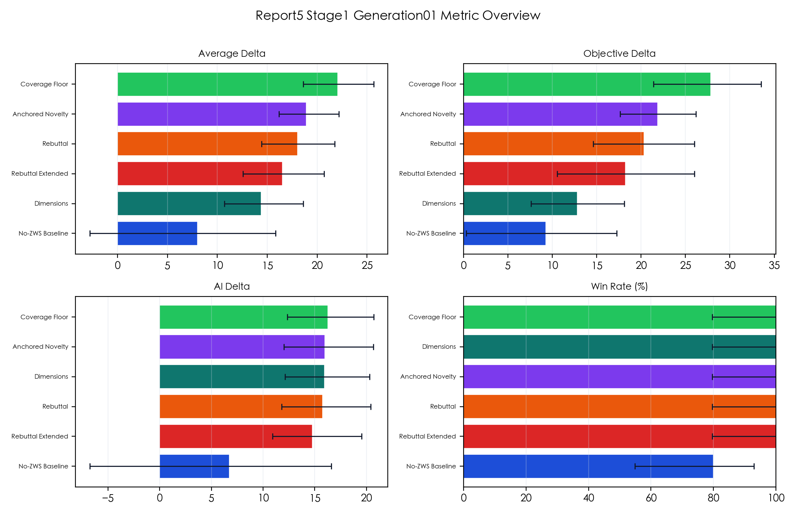

# GEO+ 五组比赛数据验证报告（Report 5）

> 当前版本基于 `generation_01 x 3 simulator` 的阶段性结果整理。按用户要求，`stage1` 在 `generation_01` 完成后即中断，未继续执行 `generation_02/03`，因此本报告用于快速路线筛选，不作为最终稳定性定稿。

## 一、实验目标

本轮在 `competition/` 内对五组比赛题进行路线对比，比较不同 GEO 优化方案在 `delta`、`objective_delta`、`ai_delta`、`win_rate` 与 simulator 侧波动上的表现，并给出当前最值得继续使用的比赛路线。

本轮未读取或回写 `competition_match/` 的任何运行产物。

## 二、数据映射

| Match | Internal | Legacy | Title |
| --- | ---: | ---: | --- |
| Match1 | DS201 | DS101 | 人工智能是否应该拥有法律人格 |
| Match2 | DS202 | DS102 | 基因编辑技术是否应该全面开放 |
| Match3 | DS203 | DS103 | 全民基本收入（UBI）是否是未来社会的必需品 |
| Match4 | DS204 | DS1 | 双语教育是否一定能带来超越语言能力的认知控制优势？ |
| Match5 | DS205 | DS3 | 屏幕时间/电子产品使用会不会导致青少年抑郁？ |

## 三、实验设计

- 候选路线：`after_nozws`、`after_dimensions`、`after_rebuttal`、`after_rebuttal_extended`、`after_coverage_floor`、`after_query_anchored_novelty_gap`
- 当前实际完成规模：`1 generation x 3 simulator`
- 统计样本：每条路线 `15` 条记录，覆盖 `5` 个数据集 * `3` 次 simulator
- 结果目录：`competition/outputs/repeated_experiments/report5_stage1_mechanism_screen/`

说明：由于只有一轮 generation，`generation_variance_mean = 0` 是样本结构造成的，不代表生成侧没有波动；本轮可用来观察 simulator 内重复稳定性，但不能替代完整多 generation 稳定性验证。

## 四、路线总览

| Variant | Avg Delta | 95% CI | Avg Objective Delta | Avg AI Delta | Win Rate | Mean Total Variance |
| --- | ---: | --- | ---: | ---: | ---: | ---: |
| `after_coverage_floor` | `+22.06` | `[+18.60, +25.68]` | `+27.83` | `+16.29` | `100%` | `15.10` |
| `after_query_anchored_novelty_gap` | `+18.92` | `[+16.19, +22.17]` | `+21.87` | `+15.97` | `100%` | `6.42` |
| `after_rebuttal` | `+18.05` | `[+14.42, +21.75]` | `+20.33` | `+15.76` | `100%` | `17.48` |
| `after_rebuttal_extended` | `+16.51` | `[+12.56, +20.69]` | `+18.23` | `+14.78` | `100%` | `23.85` |
| `after_dimensions` | `+14.38` | `[+10.71, +18.63]` | `+12.82` | `+15.93` | `100%` | `20.16` |
| `after_nozws` | `+8.01` | `[-2.78, +15.84]` | `+9.29` | `+6.73` | `80%` | `156.40` |

## 五、当前结论

### 5.1 主结论

- 当前最强路线是 `after_coverage_floor`。它在五题平均提升、客观分提升、胜率三个核心指标上同时领先，`avg_delta +22.06`，`95% CI [+18.60, +25.68]`，`win_rate 100%`。
- 当前最稳路线是 `after_query_anchored_novelty_gap`。它虽然均值低于 `after_coverage_floor`，但 `mean_total_variance` 只有 `6.42`，是六条路线里最低，说明 simulator 重复波动最小。
- `after_rebuttal` 是较均衡的第三名。均值 `+18.05`，置信区间和胜率都稳，没有出现明显塌点。

### 5.2 明显不建议继续作为默认路线的方案

- `after_nozws` 不适合作为当前默认比赛路线。它的 `avg_delta` 只有 `+8.01`，`95% CI` 已跨过 `0`，`win_rate` 只有 `80%`，`mean_total_variance` 高达 `156.40`，远高于其他路线。
- `after_nozws` 在 Match1 上平均 `-14.05`，其中一次 simulator 出现 `-49.91` 的极端回撤；在 Match4 上平均也只有 `+1.78`。这说明它不是“小幅不稳”，而是存在明显的灾难性失分风险。

### 5.3 AI 分数观察

- 本轮 `avg_ai_delta` 最高的是 `after_coverage_floor`，为 `+16.29`。
- `after_query_anchored_novelty_gap`、`after_dimensions`、`after_rebuttal` 的 AI 提升都在 `+15.7 ~ +16.0` 区间，差距不大。
- `after_nozws` 的 AI 提升只有 `+6.73`，且区间 `[-6.76, +16.60]` 很宽，说明主观分也不稳。

## 六、分题观察

### 6.1 `after_coverage_floor`

- Match1: `+25.04`
- Match2: `+30.85`
- Match3: `+15.81`
- Match4: `+19.50`
- Match5: `+19.10`

特点：五题全部为正提升，没有出现明显短板；其中 Match1 的客观分提升最强，`avg_objective_delta +40.98`。

### 6.2 `after_query_anchored_novelty_gap`

- Match1: `+17.75`
- Match2: `+26.92`
- Match3: `+14.27`
- Match4: `+22.92`
- Match5: `+12.75`

特点：整体更稳、更平滑，尤其在 Match4 表现很好；如果后续更看重“低波动优先”，它是最值得保留的备选。

### 6.3 `after_rebuttal`

- Match1: `+22.00`
- Match2: `+25.48`
- Match3: `+15.52`
- Match4: `+17.42`
- Match5: `+9.80`

特点：在 Match1 与 Match2 很强，但 Match5 相对弱于 `coverage_floor` 与 `query_anchored_novelty_gap`。

## 七、当前推荐

- 默认推荐路线：`after_coverage_floor`
- 稳定性优先备选：`after_query_anchored_novelty_gap`
- 均衡备选：`after_rebuttal`
- 暂不推荐作为默认路线：`after_nozws`

如果现在就要收敛为一条比赛默认路线，基于本轮结果应选 `after_coverage_floor`。如果后续还有时间做更严谨的复验，优先值得继续补做多 generation 稳定性测试的是 `after_coverage_floor` 与 `after_query_anchored_novelty_gap` 的正面对比。

## 八、图表

- 
- 
- 
- 

## 九、产物位置

- 汇总统计：`competition/outputs/repeated_experiments/report5_stage1_mechanism_screen/summary_by_variant.json`
- 分题统计：`competition/outputs/repeated_experiments/report5_stage1_mechanism_screen/summary_by_dataset.json`
- 方差拆分：`competition/outputs/repeated_experiments/report5_stage1_mechanism_screen/variance_decomposition.json`
- 原始记录：`competition/outputs/repeated_experiments/report5_stage1_mechanism_screen/raw_results.jsonl`
