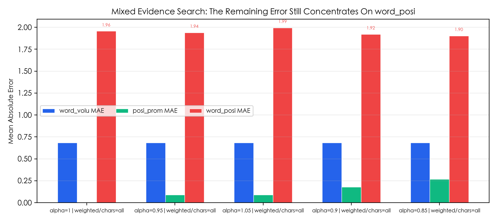
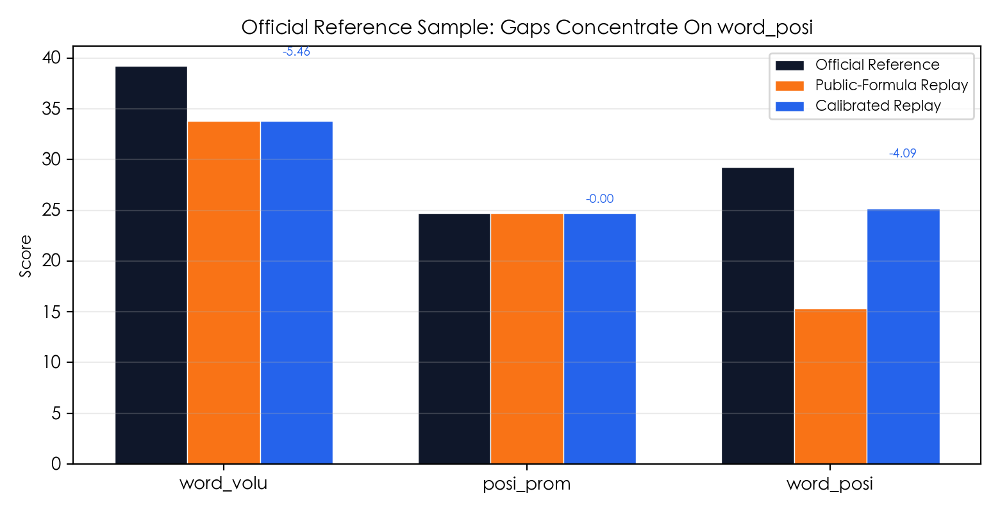

> 更新日期：2026-05-13
>
> 目的：基于当前已完成的本地重放、profile 搜索和图表分析，整理最值得向比赛方确认的客观评分口径问题。

---

## 一、报告边界

本文只讨论两类事项：

1. 公开评分文档与平台实际返回分数之间，是否存在未披露的实现细节。
2. 公开评分公式或文字说明，是否存在口径歧义。

当前证据分为两层：

1. **硬参考证据**：1 条官方参考样本。我同时掌握了答案全文，以及比赛方给出的客观分数：`word_volu=39.24`、`posi_prom=24.75`、`word_posi=29.25`。
2. **代理证据（proxy corpus）**：8 条本地物化样本。它们不作为官方真值，但可以稳定观察“公式改动主要影响哪个指标”。

---

## 二、已完成的分析工作

为尽量贴近比赛平台的客观评分行为，我已经完成了以下工作：

1. 按比赛文档公开公式实现了本地客观评分重放。
2. 将客观评分拆成可切换 profile 的实现，系统比较句子切分、引用均分、位置衰减和分母口径。
3. 基于硬参考样本和代理样本进行 profile 搜索，筛选更接近平台返回值的实现。
4. 生成了 4 张图表，用来展示三项客观分的对齐情况、`word_posi` 的偏差集中、profile 搜索后的残余误差，以及 `word_posi` 分母切换的影响。

当前最优 profile 为：

- `split=punct_or_newline|dedup=unique|credit=unique_refs|pos=share|alpha=1|denom=total_weighted_chars|chars=all`

在混合样本上的误差为：

- `word_volu_mae = 0.682`
- `posi_prom_mae = 0.0001`
- `word_posi_mae = 1.956`
- `mean_abs_error = 0.879`

这说明本地实现已经可以比较稳定地逼近平台行为，但剩余误差仍主要集中在 `word_posi`。

---

## 三、公开文档给出的客观评分基线

比赛文档给出的三项客观分公式如下：

$$
word\_volu(c_i, r)=\frac{\sum_{s\in S_{c_i}}|s|}{\sum_{s\in S_r}|s|}
$$

$$
posi\_prom(c_i, r)={\sum_{s\in S_{c_i}}e^{-\frac{pos(s)}{|S_r|}}}
$$

$$
word\_posi(c_i, r)=\frac{\sum_{s\in S_{c_i}}|s|e^{-\frac{pos(s)}{|S_r|}}}{\sum_{s\in S_r}|s|}
$$

同时文档还写明：

- 当一句话存在多个引用时，每个引用源均分句子的词占比分数和重要性分数。
- 示例中的引用格式为句尾 `[1][2]`。
- 文档中同时混用了“字数”“词占比”两种表述。

因此，真正影响本地重放是否贴近平台行为的关键，不只在公式本身，还包括：

1. 句子如何切分。
2. 多引用句如何均分。
3. `|s|` 到底按什么长度单位统计。
4. `posi_prom` 和 `word_posi` 的最终返回值是否带有额外归一化。

---

## 四、关键发现

### 4.1 `word_posi` 最像存在未公开的实现细节

在唯一的硬参考样本上：

| 指标 | 官方分数 | 按公开公式直译重放（legacy） | 调整 `word_posi` 分母后的重放（calibrated） |
|------|:--:|:--:|:--:|
| `word_volu` | 39.24 | 33.78 | 33.78 |
| `posi_prom` | 24.75 | 24.75 | 24.75 |
| `word_posi` | 29.25 | 15.35 | 25.16 |

对应残差为：

- `legacy_word_posi_gap = -13.90`
- `calibrated_word_posi_gap = -4.09`

这说明：

1. 只按公开公式的常规直译实现，`word_posi` 明显偏低。
2. 仅把 `word_posi` 的分母从 `total_chars` 改为 `total_weighted_chars` 后，结果会明显靠近官方，但仍然不能完全对齐。

代理样本也支持这一点。当前 8 条 proxy corpus 中，公式切换对三项指标的平均绝对影响分别为：

- `word_volu`: `0.00`
- `posi_prom`: `0.00`
- `word_posi`: `3.73`

最大 `word_posi` 位移出现在 `DS12`，达到 `+6.86`。这说明当前差异主要集中在 `word_posi`，而不是三项一起漂移。

当前最稳妥的判断是：`word_posi` 很可能包含了公开文档未完整披露的实现细节，至少公开公式不足以完整重放平台行为。

### 4.2 `posi_prom` 更像公开公式缺少归一化说明

比赛文档给出的 `posi_prom` 公式更像原始衰减和，但平台返回给选手的是 `24.31`、`24.75` 这类百分制数值。

在硬参考样本上，本地归一化实现得到 `24.749138...`，与官方 `24.75` 的误差只有 `-0.00086`。这说明平台很可能使用了“归一化后的百分制 `posi_prom`”，只是公开公式没有把这一点写清楚。

因此，这里更像“文档口径不完整”，而不是“平台算错了”。

### 4.3 `word_volu` 的长度统计口径可能未写清楚

在硬参考样本上，官方 `word_volu=39.24`，本地两套 profile 都得到 `33.78`，残差稳定为 `-5.46`。由于这两个 profile 的差别只在 `word_posi` 分母，而 `word_volu` 完全不动，说明这里的偏差更可能来自：

1. `|s|` 的长度单位定义。
2. 引用标记 `[1][2]`、标点、空格、换行是否参与计长。
3. 句子切分与多引用均分的具体口径。

因此，`word_volu` 当前更像“长度统计规则未公开完整”，而不是一个单纯的公式抄写问题。

---

## 五、当前结论

基于现有成果、数据和图表，当前最稳妥的结论是：

1. **`word_posi` 是当前最像存在未公开实现细节的指标。** 公开公式直译会明显偏低；把分母改成加权总字数后会显著逼近官方，但仍有残余误差。
2. **`posi_prom` 更像公开文档缺少归一化/百分制说明。** 本地归一化实现后几乎可以精确贴合硬参考样本。
3. **`word_volu` 仍有无法由 `word_posi` 分母改动解释的稳定残差。** 更可能与长度统计单位、清洗规则、句子切分或多引用均分口径有关。
4. **当前本地分析已经不是随意猜测公式。** 我们已经完成 profile 搜索、样本对比和图表分析，且不同证据共同指向：剩余误差最集中在 `word_posi`。

---

## 六、想要直接询问比赛方的问题

1. `word_posi` 的实际实现中，分母是否使用了“全文原始字数和”之外的口径，例如位置加权后的总字数？
2. `word_posi` 在公开公式之外，是否还包含未披露的归一化、句子切分、引用归属或长度统计细节？
3. `posi_prom` 返回给选手的分数，是否先做了归一化并转换为百分制？如果是，公开文档能否补充完整公式？
4. 公式中的 `|s|` 具体按什么单位统计：汉字字符数、去空白字符数、还是别的长度定义？
5. 计算 `|s|` 时，引用标记 `[1][2]`、标点、空格、换行是否计入长度？
6. 当一句话含多个引用时，句子长度和位置权重的“均分”是在文本清洗前还是清洗后执行？
7. 句子切分是否严格按句号类标点进行，还是还会把换行、分号、无标点短段落纳入句子边界判断？
