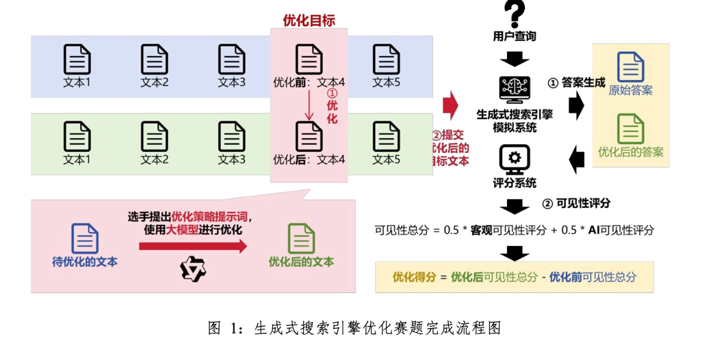
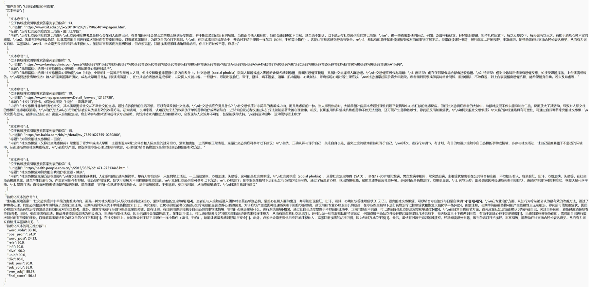

# 天枢杯生成式搜索引擎优化赛道决赛赛题说明

> 本决赛赛题旨在通过实战操作，让参赛选手深入体验生成式搜索引擎优化 （GenerativeSearchEngineOptimization,GEO）技术的作用。比赛要求选手设计 优化策略对指定的目标内容进行优化，让它在AI生成的答案中更容易被看到和引用。


## 一、赛程设置

- 本次比赛总时长90分钟，共6道题，分为两个部分。
	- 第一部分基础题：题目5道，选手能够看到网页内容文本对应的用户查询。
	- 第二部分提升题：题目1道，选手不能看到网页内容文本对应的用户查询。

## 二、数据说明

- 本次比赛使用的数据来源于真实互联网网页内容。所有内容均为中文文本。 
- 为方便选手在规定时间内完赛，本次比赛使用Qwen3.6-plus对原始网页文本进 行了如下处理：
	- 去掉与文本主体无关的内容（如广告、按键名称等）
	- 进一步进行内容总结精炼
	- 通过丢弃超过长度限制的内容，将每条文本长度控制在600～1000个字符。
- 选手共需完成6道优化题。每道优化题都提供有与某个用户查询相关的5个文本，并且指定其中一个文本为优化目标。
- 第一部分基础题另外向选手提供用户查询，第二部分提升题则不提供。


## 三、系统模拟说明
- 本次比赛在模拟环境下进行。如图1所示，比赛提供一个GSE模拟系统， 该系统能够针对用户查询利用多个文本生成一份综合性的答案；一个可见性评分系统，该系统能够对优化目标在答案中的可见性进行评分。
- 为保持比赛公平性与GEO任务的系统黑盒设定，GSE模拟系统与评分系统的架构、模型型号、算法、参数等配置信息保密。
- 【注意事项】禁止使用提示词注入、劫持、投毒等非内容修改方式对评分系统进行攻击，一经审查发现成绩作废。
## 四、操作流程说明
- 选手应通过优化操作，让优化的目标文本在GSE模拟系统生成的答案中更容易被引用、看到。对于每道优化题，选手需进行优化操作，过程如图1所示。




1. 选手需要设计优化提示词，自行通过AI 应用产品，对指定的目标文本进行优化。
2. 选手须向平台提交优化后的目标文本。
- 选手提交优化后的文本后，平台将对这次提交的优化情况进行打分，具体过程如下：GSE 模拟系统将分别利用原始文本（蓝色块）以及优化后的文本（绿色块）对用户查询生成答案。两次用于生成答案的文本只有优化的目标文本不同。评分系统将分别对优化前、后答案中目标文本的可见性进行打分。优化前、后的可见性总分提高情况作为该选手在该题目上的优化得分（不好的优化方法可能会出现优化得分为负的情况，本次比赛平台中将此类情况计分为0，但选手收到的评分结果中仍为负分，以便选手观察并改进优化方法）。一道优化题的完整操作过程见“六、优化题作答实例”。
- 为了方便选手调整优化策略，平台向选手提供：原始文本、GSE 模拟系统生成的答案、所提交文本的可见性总分及其各细项得分。
- 经前期测试，每次操作大约耗时如下，请选手合理安排时间：
	- 提交优化提示词得到优化后的内容，需约1~2分钟
	- GSE 模拟系统生成答案，需约2分钟
	- 评分系统生成评分，需约2~3分钟

## 五、评分细则说明

- 本次比赛每队总分计算方式如下：
$$
总分=基础题优化得分总分＋5*提升题优化得分
$$
- 对于每道题目标文本的优化得分（final_score）计算如下：
$$
优化得分=优化后可见性总分-优化前可见性总分
$$
- 为保证比赛的公平性和科学性，本次比赛公开优化评分计算细则。每道题的 可见性总分由客观可见性评分与AI可见性评分两部分组成，各部分得分单独计算，满分均为100：
$$
可见性总分=0.5×客观可见性评分+0.5×AI可见性评分
$$
- 客观可见性评分：赋予引用位置更前、被引用的字数更多的文本更高的分 数。基于字数和基于位置的客观可见性评分将分别计算答案中文本被引用的词占 比分数和所在句子的位置重要性分数，客观可见性綜合评分计算位置重要性加权 的词占比总分，计算公式分别如公式1-3所示。其中，客观可见性评分将采用客观可见性综合评价指标得分。
- 基于字数的可见评分评分公式：
$$
word\_volu(c_i, r)=\frac{\sum_{s\in S_{c_i}}|s|}{\sum_{s\in S_r}|s|}
$$
- 基于位置的可见性评分公式：
$$
posi\_prom(c_i, r)={\sum_{s\in S_{c_i}}e^{-\frac{pos(s)}{|S_r|}}}
$$
- 客观可见性最终评分（客观可见性综合评分）公式：
$$
word\_posi(c_i, r)=\frac{\sum_{s\in S_{c_i}}|s|e^{-\frac{pos(s)}{|S_r|}}}{\sum_{s\in S_r}|s|}
$$
- 其中，$c_i$和$r$分别表示被引用的源和答案，$S_{c_i}$和$S_r$，則分别为组成它们的句子， Is|表示句子s的字数，pos（s）表示句子s在r中的顺序号。当一句话存在多个引用时，每个引用源均分旬子的词占比分数和重要性分数。 
- AI可见性评分：利用AI代替人类对文本的不同方面的“容易看见”程度进行评分。包括相关性（rele）、流畅性（infl）、多样性（div）、独特性（uniq）. 点击跟随可能性（clic）、位置显著性（subj_posi）、内容体量（subj_volu）七 个方面，七个方面的平均分数（aver_subj）作为AI可见性综合得分。AI可见性各方面评分将由AI系统直接给出分数，AI可见性综合评分计算如公式5所示。其中，AI可见性评分将采用AI可见性综合评分。
- AI可见性最终评分（AI可见性综合评分）公式：
$$
average=\frac{1}{7}\sum score_{sub}
$$
- 其中，scoresub表示七个方面的评分。 
- AI可见性评分七个方面的解释如下：相关性，是否与用户查询相关；流畅 性，表达是否通顺流畅；多样性，包含的信息是否多样；独特性，包含的信息是 否独家；点击跟随可能性，是否更容易吸引用户点击；位置显著性，在回答中的位置是否明显；内容体量，在回答中的字数占比是否充实。
## 六、优化题作答实例

- 在本次比赛中，选手会收到六份txt文件，每份文件对应一道优化题目，题 目的信息以json数据格式的形式进行展示。图2给出了一个题目示例，关于题目信息的说明如下：
	- “用户查询”：用户查询的文本内容数据，基础题会提供此部分信息，提升题则不会提供；
	- “文本列表”：文本列表中存放5条与用户查询相关的文本数据。每条文本 数据包含5项具体内容：文本序号、位于传统搜索引擎搜索答案列表的位次、ur链接、标题、内容；
	- “文本序号”：表示当前文本数据在文本列表中的位置；
	- “位于传统搜索引擎搜索答案列表的位次”：当用户进行查询搜索时，当前文本数据在传统索搜索引擎给出的答案列表中的位置；
	- “url链接”：当前文本数据的网页链接来源；
	- “标题”：当前文本数据对应的网页标题；
	- “内容”：当前文本数据的具体内容。
	- “待优化文本的序号”：选手需要对文本列表中的哪条文本数据的内容进行优化； 
	- “生成的原始答案”：使用文本列表中所有文本数据的内容（未优化）对用 户查询生成的答案，其中“［X］”的形式表示所在的句子引用自文本序号为X的文本内容。
	- “待优化文本的可见性分数”：待优化文本在原始答案中的可见性分数，其中各项可见性分数的细项说明见“五、评分细则说明”部分。
- 选手可使用题目提供的信息，对待优化文本进行优化，将优化后的文本内容存为txt文本，提交给平台。图3为所提交的文本内容示例。
- 平台通过内置的评分系统对选手提交的优化后文本进行评分。为方便选手作答与安排答题时间，本次比赛再提供额外的信息。评分结果的信息说明如下：
	- “生成的原始答案”：与题目信息中的“生成的原始答案”部分一致，方便选手比对优化情况
	- “生成的新答案”：使用文本列表中所有文本数据的内容（优化后）对用户 查询生成的答案，其中“［X］”的形式表示所在的句子引用自文本序号为X的文 本内容。特别说明，仅将优化后文本内容替代待优化的文本内容，其余文本内容保持不变；
	- “评分状态”：各部分可见性评分是否顺利完成，若出现“fail”状态需联系现场进行处理；
	- “优化得分”：选手提交的优化后文本在新答案中的可见性分数，其中各项 可见性分数的细项说明见“五、评分细则说明”部分，若评分未顺利完成需联系现场进行处理；
	- “评分时长”：各项AI评分进行的时间，供选手参考安排作答。



```json
{
	"用户查询":"社交恐惧症如何克服",
	"文本列表":[
		{
			"文本序号":1,
			"位于传统搜索引擎搜索答案列表的位次":13,
			"url链接":"略",
			"标题":"略",
			"内容":"略"
		},
		{
			"文本序号":2,
			"位于传统搜索引擎搜索答案列表的位次":9,
			"url链接":"略",
			"标题":"略",
			"内容":"略"
		},
		{
			"文本序号":3,
			"位于传统搜索引擎搜索答案列表的位次":19,
			"url链接":"略",
			"标题":"略",
			"内容":"略"
		},
		{
			"文本序号":4,
			"位于传统搜索引擎搜索答案列表的位次":15,
			"url链接":"略",
			"标题":"略",
			"内容":"略"
		},
		{
			"文本序号":5,
			"位于传统搜索引擎搜索答案列表的位次":5,
			"url链接":"略",
			"标题":"略",
			"内容":"略"
			}
		],
	"待优化文本的序号":1,
	"生成的原始答案":"略（其中引用以[1][2]这样放在句尾表示，如“配合药物治疗可能是更好的方式[3][5]。”）",
	"待优化文本的可见性分数":{
	"word_volu":33.16,
	"posi_prom":24.31,
	"word_posi":24.33,
	"rele":90.0,
	"infl":90.0,
	"dive":90.0,
	"uniq":90.0,
	"clic":85.0,
	"sub_posi":90.0,
	"sub_volu":85.0,
	"aver_subj":88.57,
	"final_score":56.45
	}
}
```