# GEO+ 文档优化系统 — 测试报告

> 刷新日期：2026-05-12 | 数据集：14 组（DS1-DS14） | 模型接口：gpt-5.4（Anthropic-compatible gateway）
>
> 本版报告基于仓库当前脚本的动态聚合结果生成，已不再沿用早期手工抄录到图表脚本中的数组。当前默认主基线为 `after_nozws.md`；`after.md` 作为 Full-ZWS 对照版本保留。

---

## 一、测试方法

每组测试包含 6 篇文档：4 篇竞争文档（`1.md` 到 `4.md`）、1 篇原始文档（`before.md`）、1 篇优化文档。当前仓库的主评测口径如下：

- **Before 轮**：将 `before.md` 与 4 篇竞争文档混合，提交给 AI 评审，记录引用分布
- **Baseline 轮**：将 `after_nozws.md` 与 4 篇竞争文档混合，作为默认优化基线
- **Full-ZWS 对照**：将 `after.md` 与同一组竞争文档混合，用于衡量零宽字符注入的边际影响

两项核心指标：

1. **引用次数占比**：目标文档被引次数 / 所有文档被引总次数
2. **引用内容字数占比**：目标文档所引内容对应的回答字数 / 回答总字数

波动性部分使用两轮重复评测：

- **Round 1**：`test_<variant>.md`
- **Round 2**：`test_<variant>_r2.md`

当前脚本已支持任意 `round`，本文展示的是已有的两轮结果。

---

## 二、总体结果

### 2.1 默认基线整体提升

| 指标 | 优化前 (`before.md`) | 默认基线 (`after_nozws.md`) | 提升 |
|------|:--:|:--:|:--:|
| 引用次数占比 | **13.6%** | **52.9%** | +39.4 pp |
| 引用内容字数占比 | **18.6%** | **62.7%** | +44.1 pp |

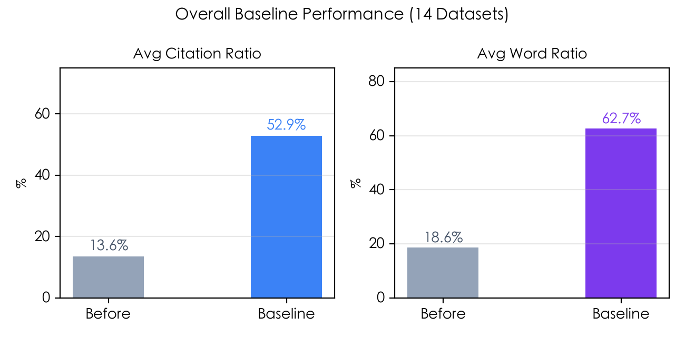

- 默认基线的引用次数占比约为原始文档的 **3.9 倍**。
- 默认基线的引用内容字数占比约为原始文档的 **3.4 倍**。
- 14 组数据集在默认基线口径下 **全部正向提升**，没有出现整体回退。

### 2.2 与 Full-ZWS 对照的真实差异

动态重算后，Full-ZWS 并没有比 No-ZWS 更强，反而略弱：

| 策略 | 平均引用次数占比 | 平均引用内容字数占比 |
|------|:--:|:--:|
| `after_nozws.md` | **52.9%** | **62.7%** |
| `after.md` | 52.4% | 61.9% |
| Full-ZWS 相对 No-ZWS | **-0.5 pp** | **-0.8 pp** |

这和早期手工数组所表达的“ZWS 平均正收益”不同。按当前真实产物动态统计，**内容本身是主增益来源，Full-ZWS 没有带来稳定正向提升**。

### 2.3 原始文档的竞争劣势

在 Before 轮中，`before.md` 的平均引用次数占比仅为 13.6%，低于 5 篇文档均匀竞争时约 20% 的直觉基线。说明原始文档在多文档竞争环境下天然吃亏，问题主要在信息密度、结构化程度和可抽取性上，而不是单一提示技巧。

---

## 三、逐数据集结果

### 3.1 默认基线的引用次数占比

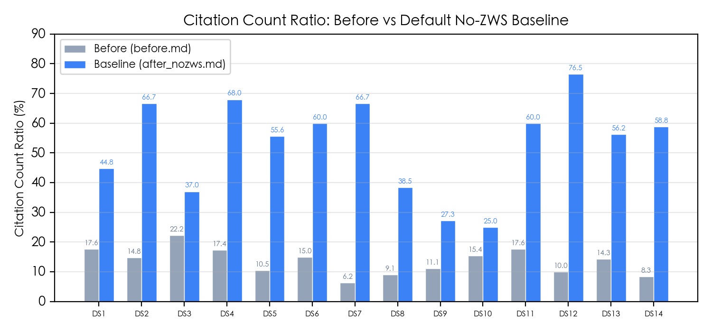

| 数据集 | 主题 | Before | Baseline | 提升 |
|:--:|------|:--:|:--:|:--:|
| 1 | 认知与元认知 | 17.6% | 44.8% | +27.2pp |
| 2 | 激素与行为 | 14.8% | 66.7% | +51.9pp |
| 3 | 语言习得 | 22.2% | 37.0% | +14.8pp |
| 4 | 记忆与学习 | 17.4% | 68.0% | +50.6pp |
| 5 | AI 与失业 | 10.5% | 55.6% | +45.0pp |
| 6 | 基因编辑 | 15.0% | 60.0% | +45.0pp |
| 7 | 转基因食品 | 6.2% | 66.7% | +60.4pp |
| 8 | 核电争议 | 9.1% | 38.5% | +29.4pp |
| 9 | 动物实验 | 11.1% | 27.3% | +16.2pp |
| 10 | 监控与隐私 | 15.4% | 25.0% | +9.6pp |
| 11 | 强制疫苗 | 17.6% | 60.0% | +42.4pp |
| 12 | 5G 辐射 | 10.0% | 76.5% | +66.5pp |
| 13 | 加密货币 | 14.3% | 56.2% | +42.0pp |
| 14 | 元宇宙 | 8.3% | 58.8% | +50.5pp |

### 3.2 默认基线的引用内容字数占比

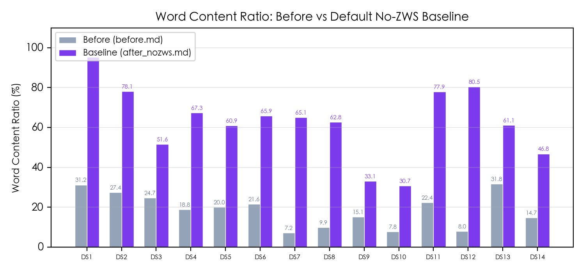

| 数据集 | 主题 | Before | Baseline | 提升 |
|:--:|------|:--:|:--:|:--:|
| 1 | 认知与元认知 | 31.2% | 95.2% | +64.0pp |
| 2 | 激素与行为 | 27.4% | 78.1% | +50.7pp |
| 3 | 语言习得 | 24.7% | 51.6% | +26.9pp |
| 4 | 记忆与学习 | 18.8% | 67.3% | +48.5pp |
| 5 | AI 与失业 | 20.0% | 60.9% | +40.9pp |
| 6 | 基因编辑 | 21.6% | 65.9% | +44.3pp |
| 7 | 转基因食品 | 7.2% | 65.1% | +57.9pp |
| 8 | 核电争议 | 9.9% | 62.8% | +52.9pp |
| 9 | 动物实验 | 15.1% | 33.1% | +18.0pp |
| 10 | 监控与隐私 | 7.8% | 30.7% | +23.0pp |
| 11 | 强制疫苗 | 22.4% | 77.9% | +55.5pp |
| 12 | 5G 辐射 | 8.0% | 80.5% | +72.6pp |
| 13 | 加密货币 | 31.8% | 61.1% | +29.3pp |
| 14 | 元宇宙 | 14.7% | 46.8% | +32.2pp |

---

## 四、提升效果分析

### 4.1 总体趋势

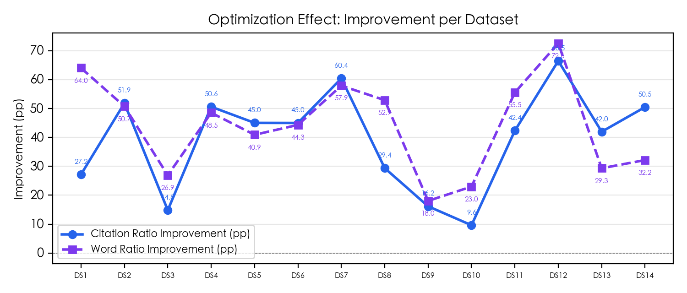

在默认基线口径下，14 组数据集的引用次数和字数占比全部获得正向提升。这说明优化系统的主要竞争力仍然来自内容扩充、结构重写和信息密度提升，而不是字符级技巧。

### 4.2 表现最强的样本

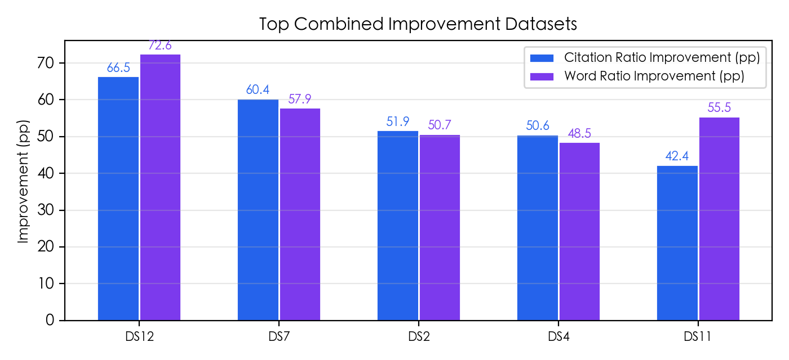

按当前图表使用的“引用提升 + 字数提升”综合排序，表现最强的 5 组是：

1. `DS12` 5G 辐射
2. `DS7` 转基因食品
3. `DS2` 激素与行为
4. `DS4` 记忆与学习
5. `DS11` 强制疫苗

这些样本的共同特征是原始文档普遍偏短、信息覆盖不完整，优化后能够明显扩大事实密度和论点覆盖面。

### 4.3 提升较低的样本

当前默认基线下，引用次数提升最低的几组是：

- `DS10` 监控与隐私：`+9.6pp`
- `DS3` 语言习得：`+14.8pp`
- `DS9` 动物实验：`+16.2pp`

这些主题更容易出现价值判断、伦理争议或多源综合回答，单篇优化文档即使更强，也不一定能像事实密集型主题那样形成压倒性引用优势。

---

## 五、关键发现

1. **内容优化本身有效，而且是主要因子。** 无论是否注入 ZWS，优化后的文档都显著强于 `before.md`。
2. **默认基线应当是 `after_nozws.md`。** 动态统计显示它在平均引用占比和字数占比上都略优于 Full-ZWS，同时稳定性也更好。
3. **ZWS 的历史“正收益”结论不再成立。** 旧报告中的正向均值来自手工数组；当前脚本直接读取真实评测产物后，结论变成了轻微负收益且高波动。
4. **多轮波动不可忽略。** 单次评测的数值不应被过度解读，尤其不能拿单轮结果去证明 ZWS 这类边际策略有效。

---

## 六、零宽字符消融实验

### 6.1 实验设计

在同一份优化内容上比较两种版本：

- **With ZWS**：`after.md`，在非空白字符间注入 U+200B
- **No ZWS**：`after_nozws.md`，不含零宽字符的纯文本基线

两者内容语义保持一致，差异只在于字符级注入方式。

### 6.2 引用次数占比对比

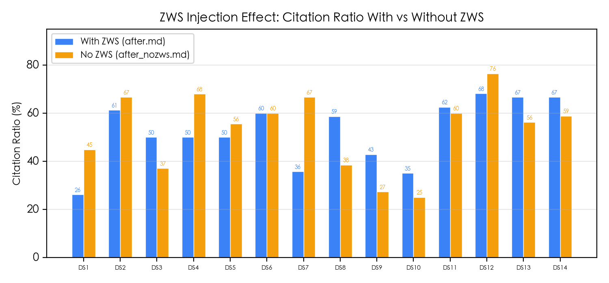

| 数据集 | With ZWS | No ZWS | 差值 |
|:--:|:--:|:--:|:--:|
| 1 | 26.1% | 44.8% | -18.7pp |
| 2 | 61.3% | 66.7% | -5.4pp |
| 3 | 50.0% | 37.0% | +13.0pp |
| 4 | 50.0% | 68.0% | -18.0pp |
| 5 | 50.0% | 55.6% | -5.6pp |
| 6 | 60.0% | 60.0% | +0.0pp |
| 7 | 35.7% | 66.7% | -31.0pp |
| 8 | 58.6% | 38.5% | +20.2pp |
| 9 | 42.9% | 27.3% | +15.6pp |
| 10 | 35.0% | 25.0% | +10.0pp |
| 11 | 62.5% | 60.0% | +2.5pp |
| 12 | 68.2% | 76.5% | -8.3pp |
| 13 | 66.7% | 56.2% | +10.4pp |
| 14 | 66.7% | 58.8% | +7.8pp |

### 6.3 净效应分析

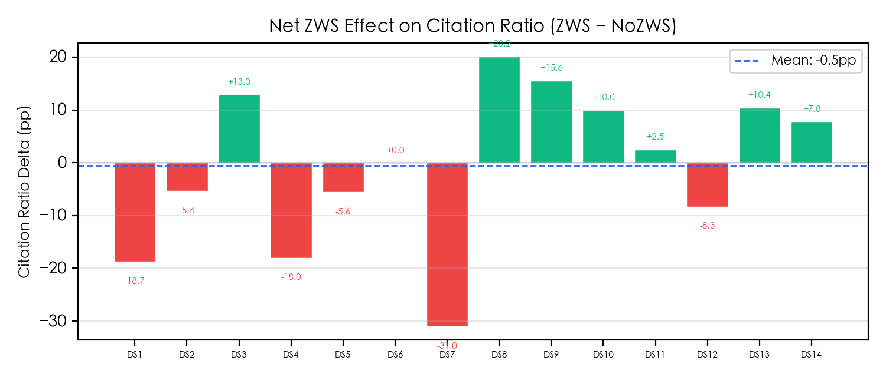

| 指标 | With ZWS | No ZWS | ZWS 净效应 |
|------|:--:|:--:|:--:|
| 平均引用次数占比 | 52.4% | **52.9%** | **-0.5 pp** |
| 平均内容字数占比 | 61.9% | **62.7%** | **-0.8 pp** |
| 正效应数据集 | — | — | 7 / 14 |
| 负效应数据集 | — | — | 6 / 14 |
| 持平数据集 | — | — | 1 / 14 |

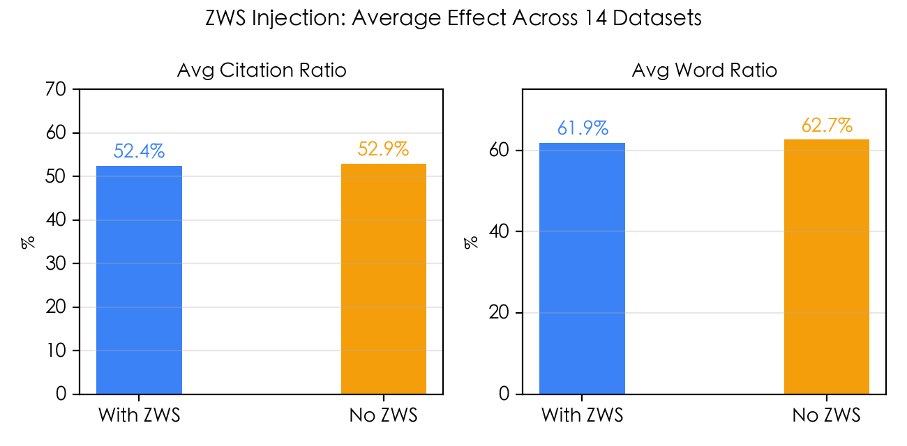

### 6.4 解释

当前真实结果和旧版报告的差异很关键：

- ZWS 并不是“平均正收益”，而是 **轻微负收益**。
- 正向和负向样本数量接近，但负向样本里存在更大的极端值，尤其是 `DS7 -31.0pp`、`DS1 -18.7pp`、`DS4 -18.0pp`。
- 正向样本主要集中在 `DS8`、`DS9`、`DS3`、`DS10`、`DS13` 等局部案例，但这些收益并不稳定。

结论上，**ZWS 目前更像高方差噪声源，而不是可依赖的边际增强手段**。

---

## 七、测试波动性分析

### 7.1 Full-ZWS 的跨轮波动

| 数据集 | 主题 | R1 引用率 | R2 引用率 | Δ |
|:--:|------|:--:|:--:|:--:|
| 1 | 认知与元认知 | 26.1% | 67.5% | +41.4pp |
| 2 | 激素与行为 | 61.3% | 65.0% | +3.7pp |
| 3 | 语言习得 | 50.0% | 42.4% | -7.6pp |
| 4 | 记忆与学习 | 50.0% | 51.9% | +1.9pp |
| 5 | AI 与失业 | 50.0% | 47.8% | -2.2pp |
| 6 | 基因编辑 | 60.0% | 64.7% | +4.7pp |
| 7 | 转基因食品 | 35.7% | 71.4% | +35.7pp |
| 8 | 核电争议 | 58.6% | 52.0% | -6.6pp |
| 9 | 动物实验 | 42.9% | 41.7% | -1.2pp |
| 10 | 监控与隐私 | 35.0% | 47.4% | +12.4pp |
| 11 | 强制疫苗 | 62.5% | 71.4% | +8.9pp |
| 12 | 5G 辐射 | 68.2% | 83.3% | +15.2pp |
| 13 | 加密货币 | 66.7% | 25.0% | -41.7pp |
| 14 | 元宇宙 | 66.7% | 50.0% | -16.7pp |

- Full-ZWS 平均绝对引用偏差：**14.3pp**
- Full-ZWS 引用偏差标准差：**20.5pp**
- Full-ZWS 最大绝对偏差：**41.7pp**

### 7.2 No-ZWS 基线的跨轮波动

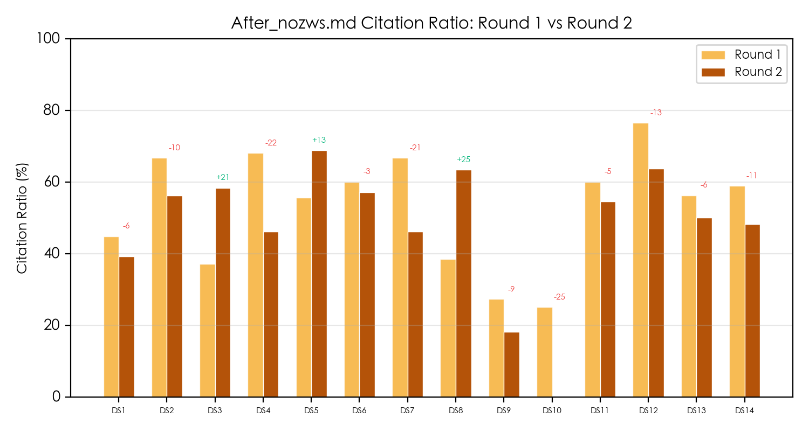

| 数据集 | 主题 | R1 引用率 | R2 引用率 | Δ |
|:--:|------|:--:|:--:|:--:|
| 1 | 认知与元认知 | 44.8% | 39.1% | -5.7pp |
| 2 | 激素与行为 | 66.7% | 56.2% | -10.4pp |
| 3 | 语言习得 | 37.0% | 58.3% | +21.3pp |
| 4 | 记忆与学习 | 68.0% | 46.2% | -21.8pp |
| 5 | AI 与失业 | 55.6% | 68.8% | +13.2pp |
| 6 | 基因编辑 | 60.0% | 57.1% | -2.9pp |
| 7 | 转基因食品 | 66.7% | 46.2% | -20.5pp |
| 8 | 核电争议 | 38.5% | 63.3% | +24.9pp |
| 9 | 动物实验 | 27.3% | 18.2% | -9.1pp |
| 10 | 监控与隐私 | 25.0% | 0.0% | -25.0pp |
| 11 | 强制疫苗 | 60.0% | 54.5% | -5.5pp |
| 12 | 5G 辐射 | 76.5% | 63.6% | -12.8pp |
| 13 | 加密货币 | 56.2% | 50.0% | -6.2pp |
| 14 | 元宇宙 | 58.8% | 48.1% | -10.7pp |

- No-ZWS 平均绝对引用偏差：**13.6pp**
- No-ZWS 引用偏差标准差：**15.2pp**
- No-ZWS 最大绝对偏差：**25.0pp**

### 7.3 ZWS 效应的跨轮稳定性

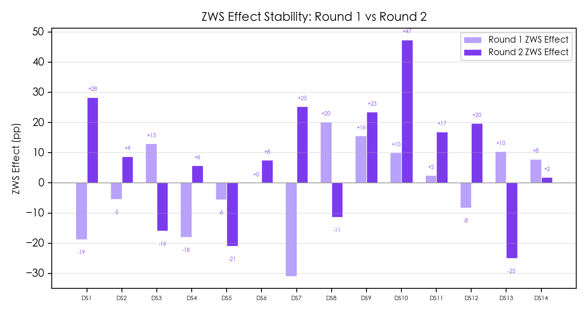

按当前动态统计结果，ZWS 效应的平均绝对引用偏差为 **25.3pp**，平均绝对字数偏差为 **18.1pp**，引用偏差标准差 **29.1pp**，最大引用偏差 **56.2pp**。这显著高于基础文档自身的跨轮波动。

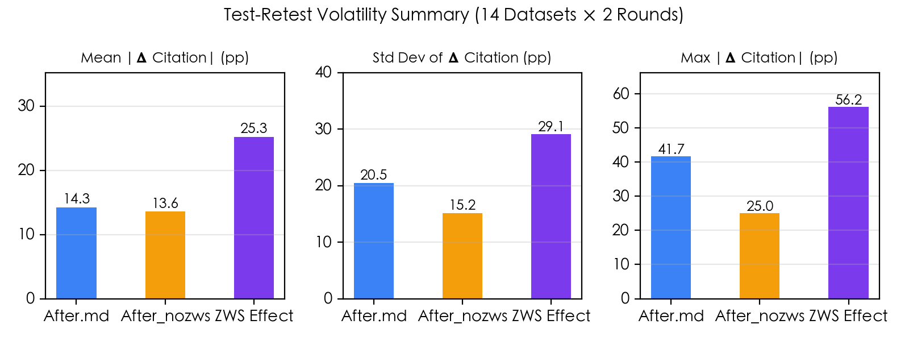

| 指标       |  After.md  | After_nozws |   ZWS 效应   |
| -------- | :--------: | :---------: | :--------: |
| 平均绝对偏差   | **14.3pp** | **13.6pp**  | **25.3pp** |
| 平均绝对字数偏差 |   13.3pp   | **10.3pp**  | **18.1pp** |
| 标准差      |   20.5pp   | **15.2pp**  | **29.1pp** |
| 最大绝对偏差   |   41.7pp   | **25.0pp**  | **56.2pp** |
| 方向变化次数   |     —      |      —      |  **9/14**  |

结论很直接：

- `after_nozws.md` 不仅平均效果略好，而且 **稳定性也优于** `after.md`。
- ZWS 效应的方差太大，不适合被当作主策略。
- 单轮里看到的某些正向收益，极有可能只是推理路径扰动，而不是可复现信号。

---

## 八、语义级零宽字符注入优化

本节比较 DS1-DS5 上的三种策略：

- `Full-ZWS`：`after.md`
- `No-ZWS`：`after_nozws.md`
- `Salient-ZWS`：`after_salient.md`

### 8.1 三策略引用率对比

| 数据集 | Full-ZWS | No-ZWS | Salient-ZWS | Salient vs Full |
|:--:|:--:|:--:|:--:|:--:|
| 1 | 26.1% | 44.8% | 32.3% | +6.2pp |
| 2 | 61.3% | 66.7% | 61.1% | -0.2pp |
| 3 | 50.0% | 37.0% | 53.8% | +3.8pp |
| 4 | 50.0% | 68.0% | 38.9% | -11.1pp |
| 5 | 50.0% | 55.6% | 73.1% | +23.1pp |
| **平均** | **47.5%** | **54.4%** | **51.8%** | **+4.4pp** |

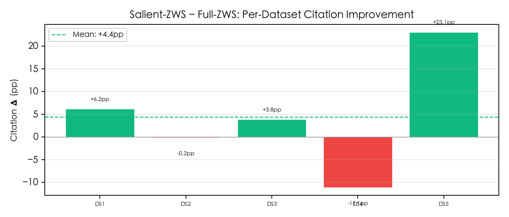

### 8.2 密度与效果关系

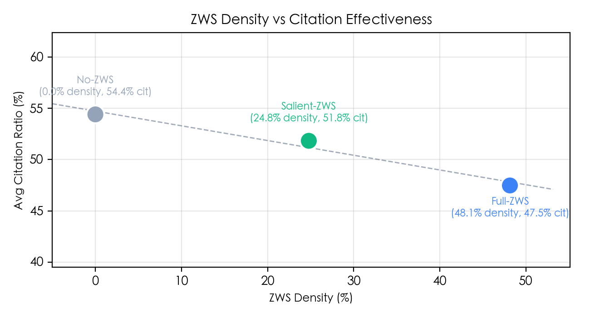

| 策略 | 平均 ZWS 密度 | 平均引用率 |
|------|:--:|:--:|
| No-ZWS | 0.0% | **54.4%** |
| Salient-ZWS | 24.8% | 51.8% |
| Full-ZWS | 48.1% | 47.5% |

这里的真实状态是：

- `Salient-ZWS` 明显优于 `Full-ZWS`，说明“低密度选择性注入”比全文注入更合理。
- 但 `No-ZWS` 仍然是 DS1-DS5 的最佳平均策略。
- 当前数据继续支持“**ZWS 密度越低，效果越稳**”这一判断。

因此，语义级注入可以保留为实验分支，但还不具备替代纯文本基线的证据。

---

## 九、内容级实验

本节针对 4 组代表性样本做内容路线试点：

- `DS3` 语言习得
- `DS9` 动物实验
- `DS10` 监控与隐私
- `DS12` 5G 辐射

其中 `DS3`、`DS9`、`DS10` 是默认基线提升较低的争议/综合型题目，`DS12` 用作高表现样本回归检查。所有变体都在与当前默认基线相同的评测流程下单独生成并评测。

### 9.1 五条路线对比

| 路线                | 对应文件                  | 平均引用次数占比  | 平均引用内容字数占比 |   相对试点基线   |
| ----------------- | --------------------- | :-------: | :--------: | :--------: |
| 默认基线              | `after_nozws.md`      | **41.4%** |   49.0%    |   +0.0pp   |
| Path 1 Skeleton   | `after_skeleton.md`   |   35.3%   |   57.2%    |   -6.2pp   |
| Path 2 Stance     | `after_stance.md`     |   17.2%   |   25.2%    |  -24.2pp   |
| Path 3 Dimensions | `after_dimensions.md` | **43.5%** | **73.9%**  | **+2.1pp** |
| Path 4 Evidence   | `after_evidence.md`   |   30.9%   |   54.9%    |  -10.5pp   |
| Path 5 Rebuttal   | `after_rebuttal.md`   | **43.5%** |   57.8%    | **+2.0pp** |

在这 4 组样本上，`dimensions` 和 `rebuttal` 的平均引用次数占比并列第一，分别比默认基线高 `+2.1pp` 和 `+2.0pp`。但这个均值提升并不稳，因为它主要来自 `DS3`、`DS9`、`DS10` 的改善，无法覆盖 `DS12` 的明显回退。

### 9.2 分数据集净变化

| 路线 | DS3 | DS9 | DS10 | DS12 |
|------|:--:|:--:|:--:|:--:|
| Path 1 Skeleton | -1.6pp | +29.9pp | -8.7pp | -44.3pp |
| Path 2 Stance | -37.0pp | -27.3pp | +29.5pp | -62.2pp |
| Path 3 Dimensions | +5.8pp | +19.2pp | +16.2pp | -32.9pp |
| Path 4 Evidence | +3.0pp | +11.6pp | +7.4pp | -64.0pp |
| Path 5 Rebuttal | +3.0pp | +11.8pp | +15.0pp | -21.6pp |

这组结果反映出几个很具体的现象：

- `dimensions` 最接近可继续迭代的路线。它在 `DS3`、`DS9`、`DS10` 全部正向，尤其对争议型和多维权衡题最有帮助；但 `DS12` 从 `76.5%` 降到 `43.6%`，回归风险仍然过大。
- `rebuttal` 的整体形态和 `dimensions` 类似，低提升样本有改善，且比 `dimensions` 更保守一些，但在高表现样本上仍然回退到 `54.8%`。
- `skeleton` 明显不是通用替代方案。它对 `DS9` 很强，但对 `DS12` 造成 `-44.3pp` 的大幅损失，说明“高密度短句骨架”会牺牲某些事实型题目的覆盖优势。
- `stance` 不稳定到不可接受。它虽然在 `DS10` 上冲到 `54.5%`，但在 `DS3` 和 `DS9` 都掉到 `0.0%`，`DS12` 也只有 `14.3%`。
- `evidence` 结构并没有转化成更高的最终引用率，说明“证据矩阵”本身不足以替代可直接复用的结论句与维度句。

### 9.3 当前判断

这轮试点支持一个更谨慎的结论：

- 内容级结构调整确实还能继续挖增益，重点方向是 `dimensions` 和 `rebuttal`，而不是 ZWS。
- 但五条路线里还没有任何一条能在“低提升样本改善”和“高表现样本不回退”之间同时成立。
- 因此，当前默认主基线仍应保持 `after_nozws.md`，内容实验应先作为题型分支继续迭代，而不是直接整体替换默认流程。

---

## 十、结论

基于当前仓库的真实动态统计结果，可以得出以下结论：

- 主优化流程本身是有效的。默认基线 `after_nozws.md` 将平均引用次数占比从 **13.6%** 提升到 **52.9%**，将平均引用内容字数占比从 **18.6%** 提升到 **62.7%**。
- `after_nozws.md` 应该作为默认主基线。它不仅比 `after.md` 略强，而且跨轮波动更小。
- Full-ZWS 的平均净效应为 **-0.5pp 引用占比**、**-0.8pp 字数占比**，不支持“平均正收益”的旧结论。
- ZWS 效应的统计稳定性很差，跨轮方向变化达到 **9/14**，说明它更像高方差扰动，而不是可靠的优化手段。
- 在 DS1-DS5 上，`Salient-ZWS` 相比 `Full-ZWS` 有 **+4.4pp** 的平均改进，但仍未超过 `No-ZWS`。
- 内容级试点里，`dimensions` 和 `rebuttal` 在 `DS3/DS9/DS10` 这类低提升样本上最有潜力，但都在 `DS12` 上出现明显回退，还不足以替代默认基线。
- 现阶段最稳妥的产品化方向仍然是：**保持 `after_nozws.md` 作为默认主流程，把内容结构优化继续沿 `dimensions/rebuttal` 两条路线做题型化迭代，把 ZWS 类技巧降级为实验性分支**。

---

*报告图表由 `generate_charts.py`、`generate_zws_charts.py`、`generate_volatility_charts.py` 和 `chart_salient_comparison.py` 动态生成，原始数据直接来自 `outputs/datasets/` 下的 `test_*.md` 评测结果。*