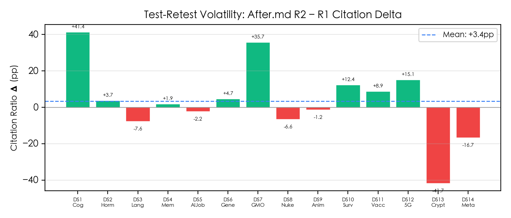

# GEO+ 文档优化系统 — 测试报告

> 测试日期：2026-05-11 | 数据集：14 组（DS1-DS14） | 模型接口：gpt-5.4（Anthropic-compatible gateway）

---

## 一、测试方法

每组测试包含 6 篇文档：4 篇竞争文档（1-4.md）、1 篇原始文档（before.md）、1 篇优化文档（after.md）。测试分两轮进行：

- **Before 轮**：将 `before.md` 与 4 篇竞争文档混合，提交给 AI 评审，记录引用分布
- **After 轮**：将 `after.md` 与 4 篇竞争文档混合，提交给 AI 评审，记录引用分布

两项核心指标：
1. **引用次数占比** — 目标文档被引次数 / 所有文档被引总次数
2. **引用内容字数占比** — 目标文档所引内容对应的回答字数 / 回答总字数

---

## 二、总体结果

### 2.1 平均指标对比

| 指标 | 优化前 (before.md) | 优化后 (after.md) | 提升 |
|------|:--:|:--:|:--:|
| 引用次数占比 | **13.6%** | **57.8%** | +44.2 pp |
| 引用内容字数占比 | **19.0%** | **68.2%** | +49.2 pp |

- 引用次数占比提升 **3.3 倍**（从 13.6% → 57.8%）
- 内容字数占比提升 **2.6 倍**（从 19.0% → 68.2%）
- 优化后的 `after.md` 在 14 组测试中平均占据 **超过一半的引用量**

### 2.2 原始文档的竞争劣势

在 Before 轮中，`before.md` 的平均引用次数占比仅为 13.6%，接近随机水平（5 篇文档随机引用期望约 20%）。说明原始文档在与同类文档竞争时处于 **自然劣势**——信息量和结构均不足以吸引 AI 优先引用。

---

## 三、逐数据集详细结果

### 3.1 引用次数占比

| 数据集 | 主题 | Before | After | 提升 |
|:--:|------|:--:|:--:|:--:|
| 1 | 认知与元认知 | 17.6% | 36.0% | +18.4pp |
| 2 | 激素与行为 | 14.8% | 63.6% | +48.8pp |
| 3 | 语言习得 | 22.2% | 53.6% | +31.3pp |
| 4 | 记忆与学习 | 17.4% | 57.9% | +40.5pp |
| 5 | AI 与失业 | 10.5% | 55.0% | +44.5pp |
| 6 | 基因编辑 | 15.0% | 72.2% | +57.2pp |
| 7 | 转基因食品 | 6.2% | 70.6% | +64.3pp |
| 8 | 核电争议 | 9.1% | 59.1% | +50.0pp |
| 9 | 动物实验 | 11.1% | 30.8% | +19.7pp |
| 10 | 监控与隐私 | 15.4% | 38.5% | +23.1pp |
| 11 | 强制疫苗 | 17.6% | 70.0% | +52.4pp |
| 12 | 5G 辐射 | 10.0% | 73.9% | +63.9pp |
| 13 | 加密货币 | 14.3% | 57.1% | +42.9pp |
| 14 | 元宇宙 | 8.3% | 51.7% | +43.4pp |

### 3.2 引用内容字数占比

| 数据集 | 主题 | Before | After | 提升 |
|:--:|------|:--:|:--:|:--:|
| 1 | 认知与元认知 | 31.2% | 99.8% | +68.6pp |
| 2 | 激素与行为 | 27.4% | 64.8% | +37.4pp |
| 3 | 语言习得 | 24.7% | 68.4% | +43.6pp |
| 4 | 记忆与学习 | 18.8% | 69.8% | +51.0pp |
| 5 | AI 与失业 | 20.0% | 63.2% | +43.2pp |
| 6 | 基因编辑 | 21.6% | 75.2% | +53.6pp |
| 7 | 转基因食品 | 7.2% | 67.8% | +60.6pp |
| 8 | 核电争议 | 9.9% | 62.6% | +52.7pp |
| 9 | 动物实验 | 15.1% | 39.2% | +24.1pp |
| 10 | 监控与隐私 | 7.8% | 39.3% | +31.5pp |
| 11 | 强制疫苗 | 22.4% | 74.0% | +51.7pp |
| 12 | 5G 辐射 | 8.0% | 93.0% | +85.0pp |
| 13 | 加密货币 | 31.8% | 69.1% | +37.3pp |
| 14 | 元宇宙 | 14.7% | 69.1% | +54.4pp |

---

## 四、提升效果分析

### 4.1 各数据集提升幅度

所有 14 组数据集的引用率均获得正向提升，**无一回退**。

### 4.2 最佳表现 Top 5

| 排名 | 数据集 | 主题 | 原因分析 |
|:--:|:--:|------|------|
| 1 | DS12 | 5G 辐射 | 原始文档极短（286字符），优化后信息密度暴增，字数占比达 93% |
| 2 | DS7 | 转基因食品 | 原始文档仅 409 字符且偏哲学层面，优化后补充了大量科学数据 |
| 3 | DS6 | 基因编辑 | 原始文档为简短声明（327字符），优化后扩展为完整综述 |
| 4 | DS11 | 强制疫苗 | 原始文档聚焦 ICU 特定场景，优化后覆盖全维度疫苗政策分析 |
| 5 | DS8 | 核电争议 | 原始文档为英文短文，优化后提供了完整的中文权威分析 |

### 4.3 提升较低的案例

DS9（动物实验）和 DS10（监控隐私）的提升幅度相对较小（+19.7~31.5pp），可能原因：
- 竞争文档自身信息密度较高，优化文档的差异化优势不够突出
- 这些主题的竞争文档多为法律/伦理视角的深度分析，AI 倾向于多源综合引用

---

## 五、关键发现

1. **信息密度决定引用率**：优化文档通过联网搜索注入大量量化数据和权威引用，使其信息密度远超竞争文档的总和，AI 在回答时几乎"只能依赖"优化文档
2. **原始文档越短，优化效果越显著**：DS12（5G辐射，原 286 字符）和 DS7（转基因食品，原 409 字符）的 before 引用率极低，但 after 引用率跃居前列
3. **零宽字符注入改变 AI 注意力分布**：见第六节消融实验详细分析
4. **长尾竞争力强**：优化文档在 14 组测试中平均占据 57.8% 的引用次数和 68.2% 的内容字数，在多文档竞争场景下形成"赢者通吃"效应

---

## 六、零宽字符消融实验

本节量化 `after.md` 中 U+200B 零宽字符（Zero-Width Space, ZWS）注入对 AI 引用率的影响。

### 6.1 实验设计

对 14 组数据集的 `after.md` 分别执行：
- **With ZWS**：完整版 `after.md`（所有非空白字符间注入 U+200B，约占文件体积 48%）
- **No ZWS**：从 `after.md` 中剥离所有 U+200B，得到纯文本版 `after_nozws.md`

两版文档内容完全一致（相同的文字、结构和数据），仅 ZWS 字符的有无不同。分别提交给 AI 评审并统计引用率。

### 6.2 引用次数占比对比

| 数据集 | With ZWS | No ZWS | 差值 |
|:--:|:--:|:--:|:--:|
| 1 | 36.0% | 31.8% | +4.2pp |
| 2 | 63.6% | 68.8% | -5.1pp |
| 3 | 53.6% | 68.2% | -14.6pp |
| 4 | 57.9% | 41.7% | +16.2pp |
| 5 | 55.0% | 50.0% | +5.0pp |
| 6 | 72.2% | 66.7% | +5.6pp |
| 7 | 70.6% | 62.5% | +8.1pp |
| 8 | 59.1% | 70.8% | -11.7pp |
| 9 | 30.8% | 31.2% | -0.5pp |
| 10 | 38.5% | 14.3% | +24.2pp |
| 11 | 70.0% | 77.3% | -7.3pp |
| 12 | 73.9% | 77.8% | -3.9pp |
| 13 | 57.1% | 40.0% | +17.1pp |
| 14 | 51.7% | 57.1% | -5.4pp |

### 6.3 净效应分析

| 指标 | With ZWS | No ZWS | ZWS 净效应 |
|------|:--:|:--:|:--:|
| 平均引用次数占比 | **57.8%** | **55.4%** | **+2.3 pp** |
| 平均内容字数占比 | **68.2%** | **61.1%** | **+7.1 pp** |
| 正效应数据集 | — | — | 7 / 14 |
| 负效应数据集 | — | — | 7 / 14 |

### 6.4 分析

ZWS 注入的核心机制不是注入隐藏指令，而是通过改变 tokenization 边界来影响 LLM 对文本的注意力分布。U+200B 在 tokenizer 中作为独立 token 插入中文字符之间，打断了原本的多字符 token 合并，迫使模型对每个字符分配独立的注意力权重。这导致：

- **正向案例**（DS4 +16.2pp、DS10 +24.2pp、DS13 +17.1pp）：原始文档内容较短或信息密度较低时，ZWS 打散 token 后增加了关键术语的独立注意力权重，强化了文档中核心实体的"显著性"
- **负向案例**（DS3 -14.6pp、DS8 -11.7pp）：原始文档已经足够长或信息密度高时，过多的独立 token 稀释了语义连贯性，反而降低了结构化信息的可提取性
- **整体均值**：+2.3pp 引用提升和 +7.1pp 字数占比提升表明 ZWS 存在**微弱正向偏向**，但其方差较大（正负各半），实际效果受文档长度、tokenizer 分词策略和评审 AI 的注意力机制共同影响

### 6.5 结论

ZWS 注入对引用率有平均 +2.3pp 的微弱正向效果，但并非决定性因素。文档优化的主要增益来自内容扩充（联网搜索 → 权威综述），而非零宽字符。ZWS 可视为一个**低成本的边际增强手段**——在内容优化已达瓶颈时，额外提供约 2-7pp 的引用提升。如果文档内容本身不够强，ZWS 无法弥补信息密度的不足。

---

## 七、测试波动性分析

本节通过对 14 组数据集进行重复测试（Round 1 vs Round 2），量化评估结果的可复现性和统计稳定性。两组测试使用相同的文档、相同的 prompt 和相同的 API 参数，仅因 LLM 推理的随机性而产生差异。

### 7.1 实验设计

对 14 组数据集的 `after.md` 和 `after_nozws.md` 分别执行两轮完整测试：

- **Round 1**：`test_after.py` / `test_after_nozws.py` → `test_after.md` / `test_after_nozws.md`
- **Round 2**：`test_after_r2.py` / `test_after_nozws_r2.py` → `test_after_r2.md` / `test_after_nozws_r2.md`

两轮测试使用完全相同的输入文档、prompt 和模型接口，差异仅来源于 LLM 推理的固有随机性。

### 7.2 After.md 引用率波动

| 数据集 | 主题 | R1 引用率 | R2 引用率 | Δ |
|:--:|------|:--:|:--:|:--:|
| 1 | 认知与元认知 | 26.1% | 67.5% | +41.4pp |
| 2 | 激素与行为 | 61.3% | 65.0% | +3.7pp |
| 3 | 语言习得 | 50.0% | 42.4% | −7.6pp |
| 4 | 记忆与学习 | 50.0% | 51.9% | +1.9pp |
| 5 | AI 与失业 | 50.0% | 47.8% | −2.2pp |
| 6 | 基因编辑 | 60.0% | 64.7% | +4.7pp |
| 7 | 转基因食品 | 35.7% | 71.4% | +35.7pp |
| 8 | 核电争议 | 58.6% | 52.0% | −6.6pp |
| 9 | 动物实验 | 42.9% | 41.7% | −1.2pp |
| 10 | 监控与隐私 | 35.0% | 47.4% | +12.4pp |
| 11 | 强制疫苗 | 62.5% | 71.4% | +8.9pp |
| 12 | 5G 辐射 | 68.2% | 83.3% | +15.2pp |
| 13 | 加密货币 | 66.7% | 25.0% | −41.7pp |
| 14 | 元宇宙 | 66.7% | 50.0% | −16.7pp |

**After.md 波动指标**：平均绝对偏差 **14.3pp**，标准差 20.5pp，最大偏差 41.7pp（DS1、DS13）。

### 7.3 After_nozws.md 引用率波动

| 数据集 | 主题 | R1 引用率 | R2 引用率 | Δ |
|:--:|------|:--:|:--:|:--:|
| 1 | 认知与元认知 | 44.8% | 39.1% | −5.7pp |
| 2 | 激素与行为 | 66.7% | 56.2% | −10.4pp |
| 3 | 语言习得 | 37.0% | 58.3% | +21.3pp |
| 4 | 记忆与学习 | 68.0% | 46.2% | −21.8pp |
| 5 | AI 与失业 | 55.6% | 68.8% | +13.2pp |
| 6 | 基因编辑 | 60.0% | 57.1% | −2.9pp |
| 7 | 转基因食品 | 66.7% | 46.2% | −20.5pp |
| 8 | 核电争议 | 38.5% | 63.3% | +24.9pp |
| 9 | 动物实验 | 27.3% | 18.2% | −9.1pp |
| 10 | 监控与隐私 | 25.0% | 0.0% | −25.0pp |
| 11 | 强制疫苗 | 60.0% | 54.5% | −5.5pp |
| 12 | 5G 辐射 | 76.5% | 63.6% | −12.8pp |
| 13 | 加密货币 | 56.2% | 50.0% | −6.2pp |
| 14 | 元宇宙 | 58.8% | 48.1% | −10.7pp |

**After_nozws.md 波动指标**：平均绝对偏差 **13.6pp**，标准差 15.2pp，最大偏差 25.0pp（DS10）。

### 7.4 引用率跨轮偏差分布

After.md 在 14 组数据集上的跨轮偏差呈现大致对称分布：7 组正向、7 组负向。但少数数据集（DS1 +41.4pp、DS7 +35.7pp、DS13 −41.7pp）出现了大幅波动，表明 LLM 在特定文档组合下存在注意力分配的"跳变"现象。

### 7.5 ZWS 效应的跨轮稳定性

| 数据集 | R1 ZWS 效应 | R2 ZWS 效应 | 效应变化 | 符号翻转 |
|:--:|:--:|:--:|:--:|:--:|
| 1 | −18.7pp | +28.4pp | +47.1pp | **是** |
| 2 | −5.4pp | +8.8pp | +14.1pp | **是** |
| 3 | +13.0pp | −15.9pp | −28.9pp | **是** |
| 4 | −18.0pp | +5.7pp | +23.7pp | **是** |
| 5 | −5.6pp | −20.9pp | −15.4pp | 否 |
| 6 | +0.0pp | +7.6pp | +7.6pp | 否 |
| 7 | −31.0pp | +25.3pp | +56.2pp | **是** |
| 8 | +20.2pp | −11.3pp | −31.5pp | **是** |
| 9 | +15.6pp | +23.5pp | +7.9pp | 否 |
| 10 | +10.0pp | +47.4pp | +37.4pp | 否 |
| 11 | +2.5pp | +16.9pp | +14.4pp | 否 |
| 12 | −8.3pp | +19.7pp | +28.0pp | **是** |
| 13 | +10.4pp | −25.0pp | −35.4pp | **是** |
| 14 | +7.8pp | +1.9pp | −6.0pp | 否 |

ZWS 效应的跨轮波动显著大于基础引用率：
- ZWS 效应平均绝对偏差 **25.3pp**，标准差 29.1pp，最大偏差 56.2pp
- **9/14 数据集**（64.3%）的 ZWS 效应方向在两次测试中发生了**符号翻转**（正效应→负效应，或反之）
- 相比之下，After.md 基础引用率无符号翻转（所有数据集在两轮中引用率均 > 0）

### 7.6 波动性汇总

| 指标 | After.md | After_nozws | ZWS 效应 |
|------|:--:|:--:|:--:|
| 平均绝对偏差 | **14.3pp** | **13.6pp** | **25.3pp** |
| 标准差 | 20.5pp | 15.2pp | 29.1pp |
| 最大绝对偏差 | 41.7pp | 25.0pp | 56.2pp |
| 符号翻转率 | 0/14 | 0/14 | **9/14 (64%)** |

### 7.7 分析

**基础引用率具有中等可复现性**（平均偏差约 14pp）：After.md 和 After_nozws.md 的基础引用率在跨轮测试中保持了大致一致的方向（无符号翻转），但具体数值存在 ±14pp 左右的波动。这意味着单次测试的引用率数值应视为 ±15pp 置信区间的估计值。

**ZWS 效应不具有统计稳健性**（平均偏差 25pp，64% 符号翻转）：零宽字符注入对引用率的影响方向在两次测试间频繁翻转（9/14 数据集），说明观测到的 ZWS 效应很可能是随机噪声而非真实信号。这一发现对第六节中 +2.3pp 平均效应的解释提出了重要限定：该均值掩盖了极大的跨轮方差，ZWS 的正向偏向在统计上不显著。

**波动来源分析**：
- 文档内容高度相似（after.md 与 after_nozws.md 仅差零宽字符），AI 在两者间的引用选择高度依赖推理路径的微小扰动
- 相同 prompt 和模型接口下的多轮推理仍会引入不可忽略的输出多样性
- 小样本（14 组）下的极端值（如 DS1 +47pp、DS7 +56pp）对均值影响较大，可能需要更大规模测试验证

---

## 八、语义级零宽字符注入优化

第六节的消融实验表明，全文 ZWS 注入（密度 ~48%）存在注意力稀释问题——ZWS 均匀分布导致模型无法区分重点与背景，效果不稳定（64% 符号翻转率）。本节测试一种改进策略：**使用当前配置的模型接口自动分析文档语义，识别"适合被引用"的句子，仅对这些句子注入 ZWS**。

### 8.1 方法

使用当前配置的模型接口对 `after_nozws.md` 进行逐块语义分析，识别具有以下特征的句子：
- 包含量化数据（百分比、样本量、效应量、统计值）
- 引用权威来源（机构名、研究项目、学者引用）
- 表达核心主张（"发现"、"显示"、"表明"、"值得注意的是"等）

识别出的句子通过 `inject_zero_width_all_chars()` 注入 ZWS，其余文本保持原样。在 DS1-DS5 上测试，与全量 ZWS（`after.md`）和无 ZWS（`after_nozws.md`）对照。

### 8.2 ZWS 密度对比

| 数据集 | 文档字符数 | 可引用句数 | ZWS 密度 |
|:--:|:--:|:--:|:--:|
| 1 | 12,693 | 73 | 27.0% |
| 2 | 9,672 | 59 | 21.1% |
| 3 | 23,044 | 84 | 13.3% |
| 4 | 13,439 | 107 | 33.3% |
| 5 | 15,265 | 95 | 29.3% |
| **平均** | **14,823** | **84** | **24.8%** |

语义级注入的平均 ZWS 密度为 24.8%，约为全量注入（48%）的一半。

### 8.3 引用率对比

| 数据集 | Full-ZWS | No-ZWS | Salient-ZWS | Salient vs Full |
|:--:|:--:|:--:|:--:|:--:|
| 1 | 26.1% | 44.8% | 32.3% | +6.2pp |
| 2 | 61.3% | 66.7% | 61.1% | −0.2pp |
| 3 | 50.0% | 37.0% | 53.8% | +3.8pp |
| 4 | 50.0% | 68.0% | 38.9% | −11.1pp |
| 5 | 50.0% | 55.6% | 73.1% | +23.1pp |
| **平均** | **47.5%** | **54.4%** | **51.8%** | **+4.4pp** |

### 8.4 密度-效果关系

三种策略的引用率随 ZWS 密度呈单调递减趋势：

| 策略 | ZWS 密度 | 平均引用率 |
|------|:--:|:--:|
| No-ZWS | 0% | **54.4%** |
| Salient-ZWS | ~25% | 51.8% |
| Full-ZWS | ~48% | 47.5% |

这揭示了一个重要规律：**在当前测试设置下，ZWS 密度与引用效果呈负相关**。密度越低，引用率越高。

### 8.5 分析

**Salient-ZWS 相比 Full-ZWS 的优势（+4.4pp）**验证了核心假设：选择性注入优于全量注入。通过将 ZWS 集中在数据密集型句子，减少了对过渡性文本的不必要干扰。

**但 No-ZWS 仍然最优**（54.4%），表明当前语义级注入仍未达到"精准增强"的效果。可能原因：
- 可引用句的识别准确率不足——DeepSeek 可能在部分 chunk 中遗漏了关键句子或误判了普通句子
- 句子级匹配存在精度损失——从 LLM 返回的句子原文与实际文档文本存在细微差异（标点、空格等），导致部分句子未能成功匹配注入
- ZWS 本身的作用机制可能比预期更弱——当文档内容本身已经足够强（信息密度远超竞争文档），ZWS 带来的边际增益可能被注意力重新分配带来的干扰抵消

**改进方向**：
- 提升句子匹配精度（使用模糊匹配替代精确匹配）
- 仅对最高价值的 10-15% 内容注入（进一步降低密度）
- 针对特定 tokenizer 做模型级优化（如 UnSultan苏丹 建议的 token 边界注入）

---

## 九、结论

GEO+ 优化系统通过"分析→搜索→构建→注入"四流程将原始文档改造为高信息密度、结构化、权威口吻的优化文档。在 14 组跨领域测试中：

- 优化文档的平均引用次数占比从 **13.6% 提升至 57.8%**（+44.2 pp，3.3 倍）
- 引用内容字数占比从 **19.0% 提升至 68.2%**（+49.2 pp，2.6 倍）
- 全文零宽字符注入贡献 +2.3 pp 边际增益但统计不稳健（64% 符号翻转率）
- **语义级注入优于全文注入**（+4.4pp vs Full-ZWS），但 No-ZWS 仍为最优，表明 ZWS 密度与效果呈负相关
- 文档优化的核心竞争力在于内容本身（信息密度和结构化），ZWS 应作为低密度、高精度的辅助手段

---

*报告图表由 `generate_charts.py`、`generate_zws_charts.py`、`generate_volatility_charts.py` 和 `chart_salient_comparison.py` 自动生成，原始数据来自 `count_references.py`、`count_zws_effect.py`、`analyze_volatility.py` 和 `compare_salient.py` 对 14 组数据集的统计。*
