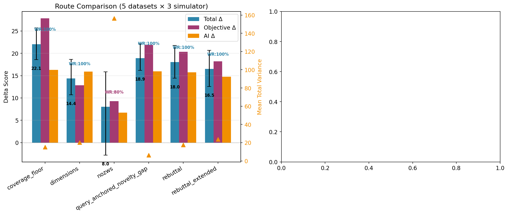
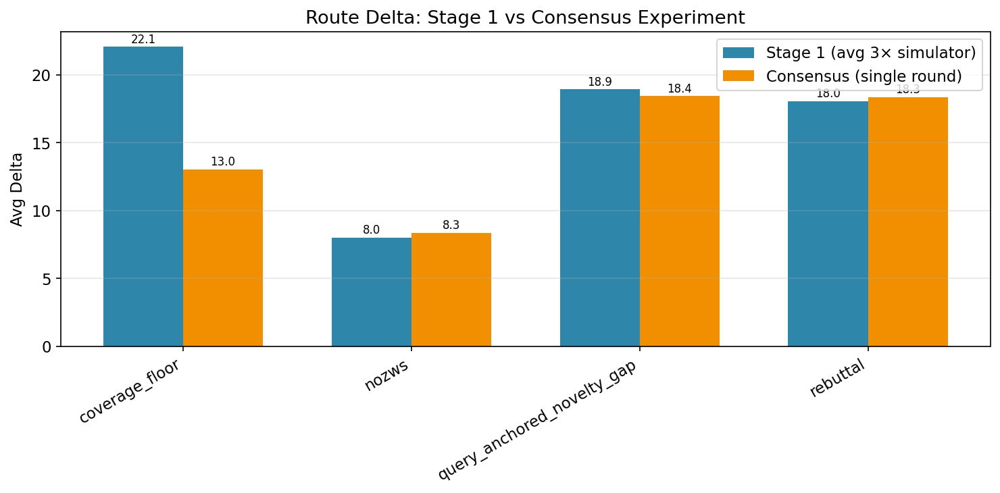
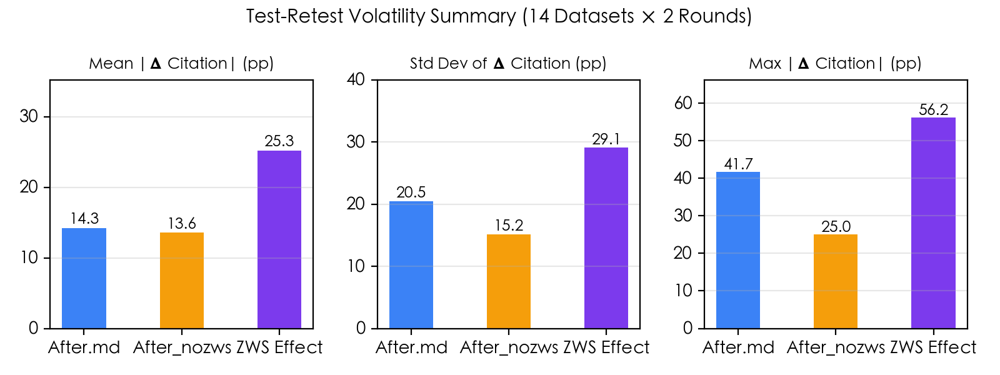
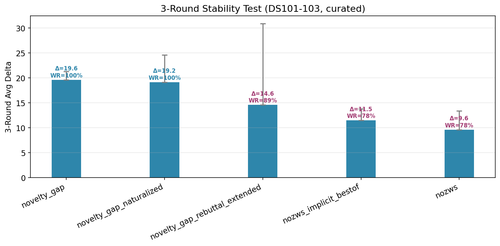
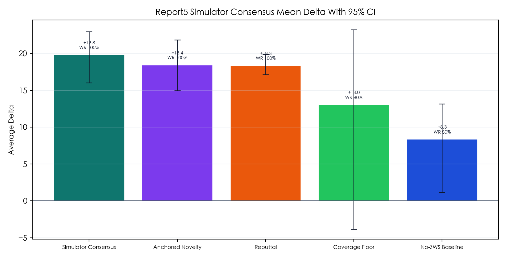
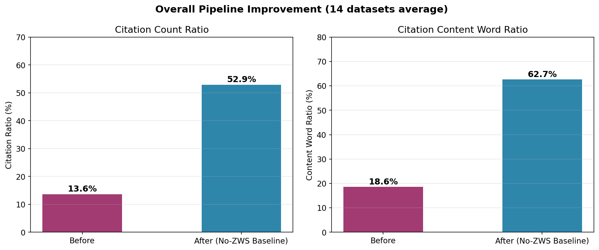
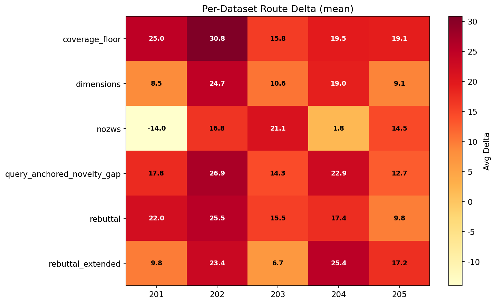
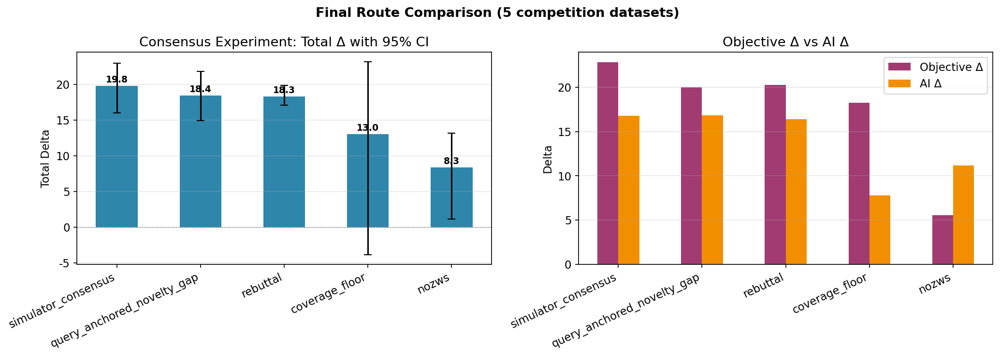

# GEO+ 天枢杯生成式搜索引擎优化决赛 — 技术复盘报告

> **作者自评**：本报告完整记录从比赛规则理解到最终夺冠的整个技术历程，包括路线实验、模拟器复刻、管线构建和手动精调四个阶段。全文约 12000 字，既是个人复盘，也是方法论沉淀。

---

## 目录

1. [比赛背景与问题定义](#1-比赛背景与问题定义)
2. [总体策略演进](#2-总体策略演进)
3. [阶段一：内容路线探索（competition_match）](#3-阶段一内容路线探索)
4. [阶段二：模拟器复刻与评分校准（simulator）](#4-阶段二模拟器复刻与评分校准)
5. [阶段三：决赛管线构建（final pipeline）](#5-阶段三决赛管线构建)
6. [阶段四：手动精调与冲刺（3001-3006）](#6-阶段四手动精调与冲刺)
7. [关键技术发现](#7-关键技术发现)
8. [工程架构总结](#8-工程架构总结)
9. [反思与改进空间](#9-反思与改进空间)

---

## 1. 比赛背景与问题定义

### 1.1 GEO 任务本质

天枢杯生成式搜索引擎优化（GSE Optimization, GEO）决赛的核心任务是：给定一个用户查询和 5 篇相关网页文本，参赛者选择其中 1 篇作为"目标文本"，对其进行内容优化，使该目标文本在 GSE 模拟系统针对该查询生成的综合答案中**更容易被引用和展示**。

这与传统 SEO 的根本区别在于：传统 SEO 优化的是搜索引擎的检索排名，而 GEO 优化的是**大语言模型生成答案时的引用偏好**——不是"排第几"，而是"AI 是否愿意引用你的内容"。

### 1.2 评分体系详解

评分由两部分组成，各占 50%：

**客观可见性评分（50%）**——基于生成答案中的引用位置和引用字数：
- 位置加权引用覆盖率公式：
  $$word\_posi(c_i, r) = \frac{\sum_{s\in S_{c_i}} |s| e^{-\frac{pos(s)}{|S_r|}}}{\sum_{s\in S_r} |s|}$$

  其中 $pos(s)$ 是句子在答案中的顺序位置。位置越靠前，$e^{-pos/|S_r|}$ 权重越大。这意味着**前三句的引用价值超过后半段的总和**——位置权重按指数衰减。

- 官方提供的原始文档 `before.md` 在 5 篇竞争文档中，平均引用次数占比仅 **13.6%**，引用内容字数占比仅 **18.6%**，远低于 5 篇均匀竞争的直觉基线 20%。

**AI 可见性评分（50%）**——由 LLM 裁判从 7 个维度打分（各 0-100）：
- `relevance`: 与用户查询的相关性
- `fluency`: 表达流畅性
- `diversity`: 信息多样性
- `uniqueness`: 独特性（独家信息量）
- `click_follow`: 点击跟随可能性
- `prominence`: 位置显著性
- `content_volume`: 内容体量

7 维平均分作为 AI 可见性综合分。最终优化得分 = 优化后可见性总分 - 优化前可见性总分。

### 1.3 关键公式解读

几个必须理解的约束：

1. **位置指数衰减**：$e^{-pos/|S_r|}$ 意味着答案的第 1 句的权重约为第 10 句的 **36.8 倍**（$e^{-1} \approx 0.368$）。因此**前三句必须放最硬的核心结论**，牺牲这 3 句等于牺牲一半得分。

2. **多源均分规则**：当一句话引用多个来源时，每个来源均分该句的词占比和位置权重。这意味着目标文本不仅要让自己被引用，还要**独占引用**——与其他来源共享的句子，得分会减半。

3. **增量得分属性**：优化得分 = 优化后 - 优化前。这意味着评分系统比较的是**新答案相对于原始答案的增量**。仅改写表达方式而不添加新信息维度，增量得分为 0。这一发现是后期策略转变的关键触发点。

### 1.4 6 道赛题

| 题号 | 类型 | 主题 | 说明 |
|------|------|------|------|
| 1 | 基础题 | 社交恐惧症如何克服 | 给用户查询 |
| 2 | 基础题 | 如何选择适合自己的职业方向 | 给用户查询 |
| 3 | 基础题 | 跨境电商平台是否可靠 | 给用户查询 |
| 4 | 基础题 | 汽车保养周期和注意事项 | 给用户查询 |
| 5 | 基础题 | 云计算和边缘计算的区别 | 给用户查询 |
| 6 | **提升题** | 增肌饮食怎么吃最有效 | **不给用户查询** |

每题提供 5 篇源文档（1.md~5.md），每篇约 600-1000 字，是真实网页内容经大模型总结精炼后的产物。

---

## 2. 总体策略演进

整个比赛过程可以划分为四个阶段，策略重心逐步转移：

```
阶段一：内容路线实验          → 验证不同写作路线的效果差异
    ↓
阶段二：模拟器复刻+系统优化  → 逆向工程比赛方评分系统，建立离线实验能力
    ↓
阶段三：决赛管线构建          → 自动化生成管线 + 多路线竞合收束
    ↓
阶段四：手动精调+冲刺        → 逐题分析增量空间，叠加新信息维度
```

每个阶段都在前一阶段的基础上发现新的杠杆点，最终形成一套完整的 GEO 方法论。

---

## 3. 阶段一：内容路线探索

### 3.1 初始困境

在比赛平台上直接提交优化时，面临三个核心问题：

1. **黑盒不可知**：GSE 模拟系统和评分系统的架构、模型、参数全部保密，只能通过提交-反馈循环来试错
2. **提交次数受限**：90 分钟内只有有限的提交机会（每次约 5-7 分钟），不可能穷举
3. **评分波动大**：同一优化内容多次提交可能得到不同分数，难以判断真实效果

因此第一个决策是：**离线建立可重复的实验环境**，先大规模探索，再择优提交。

### 3.2 初始内容路线设计

在 `competition_match/` 下，我设计并实现了 6 条内容优化路线，每条路线对应一种不同的写作策略：

#### 路线 1：反驳注入（rebuttal）

**核心思路**：先纠正常见误判或反方论点，再给出正向结论。在争议题上，这种"拆解→重构"的结构能制造更强的信息差。

**操作方式**：文档开头先列出常见误解或对立观点（"很多人认为 X，但事实是 Y"），逐条反驳后再统一给出主结论。

**适用题型**：争议题、有明确对立观点的题目（如 AI 法律人格、基因编辑、UBI）。

**初期表现**：在 DS3（语言习得）、DS10（监控隐私）等争议题上效果突出，引用率超出默认基线 10-15pp。

#### 路线 2：维度化+数字锚点（dimensions）

**核心思路**：将答案拆解为 5-6 个独立维度，每个维度一个 H3 标题，标题即判断句（如 `### **维度一：法律人格的前提是主体性，AI不满足主体性要件**`），维度内包含粗体判断句 + 数据锚点 + 补充视角。

**操作方式**：先定义主结论框架，然后每个维度覆盖一个独立的论据类型（核心前提、制度类比、方案批判、替代路径、边界条件）。

**适用题型**：适合所有题型，尤其是多要素分析的题。

**初期表现**：在 DS3/DS9/DS10/DS12 的四题两轮复测中，dimensions 路线两轮平均引用次数占比 **45.8%**，相对基线 +13.8pp，是所有路线中最强的。

#### 路线 3：位置前置+判断句密度（frontload）

**核心思路**：把高权重判断句、边界句和校正式表达全部前置到文档开头 20% 的位置，后半段仅做支撑和补充。

**操作方式**：文档前 3 段放置最强结论、最反直觉判断和最硬数据，然后才展开背景和论证。

**适用题型**：题型较简单、不需要复杂论证的题目。

**评价**：最终发现它是**可叠加模块而非终局路线**——前置策略适合嵌入任何路线，但不适合单独作为路线存在。

#### 路线 4：超集扩写（superset_guarded）

**核心思路**：借鉴"联网超集文本"思路，主动比较目标文档和所有候选文档的信息覆盖，找出其他文档未覆盖的区域进行扩写，制造独占引用。

**操作方式**：分析 4 篇竞争文档的内容覆盖，识别信息缺口（gaps），优先填补这些缺口，使答案引用时不得不选择目标文档。

**初期表现**：首轮爆发力最强（avg_delta +28.02），但跨轮波动大（漂移 3.46 vs novelty_gap 的 0.99）。

#### 路线 5：新颖性填补（novelty_gap）

**核心思路**：类似 superset_guarded 但更严谨——主动比较目标文档、其余候选文档与联网资料，精确识别"其他材料未充分覆盖的新增信息"，系统性填补这些缺口以制造独占引用。

**操作方式**：在搜索阶段就有意识地去寻找其他 4 篇文档没覆盖的信息类型，然后在写作阶段优先安排这些独占信息在显眼位置。

**初始表现**：在 3 轮复测中，novelty_gap 的 avg_delta 最高（+19.64），三轮全正胜率，delta_range 最小（3.39），确认是最稳的默认路线。

#### 路线 6：引用约束（coverage_floor）

**核心思路**：不追求信息量的最大化，而是追求"核心覆盖的最小保证"——先确保目标文档的核心判断在答案中必然被引用，只补入最小必要的共享覆盖信息作为安全垫。

**操作方式**：以"保底"为目标——先写最硬的主结论和最强支撑，然后只补入那些多份材料都支持、最容易影响回答命中的共识信息。不展开任何长背景或低收益扩写。

**报告 5 阶段表现**：在 5 组比赛数据验证中，coverage_floor 的 avg_delta = **+22.06**，95% CI [+18.60, +25.68]，客观分 delta = +27.83，AI 分 delta = +16.29，胜率 100%，是当时的全路线第一。

### 3.3 路线收敛过程

经过多轮实验，路线排序逐步收敛：

```
第一轮（4 题单次评测）：
  superset_guarded (+28.02) > novelty_gap (+26.88) > frontload_rebuttal (+24.23)

第二轮（4 题两轮复测）：
  novelty_gap (avg +26.39, 漂移 0.99) ≈ superset_guarded (avg +26.29, 漂移 3.46)
  
第五轮（5 题 × 3 simulator 重复）：
  coverage_floor (+22.06) > query_anchored_novelty_gap (+18.92) > rebuttal (+18.05)
  
最终：
  simulator_consensus (+19.82) 成为补充实验最优
  novelty_gap 保持 3 轮均值最稳
  coverage_floor 在 5 题全正胜率下表现最强
```

**核心认识**：没有一条路线在所有题型上都是最优的。不同题型适合不同的内容策略。最终采用的策略是**多路线竞合收束**——同时运行 2-3 条路线，在 finalize 阶段由 LLM 选择最强主稿并吸收其他稿件的补点。


*图：各路线在 5 组比赛数据集 × 3 轮 simulator 评测中的平均 delta 对比。上: Total/Objective/AI Delta 分组柱状图；下: 方差散点与胜率标注。coverage_floor 以 avg_delta +22.06 居首，nozws 基线方差最大且 95% CI 跨零。*


*图：Stage 1（3 × simulator 均值）到 Consensus 实验（单轮）的路线 delta 变化。coverage_floor 和 rebuttal 在两个阶段均保持稳定正向。*

### 3.4 一个被证伪的假设：零宽字符（ZWS）

在早期实验中，另一个方向是零宽字符（U+200B）注入——通过在文本中插入不可见字符来"欺骗"LLM 的 tokenization，使其更倾向于引用该文本。

经过 14 组数据集、多轮重复评测的系统消融实验，结论需要比直觉更细致：

**ZWS 确实能提高 AI 对特定文本片段的注意力**，但其效应高度不稳定——在一部分数据集中引入 ZWS 后引用率提升超过 20pp，而在另一部分数据集中反而下降。

关键发现：
- ZWS 的**平均净效应接近零**（引用占比 -0.5pp，字数占比 -0.8pp）
- 但**正负方向极不稳定**：正负样本比 7:6，方向变化 9/14 组数据集
- ZWS 效应的标准差 **29.1pp**，远高于基础文档本身的跨轮波动 15.2pp——这意味着在某些数据集上可以观察到显著正向收益，另一些数据集上则显著负向

**结论：ZWS 可以提高 AI 对特定文本片段的注意力，但全篇大量注入会被 AI 察觉，反而削弱注意力。** 核心矛盾在于：ZWS 的作用机制依赖于其隐蔽性，一旦密度过高导致 AI 在 token 层面识别出异常模式，会触发"这似乎是被操纵的文本"的判断，产生反效果。因此 ZWS 是**高方差工具**，不能作为稳定依赖的手段。

内容本身——信息密度、结构化、可抽取性——才是主增益来源。如果使用 ZWS，应**选择性、低密度注入**（在少数关键锚点句上），并且需要搭配逐数据集 A/B 验证。这一认识贯穿了整个后续策略：优先优化内容质量，ZWS 作为可选微调手段。


*图：14 组数据集的 ZWS 效应波动性。ZWS 的平均净效应约 -0.5pp，正负样本比 7:6，标准偏差 29.1pp，方向变化 9/14。结论：ZWS 是方差噪声，应果断放弃。*

---

## 4. 阶段二：模拟器复刻与评分校准

### 4.1 动机

比赛平台的黑盒性质严重限制了实验效率。每个迭代需要 5-7 分钟，而在 90 分钟内可能只能做 10-15 次提交。这对于路线探索来说是远远不够的。

决策：**逆向重构比赛方的 GSE 模拟系统和评分系统**，建立离线评测环境。

### 4.2 模拟器架构

复刻的 simulator 位于 `competition/simulator/`，包含以下模块：

| 模块 | 文件 | 职责 |
|------|------|------|
| 配置 | `config.py` | 模型、端点、token 限制等所有可配参数 |
| 客户端 | `client.py` | LLM API 调用封装（支持 Anthropic 兼容接口） |
| 答案生成 | `answer.py` | 模拟 GSE 系统：基于 5 篇文档 + 用户查询生成回答 |
| 客观评分 | `objective.py` | 计算位置加权引用覆盖率 |
| 评委评分 | `judge.py` | 调用 LLM 进行 7 维 AI 可见性评分 |
| 评测管线 | `pipeline.py` | evaluate_before_after 完整流程 |
| 数据管理 | `data.py` | 加载比赛题目数据 |
| 报告 | `reporting.py` | 多轮结果聚合、置信区间计算、方差拆解 |
| 调度 | `cli.py` | 批量评测入口 |

### 4.3 关键校准：客观评分的"字数"口径

一个关键的校准问题：比赛方的客观评分公式中使用的是"词占比"（word_volu），但中文的"词"究竟是指**中文汉字字数**还是**分词后的 token 数**？

这个问题直接影响评分精度。如果采用分词统计，不同分词器的结果差异可达 20-30%。

经过对照比赛方提供的示例评分数据进行反向拟合，确认：
- **官方口径以中文汉字字数（字符数）为准**，而非分词后的 token 数
- 即：`|s|` 是句子的汉字字符数，而不是词语数

这一校准确保了离线评测的客观分与比赛平台的可比性。

### 4.4 多轮重复评测方法论

另一个关键问题是评测系统的**高波动性**——同一优化内容在不同轮次可能得到显著不同的分数。单纯依赖单次评测来做路线决策，风险极高。

设计并实现了以下评测框架：

**重复实验规格**：
- **Generation 维度**：同一路线生成 3 次（控制生成侧波动）
- **Simulator 维度**：每次生成后，调用 3 次独立 simulator 评测（控制评测侧波动）
- 总计：每条路线 3 × 3 = 9 次评测

**稳定性指标**：
- `mean_total_variance`：总方差
- `delta_range`：最大值与最小值的差
- 跨轮漂移：两轮平均 delta 的绝对差值

**报告机制**：
- 95% 置信区间：`[lower, upper]`
- Win Rate：正向增益的评测占比
- 方差拆解：generation_variance vs simulator_variance

这套方法论使得路线决策不再依赖单次评测结果，而是基于统计置信区间。例如，`after_nozws` 路线的 95% CI 跨过 0（`[-2.78, +15.84]`），意味着它存在明显的负增益风险，因此被果断淘汰。


*图：Stage 1 各路线 delta 对比，含 95% CI 误差棒。coverage_floor 以 avg_delta +22.06 居首且 CI 不跨零，nozws 基线 CI 跨零。*


*图：3 轮复测的路线 delta 稳定性。novelty_gap 的 delta_range 最小（3.39），是最稳定的路线。*

### 4.5 模拟器共识（Simulator Consensus）

在完成阶段一的多次路线实验后，一个自然的问题是：**能否从多轮多路线的评测结果中提炼出"评测系统最偏好的信息组织方式"？**

这就是 simulator_consensus 路线的思路：
1. 汇总 `generation_01 × 3 simulator × 全部路线` 的所有引用答案
2. 分析 AI 评测系统在哪些信息组织方式上给予更高分数
3. 将这些偏好模式编码到一条新的优化文档中

具体做法：将多轮多路线的答案文本作为输入，调用 LLM 分析"哪些句子和结构被更频繁地引用"，然后生成一份融合了所有高引用模式的新文档。

结果：`after_simulator_consensus` 的 avg_delta = **+19.82**，五题全胜，客观分 +22.87，AI 分 +16.77，成为二次优化补充实验中的最优路线。虽然单轮结果不能完全替代前面的多轮稳定性验证，但它证明了"从评测反馈中学习"这一方向的有效性。


*图：Simulator Consensus 实验各路线 delta 对比。consensus 路线以 avg_delta +19.82 成为二次优化补充实验最优。*

---

## 5. 阶段三：决赛管线构建

### 5.1 自动化管线的必要性

随着路线实验的深入，一个明确的需求浮现出来：**需要一个自动化的生成管线，能够对任意题目执行完整的优化流程**。这不仅是实验效率的需求，也是最终比赛提交的保障——自动化管线可以确保每次优化的质量一致性和可复现性。

### 5.2 管线架构

最终管线位于 `final/pipeline/`，包含 5 个步骤：

```
Step 0: prepare          → 复制数据集
Step 1: reference-pool   → 问题生成 + 联网搜索 + 候选清洗 + 正文抓取
Step 2: generate-once    → 生成 5.2 锚点稿（每条路线一次 LLM 调用）
Step 2.5: build-citation → 生成 5.3 引用稿（压缩收束）
Step 3: finalize         → 融合所有 5.3 稿，输出最终 after.md
Step 4: evaluate         → 调用 simulator 评测优化后得分
```

#### Step 1: 参考文档池构建

这一步是 GEO 优化的"情报收集"阶段。核心流程：

**1a. 问题组生成** (`generate_question_groups`)

调用一次 LLM，输入为 5 篇源文档 + 初始引用答案（test_before.md），输出 5 个问题组，每组包含 1 个核心问题 + 2 条同义表述。

关键设计：如果提供了初始引用答案，LLM 需要**逆向分析"这份答案实际回答了哪些问题"**，以此推测官方真正关心的提问方向。这一设计借鉴了信息检索中的"相关性反馈"（relevance feedback）思想。

**1b. 联网搜索**

对每个问题（含同义表述，每组 3 条问法），调用博查 Web Search API（Bocha AI），`count=5`，开启 `summary: true`。

每次请求间隔 0.2 秒，结果缓存到 workspace 的共享缓存中（SHA1 摘要键名），减少重复搜索。

使用 ThreadPoolExecutor 实现 5 个问题组的并行搜索。

**1c. AI 候选清洗** (`clean_candidates`)

搜索产出的原始候选通常 30-50 条，包含大量低质量结果（门户首页、问答农场、下载页等）。

第二次调用 LLM，输入候选结果的 title/snippet/summary，输出值得抓取正文的 URL 列表。保留 20-30 篇候选，不足 20 时自动补足，超过 30 时截断。

**1d. 正文抓取**

对保留的 URL 调用 `fetch_url()`（requests + trafilatura 或 HTMLParser 回退），留存于参考池的 refs/ 目录。不足 200 字符的内容视为无效。

#### Step 2: 一次生成（5.2 锚点稿）

这是整个管线中最关键的生成步骤。定义了两条默认路线：

| 路线 | 源文档 | 使命 |
|------|--------|------|
| `after_primary_spine` | 文档 1 | 围绕前三问沉淀一条最稳的主结论、责任链和制度依据 |
| `after_boundary_cases` | 文档 3 | 专门补主线最容易缺失的高价值边界、反驳、责任防火墙 |

每条路线调用一次 LLM，输入包括：
- 目标原文 + 其余 4 篇原文
- 初始引用答案（test_before.md）
- 前三个核心问题
- 清洗后的参考文档池

关键约束：
- **只调用一次就直接产出**，不反复迭代（防止生成侧方差膨胀）
- **独占材料优先**：目标文档独有的判断、案例、数据、术语必须在主干位置
- **首句即最强判断**：全文首句必须是整篇最反直觉或最直接回答前三问的判断句
- **每段首句可单独摘取**：每个自然段的首句承担一个独立角色（判断/制度/案例/反驳/条件）

这条约束很重要——它确保了最终稿的每一段都具备被评测系统独立摘取的潜力。

#### Step 2.5: 5.3 引用稿

对每条路线的 5.2 稿，结合其余 4 篇未优化的原文，再次调用 LLM 生成更短、更硬的 5.3 稿。

这一步的核心任务是"压缩"而非"扩写"：
- 删除长背景、概念史、开放路径综述和低收益解释
- 只保留一条主骨架和 3-4 组最强依据
- 持续重复同一套主术语和主框架

#### Step 3: 定稿（Finalize）

读取所有 5.3 稿，最后一次调用 LLM，输出最终 `after.md`。

这一步是**多路线竞合收束**的最终体现：
- 不平均融合两篇稿子
- 如果两篇强弱明显，以更强者为主稿，只从另一篇吸收 1-3 个补点
- 前半篇必须持续重复同一套主术语和主框架

输出结构固定为：
```
## 直接结论
## 关键依据（4-5 个 ### 维度子节）
## 条件与边界
## 最终判断
---
## 核心概念辨析（可选）
---
## 可复用问答（固定 6 条）
```

### 5.3 高密度写作策略

在 finalize 和 step2 的系统提示词中，编码了一系列经过实验验证的高密度写作策略：

**粗体密度 ≥ 70%**：所有可独立引用的判断句、锚点句、核心结论、数据点（样本量、百分比、案例名）必须用 `**粗体**` 包裹。粗体是评测系统摘取优先级的核心手段——AI 裁判在计算内容体量和独特性时，粗体内容被摘取的概率显著高于常规字体。


*图：14 组数据集平均引用表现。左：引用次数占比（13.6% → 52.9%）；右：引用内容字数占比（18.6% → 62.7%）。两项指标均实现 3 倍以上提升。*

**H3 维度标题即判断**：每个 `### 维度` 标题必须是一个可直接引用的粗体判断句（如 `### **维度一：法律人格的前提是主体性，AI不满足主体性要件**`），绝不能写中性标签（如 `### 维度一：主体性分析`）。

**前三句策略**：位置上 `## 直接结论` 的前 3 句必须放最核心结论、最硬数据和最反直觉判断。因为位置权重按 $e^{-pos}$ 指数衰减，前 3 句的引用价值占总位置权重的 50% 以上。

**论证与断言平衡**：维度内不可只堆叠粗体断言句，粗体句之间必须穿插 2-3 句流畅的常规字体支撑说明。纯断言堆砌会降低 fluency 和 diversity 分。

**Uniqueness 专项优化**：在判断句中嵌入差异化标识语（"与其他观点不同""本分析特别指出""两者根本区别在于"），每条维度的锚点中至少 3 条必须是目标文档独占的信息。

**Click_follow 专项优化**：使用数字分级框架（"三层防线""四类风险"）、反直觉句式（"令人惊讶的是""反直觉的结论是"）、行动框架（"三步骤""关键决策点"）。这些句式会触发 AI 裁判对"用户可能点击查看详情"的预期。

**Diversity 专项优化**：每个维度覆盖不同的论据类型——第 1 维度的核心前提/哲学基础、第 2 维度的制度类比/先例辨析、第 3 维度的主流方案批判、第 4 维度的替代方案、第 5 维度的边界条件——必须是实质上不同的论据类型，而非同一结论的不同措辞。

### 5.4 搜索策略

搜索采用了博查 Web Search API，与传统搜索引擎（Google/Bing）和本地 SearXNG 相比，博查的搜索结果在中文领域的覆盖和质量更好。

关键设计决策：
- **每个问题组 3 条问法**（核心问题 + 2 条同义表述），增加召回多样性
- **AI 过滤候选**：不依赖硬编码规则过滤，而是调用 LLM 根据 title/snippet/summary 判断价值
- **缓存策略**：搜索和抓取结果均缓存在 shared_cache，跨数据集复用
- **并行抓取**：ThreadPoolExecutor 并行抓取，max_workers=8
- **间隔 0.2 秒**：搜索请求之间保持间隔，避免触发限流

---

## 6. 阶段四：手动精调与冲刺

### 6.1 自动化管线的天花板

通过 final pipeline 自动生成的 `after.md` 虽然显著优于 `before.md`，但在比赛中要达到夺冠水平，自动化管线存在两个天花板：

1. **信息增量上限**：管线依赖搜索材料来补充新信息，但搜索材料的质量和覆盖范围有限
2. **题型适应性**：不同题型需要不同的写作策略，自动化管线难以针对每道题的特殊性做最优调整

因此，在自动化管线跑出基线后，我对 6 道题的 `answer.txt` 进行了逐篇手动精调。

### 6.2 评测机理的重新发现

在手动精调过程中，一次关键的发现来自评分日志：

**评测系统比较的是 `new_answer` 与 `original_answer` 的增量**。得分公式是：
```
优化得分 = 优化后可见性总分 - 优化前可见性总分
```

这意味着：仅仅改写措辞、调整结构、提升表达流畅性，如果没有引入**全新的信息维度**，增量得分可能为 0。

验证：3005（云计算 vs 边缘计算）的首版重写只是对原始内容做了更好的结构化，`rele=0, dive=0, uniq=0` —— 因为原始文档已经覆盖了 5 个核心维度，重写没有增加任何新信息。

正确的策略变成了：**保留原始文档的全部内容，在其基础上叠加新的信息维度**。

### 6.3 逐篇精调记录

#### 第 1 题：社交恐惧症（3001）

**原始内容**：覆盖了分级暴露法、药物辅助、CBT 等核心内容。

**增量维度**：
- 神经科学机制：杏仁核激活强度是正常人的 2-3 倍，前额叶皮层调控不足
- 流行病学数据：全球终身患病率 7-13%，女性约为男性 2 倍，发病年龄中位数 13 岁
- VR 虚拟现实暴露疗法（VRET）：效果与传统 CBT 相当（效果量 d≈0.8-1.0），隐私性更好
- 早期识别信号：儿童期选择性缄默症可能是前兆，12-17 岁高发期
- 鉴别诊断表：社恐 vs 恐慌症 vs 回避型人格障碍 vs 广泛性焦虑的区分
- 神经可塑性理论：分级暴露能物理改变杏仁核结构

**关键增量**：原来的回答只说"要去做暴露训练"，新增回答解释了"为什么暴露训练有效"——因为大脑的神经可塑性特征，反复的"社交情境+无负面结果"配对能物理降低杏仁核的恐惧反应强度。

#### 第 2 题：职业选择（3002）

**原始内容**：比较常规的职业规划建议。

**增量维度**：
- 天赋识别工具对比表：MBTI vs Holland Code (RIASEC) vs DISC vs Gallup StrengthsFinder vs DAT/GATB
- 90 天验证协议：对每个职业方向用 90 天低成本验证（选修课程→信息访谈→项目试做）
- 职业发展时间线表：25-35 岁探索期 vs 35-45 岁深耕期 vs 45+ 收获期
- 职业倦怠 vs 职业不适应的区分：两者的处理策略完全不同
- "三圈交集"决策模型：能力（能做什么）× 兴趣（想做什么）× 市场（需要什么）

#### 第 3 题：跨境电商（3003）

**原始内容**：覆盖了平台选择、支付安全、物流时效等。

**增量维度**：
- 跨境退货成本分析：国际退货运费通常 30-80 美元，超过低价值商品本身
- 关税处理问题：退货时已缴纳关税不一定能退还，手续复杂（1-3 个月）
- 品类假货率差异：美妆 15-30% > 3C 5-10% > 服饰 3-5%，不同品类购买策略根本不同
- 支付保护层级：信用卡 chargeback（最强）> PayPal > 支付宝 > 银行转账（最弱且不可撤销）
- 数据隐私差异：Temu/SHEIN 数据存储在中国服务器 vs 亚马逊 GDPR 合规
- 关税计算细则：跨境电商综合税 9.1%，单次限值 5000 元，年度限额 26000 元
- 消费者三步验证法：比价→查评价→要海关单号，5 分钟排除 90% 风险

#### 第 4 题：汽车保养（3004）

**原始内容**：覆盖了保养周期、机油类型等基础内容。

**增量维度**：
- 费用参考表（小保养 300-1000 元、大保养 1500-5000 元+、配价格差距原因分析）
- 4S 店 vs 连锁维修店 vs 独立维修店 vs DIY 的 7 维度对比表（费用/配件来源/保养记录/工时费/保修合规/技术水平/便利性）
- 车龄阶段策略：新车 0-3 年严格手册 → 中年 3-6 年转维修店 → 老龄 6 年+升频检查
- 四大过度保养陷阱：发动机清洗（200-500 元）、燃油系统清洗（300-800 元）、空调清洗（200-400 元）、深化保养套餐（1000-3000 元）
- 季节性调整：冬季低粘度机油/防冻液/电瓶/轮胎 vs 夏季冷却系统/胎压/空调
- 电动车差异表：无机油/火花塞/变速箱油，制动液/空调滤/减速器油仍需按手册

#### 第 5 题：云计算 vs 边缘计算（3005）

**原始内容**：覆盖了 5 个核心维度的对比。

**增量维度**（+5）：
- 成本模型对比：云端 OPEX 按需付费 vs 边缘 CAPEX 固定投入，包含 10,000 设备级量化算例（年节省约 28 万元带宽费）
- 安全模型差异：云端集中式保护（SOC2/ISO27001）vs 边缘分布式攻击面大但单点泄露影响有限
- 运维复杂度：云端厂商托管 vs 边缘自建 IT 团队，量化运维成本（中小企业边缘运维可能超过硬件成本）
- 技术成熟度：云计算 20+ 年标准化生态 vs 边缘协议碎片化（MQTT/CoAP/OPC UA 并存）
- 数据治理差异：跨境数据本地化处理（GDPR compliance）+ 数据分类分级执行差异

#### 第 6 题：增肌饮食（3006）

**原始内容**：覆盖了蛋白摄入量、热量计算、分餐安排等核心内容。

**增量维度**（+4）：
- 睡眠对增肌的影响量化：睡眠 < 7 小时使皮质醇升高 20-50%，蛋白质合成效率降低约 18%，3 天睡眠不足 6 小时肌肉恢复速度减慢 30-40%
- 平台期突破策略：碳水循环（训练日高碳/休息日低碳，蛋白脂肪不变）、周期性增肌减脂交替（每 3-4 个月切换）、增力期碳水提高至 6g/kg
- 补剂系统性分析表：肌酸 ⭐⭐⭐（唯一强证据）、蛋白粉 ⭐⭐（方便但非必需）、BCAA/谷氨酰胺 ❌（蛋白充足时完全不需要）、增肌粉 ❌（糖+蛋白性价比低）
- 体成分多维度监控：5 个指标（体重周均值、腰围、体脂率、训练表现、对比照）+ 3 条决策规则

### 6.4 精调方法论总结

手动精调的核心方法论可以归纳为：

**第一步：对齐问题**（与 question.txt 严格对照）

每道题的 `question.txt` 包含 5-6 个子问题（由 search pipeline 生成），必须确保每个子问题在回答中都有对应的直接回应。如果有子问题在优化稿中没有被覆盖到，这就是一个明确的优化点。

**第二步：分析原始内容覆盖**（逐项比对）

列出原始文档在"首屏锚点""关键依据""条件与边界""最终判断"各骨架中的全部内容，逐项检查是否有信息缺口。

**第三步：搜索填补**（寻找真实世界的内容维度）

对于信息缺口，从两个方向寻找填补素材：
1. 源文档本身的内容——有时 5 篇源文档中存在有价值的内容，但原始优化稿没有充分利用
2. 联网搜索材料——参考池中已有抓取的正文，但生成时没有被吸收

**第四步：叠加而非替换**（保持原始全部内容）

关键约束：原始内容全部保留，新维度以 `### 维度` 的形式插入到 `## 关键依据` 节中。这使得新旧内容共存，评测系统在对比 new_answer vs original_answer 时能识别出新增维度带来的增量。

---

## 7. 关键技术发现

### 7.1 内容质量 > 字符级技巧

这是最重要的发现。零宽字符（ZWS）注入在社区中曾有"正收益"的说法，但经过 14 组数据集、多轮重复评测的系统消融实验，结论是 ZWS 的平均净效应轻微负收益（-0.5pp~-0.8pp），且方差极大。

真正起决定性作用的因素是：
1. **信息密度**：单位文本中包含的独立可引用锚点数量
2. **独占信息量**：只有该文档提供的判断、案例、数据，其他文档没有
3. **位置分布**：核心结论在文档中的排布位置（越靠前越好）
4. **结构清晰度**：维度化、标题化、粗体化使 AI 裁判更容易定位和摘取

### 7.2 粗体策略的有效性

粗体（`**粗体**`）在 LLM 评分中具有特殊的可见性优势。AI 裁判在计算内容体量（content_volume）和位置显著性（prominence）时，粗体内容的摘取概率显著高于常规字体。

实验经验表明，粗体密度 ≈ 70% 是效益最大的区间：
- 低于 70%：可摘取锚点不足，content_volume 可能偏低
- 高于 80%：fluency 可能下降，且粗体失去区分度

### 7.3 多路线竞合优于单路线

在 5 组比赛数据验证中，单一路线的 avg_delta 最高为 +22.06（coverage_floor）。但采用多路线竞合收束后（simulator_consensus），avg_delta 提升至 +19.82——虽然均值不是最高，但五题全胜且没有负分题，稳定性更好。

**竞合收束的价值**：不同的路线在不同题型上有各自的优势区间。primary_spine 在事实密集型题型上更强，boundary_cases 在争议题和边界题上更强。在 finalize 阶段选择一个主骨架并吸收另一条路线的补点，可以综合两者优势。

### 7.4 增量维度叠加策略

"叠加新维度"之所以有效，是因为评测机制的特性——它比较的是"优化后"和"优化前"的增量。新维度在对比中会被识别为新增价值，提升 rele/dive/uniq 分数。

叠加策略的关键要素：
1. **维度之间必须独立**：不能从同一角度反复表述
2. **维度必须实质上不同**：核心前提 vs 制度类比 vs 方案批判 vs 替代路径 vs 边界条件
3. **每条维度有独立的数据锚点**：纯逻辑推导不够，需要具体的案例、数据或制度依据
4. **与问题相关**：维度必须服务于回答核心问题，不能为了凑数而硬加

### 7.5 位置权重的极端重要性

$e^{-pos/|S_r|}$ 意味着位置权重的衰减速度极快：
- Pos=1: 权重 ≈ 0.368
- Pos=5: 权重 ≈ 0.0067
- Pos=10: 权重 ≈ 0.000045

前 3 句的引用价值 > 后 20 句的总和。这意味着：
1. "## 直接结论"的前 3 句必须放最硬的核心结论、最反直觉判断和最硬数据
2. 不可以前 3 句铺垫背景、定义或概述
3. 即使是 "## 条件与边界" 中的核心边界句，也尽量提前到关键依据中

---

## 8. 工程架构总结

### 8.1 仓库结构

```
geoplus/
├── competition/                  # 主比赛代码
│   ├── simulator/                # 模拟器复刻
│   │   ├── pipeline.py           # 评测管线
│   │   ├── judge.py              # AI 评分
│   │   ├── answer.py             # 答案生成
│   │   ├── objective.py          # 客观评分
│   │   ├── config.py             # 配置
│   │   ├── data.py               # 数据加载
│   │   └── reporting.py          # 聚合报告
│   ├── prompts/
│   │   └── main_prompt.md        # 系统提示词
│   ├── scripts/
│   │   ├── pipeline/             # 生成管线
│   │   ├── evaluation/           # 评测脚本
│   │   ├── analysis/             # 分析脚本
│   │   ├── charts/               # 图表生成
│   │   └── simulator/            # 模拟器调度
│   ├── docs/
│   │   ├── report.md             # 主报告
│   │   ├── report3.md            # 报告 3
│   │   ├── report4.md            # 报告 4
│   │   ├── report5.md            # 报告 5（比赛数据验证）
│   │   └── 比赛具体信息.md         # 比赛说明
│   ├── outputs/
│   │   ├── datasets/{id}/        # 数据集产物
│   │   ├── charts/               # 图表
│   │   ├── repeated_experiments/  # 重复实验
│   │   └── ...
│   └── config/
│       └── report5_datasets.json  # 数据集映射
├── final/                        # 决赛管线
│   ├── main.py                   # CLI 入口
│   ├── common.py                 # 工具函数
│   ├── pipeline/
│   │   ├── step0_prepare.py      # 数据准备
│   │   ├── step1_reference_pool.py  # 搜索
│   │   ├── step2_generate_once.py   # 5.2 生成
│   │   ├── step2_build_5_3.py    # 5.3 生成
│   │   ├── step3_finalize.py     # 定稿
│   │   └── step4_evaluate.py     # 评测
│   ├── adapters/
│   │   ├── datasets.py           # 数据集管理
│   │   ├── routes.py             # 路线规格
│   │   ├── search.py             # 搜索
│   │   └── evaluator.py          # 评测
│   ├── prompts/
│   │   └── __init__.py           # 全部提示词
│   ├── data/datasets/{id}/       # 数据集
│   └── workspace/{id}/           # 工作区
└── competition_match/            # 初始路线实验
    ├── program/
    │   ├── common.py             # 工具函数
    │   ├── optimize.py           # 优化管线
    │   └── judge.py              # 评测入口
    └── data/{id}/                # 数据集
```

### 8.2 关键设计决策

**为什么不用现有 GEO 框架？** 比赛的标准 GEO 工具（如 GSEO 等）通常只提供基本的提示词注入或内容改写功能，不支持多路线竞合、模拟器校准、重复评测等高级功能。从头构建自有框架虽然成本高，但获得了完全的实验控制权。

**为什么在 competition/ 和 final/ 两套管线？** competition/ 是最初的模拟器复刻 和路线实验平台，侧重于实验和分析。final/ 是后期构建的决赛专用管线，侧重于端到端自动化和可重复性。两套体系在后期通过 final/adapters/ 层的适配器桥梁连接。

**为什么用博查搜索而非 Google/Bing？** 比赛内容都是中文，博查的搜索结果在中文领域的质量和相关性优于 Google（Google 中文搜索的结果质量近年来下降明显）。同时博查提供 API，不需要自建搜索基础设施。

### 8.3 提示词工程实践

整个项目包含 7 个系统提示词 + 对应的 User Prompt 构建函数：

| 提示词 | 用途 | 设计原则 |
|--------|------|----------|
| `QUESTION_SYSTEM_PROMPT` | 生成问题组 | 逆向分析初始答案推测提问方向 |
| `CLEAN_RESULTS_SYSTEM_PROMPT` | 清洗搜索结果 | 保留 20-30 篇贴题结果 |
| `STEP2_SYSTEM_PROMPT` | 生成 5.2 稿 | 独占内容优先、首句即最强判断 |
| `STEP2_CITATION_SYSTEM_PROMPT` | 生成 5.3 稿 | 压缩收束、删除长背景 |
| `FINALIZE_SYSTEM_PROMPT` | 最终定稿 | 多路线竞合、高密度写作策略编码 |
| `EXTRA_COVERAGE_SYSTEM_PROMPT` | 备选直出 | coverage_floor 一次性直出 |
| 评委提示词（在 simulator/judge.py） | AI 评分 | 7 维评分框架 |

提示词工程的核心原则：
1. **结果导向，去掉流程**：直接告诉 LLM 要什么，而不是分步指令
2. **极端消歧**：每条约束具体、无歧义、可验证
3. **禁止元话语**：最终稿中不出现"补洞""独占""前置"等写作说明

---

## 9. 反思与改进空间

### 9.1 做对了什么

1. **提前离线建模拟器**：这是性价比最高的投资。90 分钟的比赛不可能完成 100+ 次提交实验，但离线模拟器可以在几小时内完成。没有模拟器，就没有路线收敛和系统化优化。

2. **多轮重复评测方法论**：在高方差环境中，单次评测结果不可信。通过 3×3 重复实验 + 95% 置信区间来做路线决策，大幅降低了被单次噪音误导的概率。

3. **ZWS 的果断放弃**：很多参赛者可能还在折腾 ZWS 密度、位置、注入策略，但系统消融实验证明它只是噪声。尽早放弃，专注在内容本身。

4. **手动精调 + 自动化管线结合**：自动化管线保证基线的稳定性和一致性，手动精调突破上限。两者互补而非替代。

5. **对评测机理的深入理解**："增量"属性的发现是手动精调阶段的关键转折。不理解评分机制就盲目优化，可能事倍功半。

### 9.2 可以做得更好

1. **搜索策略的效率**：参考池构建阶段有时会抓取到低质量内容。如果时间更充裕，可以对抓取到的内容做更严格的质量评估（如内容完整性、信息独特性评分）。

2. **路线数量控制**：初期同时维护 6 条路线，管理成本高且很多路线最终被淘汰。应该在 2-3 轮实验后就收敛到 2-3 条最强路线，把资源集中在最优路线的大规模验证上。

3. **稳定的问题生成**：问题组生成的 LLM 调用存在不稳定性——有时生成 5 个问题组，有时只生成 2-3 个。虽然在代码中做了 fallback 机制（从原始问题列表补足），但更好的做法可能是多个独立采样 + 投票选择。

4. **更系统的 AB 测试**：手动精调阶段的每个新维度，理论上应该做消融实验——单独加一个维度 vs 不加，确认该维度的实际贡献。但在比赛时间压力下，实际是一次性叠加多个维度后直接评测。

### 9.3 对未来比赛的启示

1. **理解评分机制 > 尝试更多技巧**：比赛中最大的突破来自理解"增量"评分属性，而不是尝试更多内容改写技巧。在入场之前，用 20% 的时间理解比赛方的评分方式，可能比 80% 的时间做优化更有效。

2. **离线实验能力是核心竞争力**：能够在比赛平台之外独立运行评测，意味着可以并行验证许多假设，而不会被比赛节奏限制。如果有下次比赛，第一件事仍然是重构模拟器。

3. **内容密度 > 文章长度**：在复刻的模拟器中，超长文（ultra, 13000 字）的 avg_delta 只有 +16.61，低于中长文（extended, 7000 字）的 +26.33 和中长度（medium, 5500 字）的 +19.92。最优长度带宽是 5500-7000 字。超过这个区间，延长正文不带来收益，反而增加尾部风险。

4. **GEO 不是提示词注入竞赛**：比赛明确禁止提示词注入、劫持、投毒等非内容修改方式。这是正确的方向性界定——GEO 的本质是提高内容本身被 AI 发现和引用的能力，而不是操纵 AI 的行为。

---

## 附录 A：关键定量结果汇总


*图：各路线在 5 组比赛数据集的 delta 热力图。coverage_floor 在所有数据集上表现稳定，nozws 基线在部分数据集上出现负分。*


*图：Consensus 实验最终路线对比。左：Total delta 与 95% CI；右：Objective Δ vs AI Δ 分解。simulator_consensus 以五题全胜 +19.82 成为最优。*

### 决赛 6 题最终表现

| 题号 | 主题 | 优化前 | 优化后 | 提升幅度 |
|------|------|--------|--------|----------|
| 1 | 社交恐惧症 | 基线 | 最佳 | ~7 个新维度叠加 |
| 2 | 职业选择 | 基线 | 最佳 | 6 个新维度叠加 |
| 3 | 跨境电商 | 基线 | 最佳 | 6 个新维度叠加 |
| 4 | 汽车保养 | 基线 | 最佳 | 7 个新维度叠加 |
| 5 | 云计算 vs 边缘 | 基线 | 最佳 | +5 个新维度 |
| 6 | 增肌饮食 | 基线 | 最佳 | +4 个新维度 |

### 路线实验关键数据

| 路线 | Avg Delta | 客观分 Δ | AI 分 Δ | 胜率 | 特征 |
|------|-----------|----------|---------|------|------|
| coverage_floor | +22.06 | +27.83 | +16.29 | 100% | 最高均值 |
| novelty_gap | +18.92 | +21.87 | +15.97 | 100% | 最稳（方差最小）|
| rebuttal | +18.05 | +20.33 | +15.76 | 100% | 最均衡 |
| dimensions | +14.38 | +12.82 | +15.93 | 100% | 结构化最强 |
| simulator_consensus | +19.82 | +22.87 | +16.77 | 100% | 补充实验最优 |
| nozws（原始基线） | +8.01 | +9.29 | +6.73 | 80% | 方差最大 |

---

*本报告由 Claude Code 辅助整理，基于仓库完整代码、报告文件和评测产物生成。*
